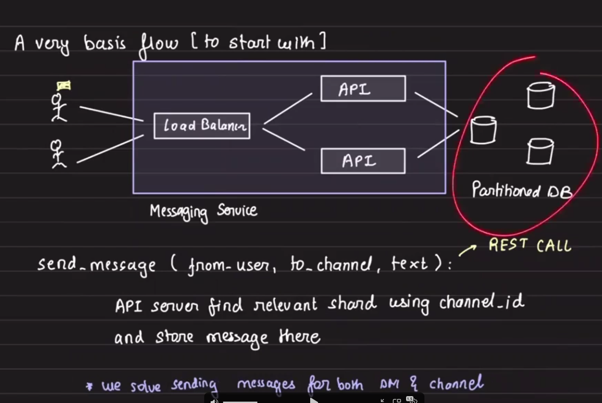
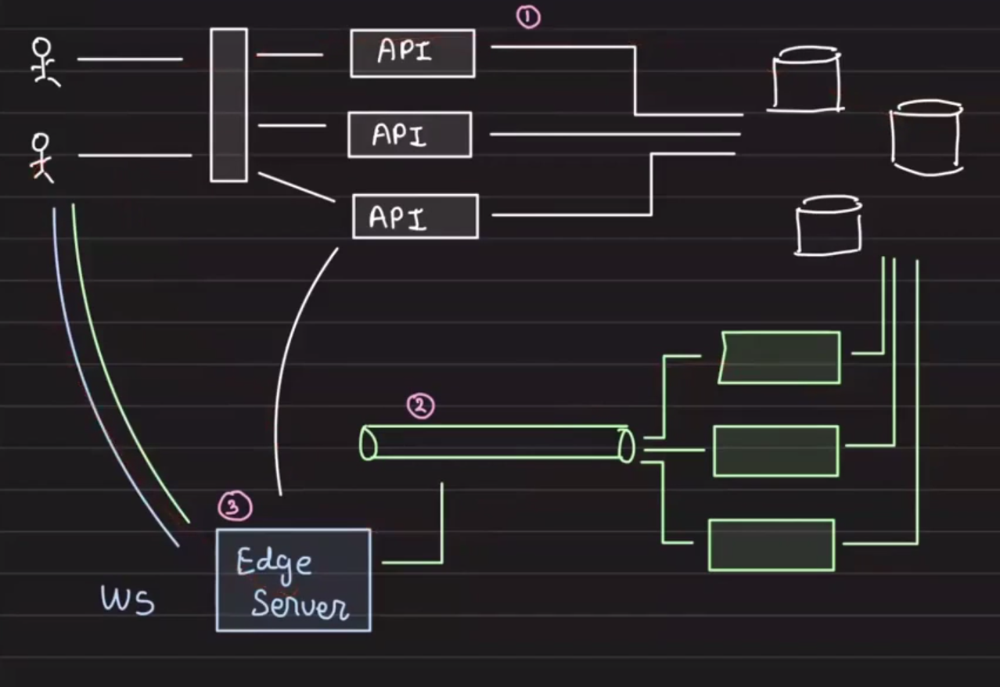
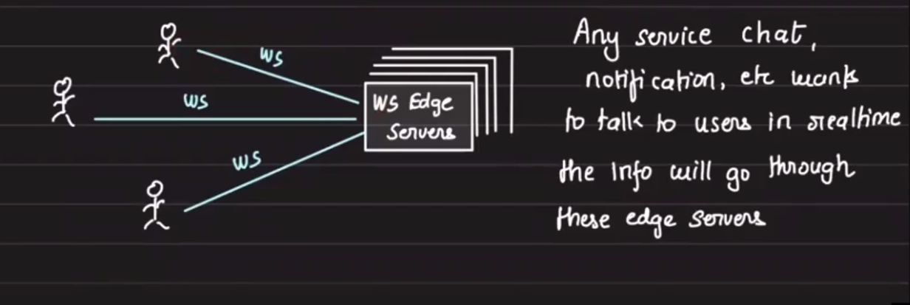
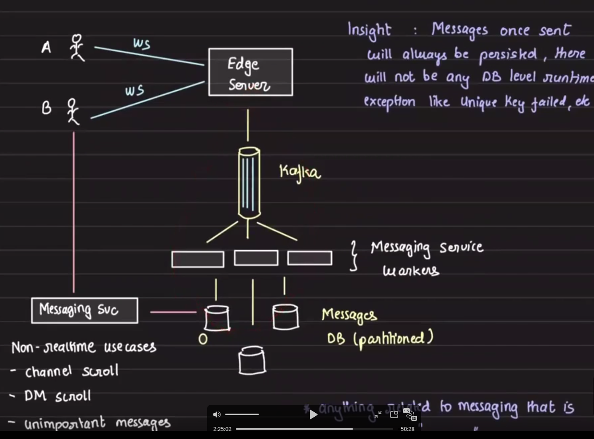
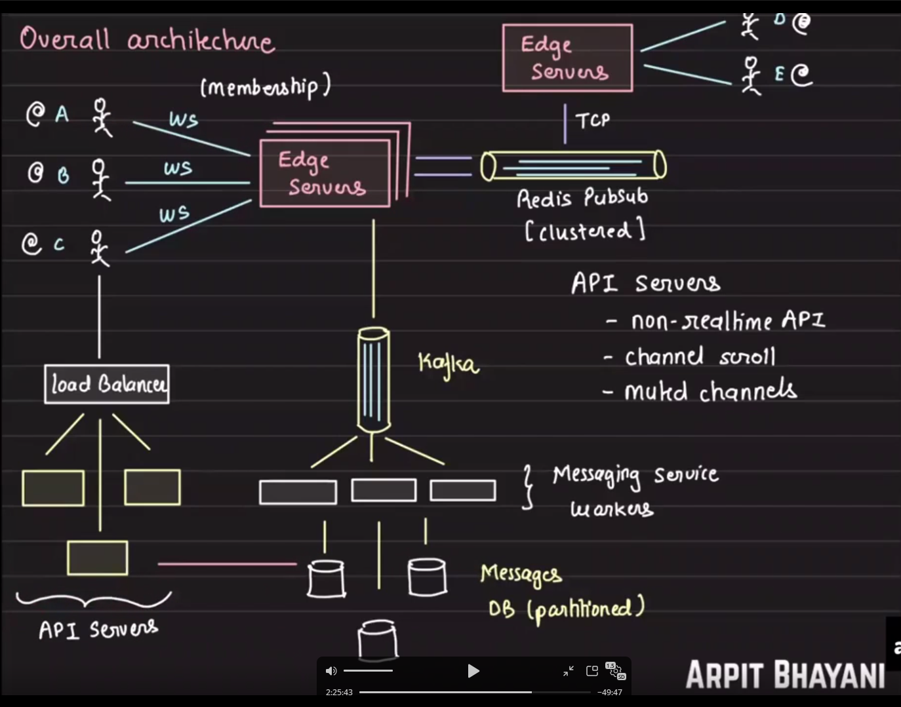

# Slack Final Design

## Index

- [Overview](#overview)
- [Channel Types](#channel-types)
- [Partitioning and Sharding](#partitioning-and-sharding)
- [Approach 1](#approach-1)
- [Persistence Models](#persistence-models)
- [Edge Server Requirements](#edge-server-requirements)
- [Architecture Diagram](#architecture-diagram)

## Overview

This document outlines the final design for Slack-style real-time chat communication.

## Channel Types

- Channels can be either `dm` or `channel`
- A direct message (`dm`) is also a channel, but it is between two people

## Partitioning and Sharding

- Because there will be a large number of messages, we store them in a sharded database
- Pick any database that supports sharding; even SQL can work if it can shard
- Data should be mutually exclusive and sharded by `channel_id`
- All messages for a channel should reside in one shard
- This makes scrolling simple and avoids cross-shard queries

## Approach 1

## Persistence Models

### Slack-style Persistence

- **White path:** Slack-style persistence in the database first
  - `user -> api -> db` (`ws` is not required for the initial save)
- **Green path:** WhatsApp-style immediate send then store
  - `user -> ws -> kafka -> db`
- **Blue path:** Zoom-style live messages only
  - `user -> ws` with no persistence

## Edge Server Requirements

- Edge servers are required because WebSockets are expensive (`persistent TCP` connections)
- Browsers have a `6 concurrent TCP connections` limit per origin
  - This limit applies on the client side, not the server side
- We need to multiplex all real-time communication onto one WebSocket connection

Hence, we need a fleet of Edge servers to which our end users will connect over WebSocket.

- Additional design details:

## Architecture Diagram

