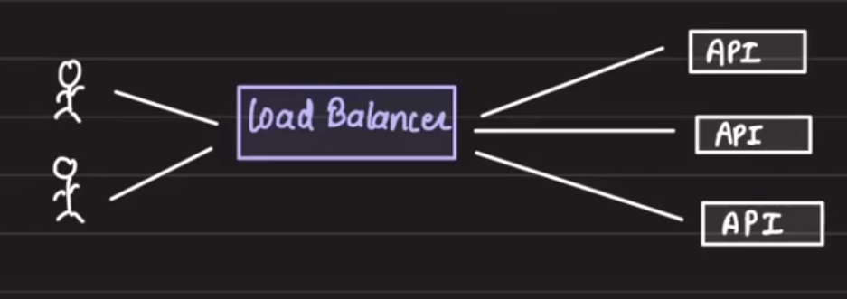
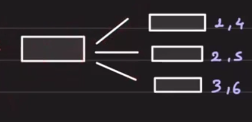
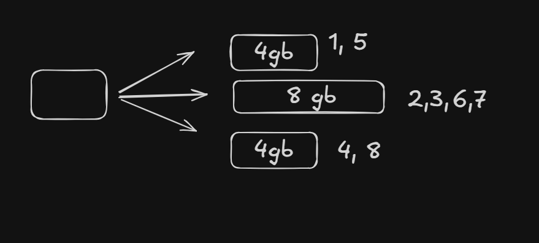
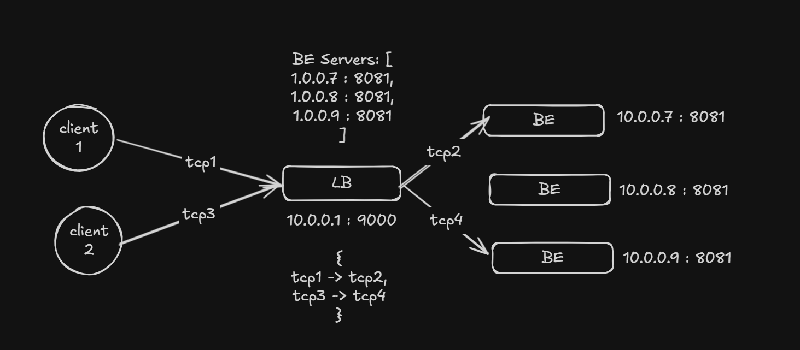
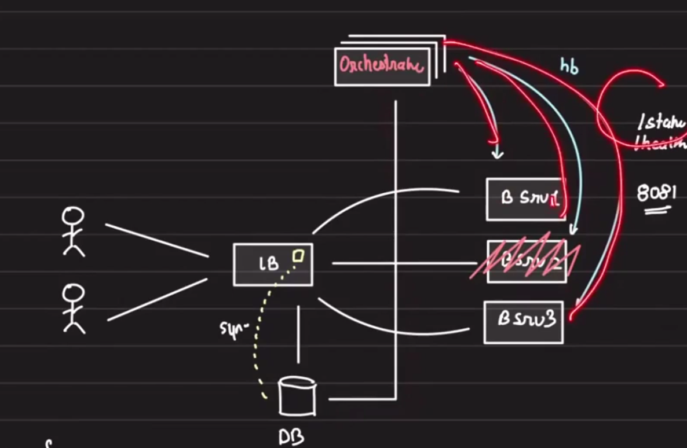
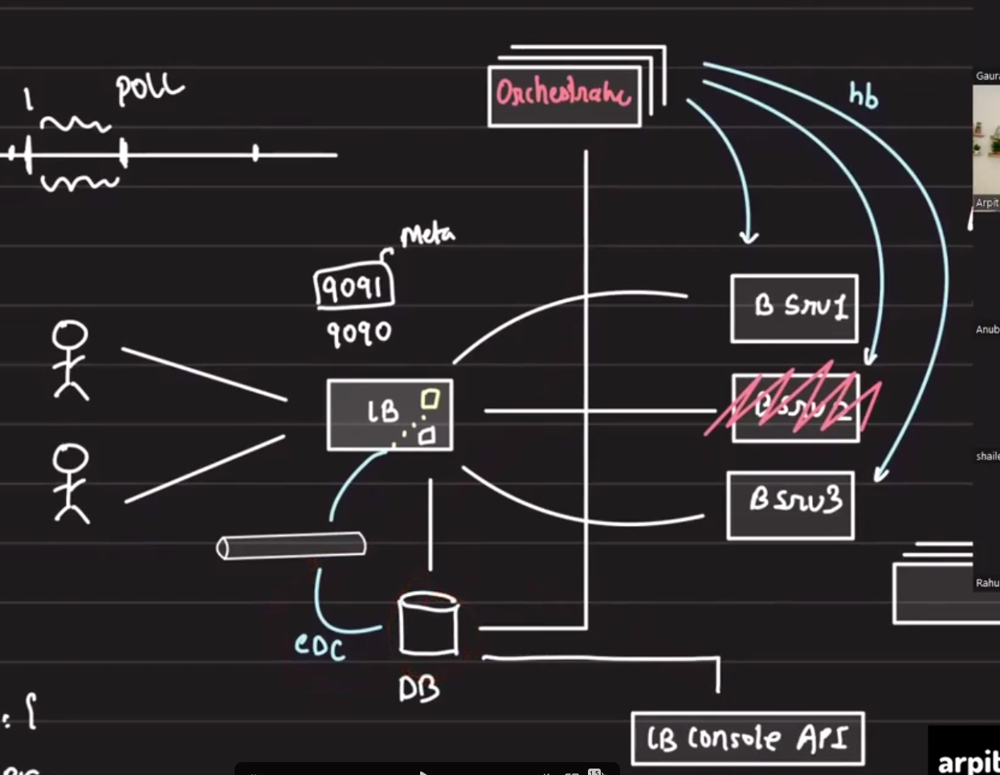
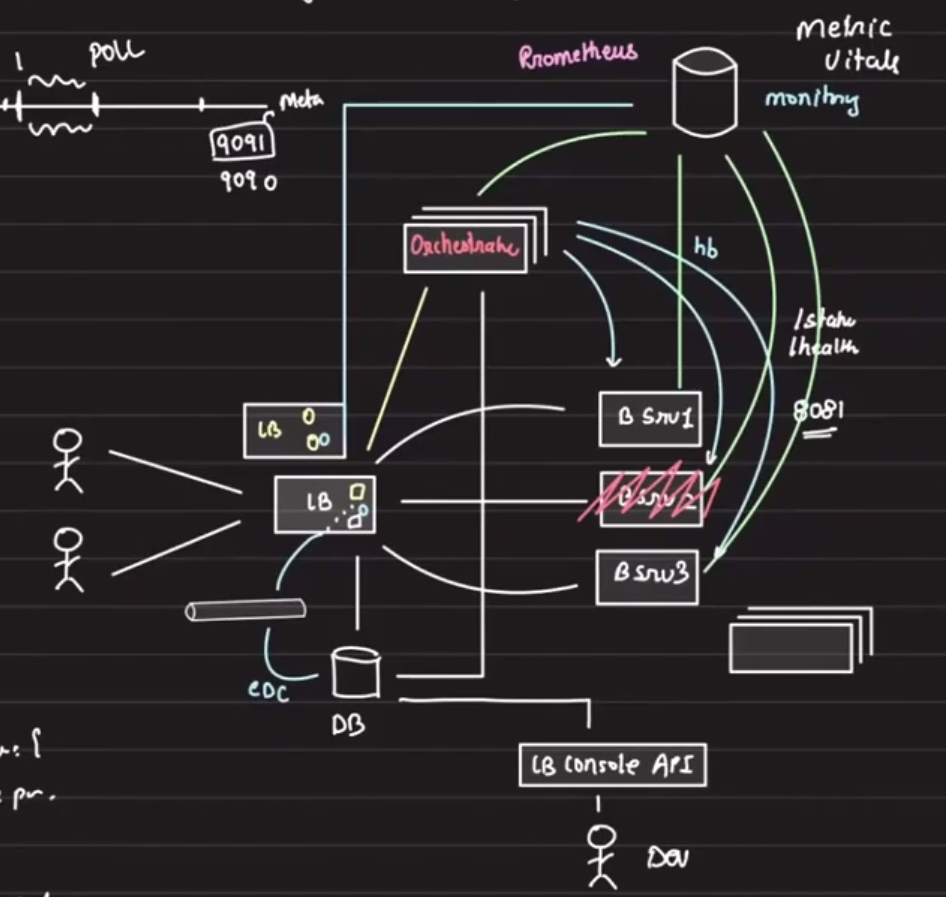
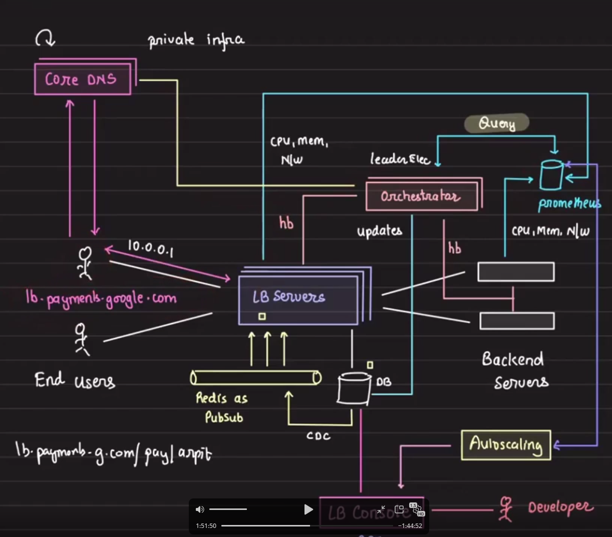

# Distributed Systems

## Index

- [Agenda](#agenda)
- [Overview](#overview)
- [Load Balancers](#load-balancers)
- [Load Balancing Algorithms](#load-balancing-algorithms)
  - [Round Robin](#round-robin)
  - [Weighted Round Robin](#weighted-round-robin)
  - [Least Connections](#least-connections)
- [Designing Load Balancers](#designing-load-balancers)
- [Day 0](#day-0)
- [TCP Connection Challenge](#tcp-connection-challenge)
- [LB Configurations](#lb-configurations)
- [Reactive Configuration Update](#reactive-configuration-update)
- [Monitoring and Autoscaling](#monitoring-and-autoscaling)
- [DNS for Multiple Load Balancers](#dns-for-multiple-load-balancers)
- [Final Design](#final-design)

## Agenda

- Approaching distributed systems
- Designing load balancers
- Remote and distributed locks
- Synchronizing consumers

## Overview


The best and worst thing about distributed systems is: *"Anything that could go wrong, will go wrong."*

## Load Balancers



Advantages of load balancers:

- Fault tolerance
- Avoiding over-clocked servers

## Load Balancing Algorithms

### Round Robin

- Distributes load iteratively
- Used when we have uniform infrastructure and uniform traffic patterns



### Weighted Round Robin

- Distributes the load iteratively according to weights
- Used when we have non-uniform infrastructure



### Least Connections

- Picks the server having the least connections from the load balancer
- Used when response times have a large variance
- Useful for analytics

## Designing Load Balancers

Requirements:

- Balance the load
- Tunable algorithm
- Scale beyond one machine

Terminology:

- `LB server`
- `Backend server`

Brainstorm:

- LB configurations
- Monitoring
- Availability
- Extensibility

## Day 0

The client will connect to the load balancer over a TCP connection. The load balancer will connect to the backend server over a TCP connection.

The load balancer needs to map which source TCP connection corresponds to which destination TCP connection.

Flow:

`client -> LB ---(request)---> LB -> backend server ---(response)---> LB`



In this implementation, the load balancer will have 2x the number of TCP connections.

To implement this:

1. Start three processes on a single machine on multiple ports, which will act as backend servers.
2. Start another process that will act as the load balancer server.
3. Then mimic the load balancing algorithms.

## TCP Connection Challenge

Now the challenge is creating 2x TCP connections. This becomes the bottleneck.

Brainstorm:

- LB configurations
- Monitoring
- Availability
- Extensibility

## LB Configurations

How would we store the load balancer configuration?

Bare minimum:

- Backend servers and their IPs
- Balancing algorithm
- A health check endpoint

```json
{
  "backends": [
    "ip1": "server1",
    "ip2": "server2"
  ],
  "algorithm": "round-robin",
  "healthCheckEndpoint": "/health"
}
```

These configs will be stored in the database.

The orchestrator will fire continuous health checks to know if a backend service is up or not.



If a backend server crashes, the orchestrator will fire a health check to that backend server and, after receiving a failed response, update the database and remove the config for that backend server.

Now, how would the load balancer know that a backend server is down and that the config was updated in the database?

## Reactive Configuration Update

Suppose a user changes LB configs, adds more servers, or the orchestrator updates the database about a backend being down.

In the load balancer:

- The main process runs on port `9091`.
- Another process runs on port `9092` as a meta port.

We can add realtime pub/sub between the database and the load balancer. Whenever there is a change in the database, via CDC it pushes an event to a Redis pub/sub channel, and the load balancer config is updated.

This makes the implementation reactive.



## Monitoring and Autoscaling

Now we need someone to keep an eye on the load balancer server as well.

The orchestrator needs to know when to add more load balancer servers, or when load reduces and it should reduce the number of load balancer servers.

- We need a telemetry agent running in the load balancer server pushing metrics and vitals to Prometheus for monitoring.
- All vitals for backend servers and load balancer servers should be pushed to Prometheus via the telemetry agent.



## DNS for Multiple Load Balancers

If we have multiple load balancers, they will have multiple IPs.

- How will the client know which load balancer server to connect to?

We can spin up a DNS.

There is a special type: CoreDNS. This is private to the infrastructure.

## Final Design



The orchestrator does the health checks for backend servers and load balancer servers and pushes metrics to Prometheus.

If anything goes wrong, the orchestrator will spin up another instance of a backend server, change the database, and from there push to Redis pub/sub via CDC so the update is applied to the load balancer.

In parallel, the orchestrator will update CoreDNS to refresh the IP address of the new load balancer server if required.
