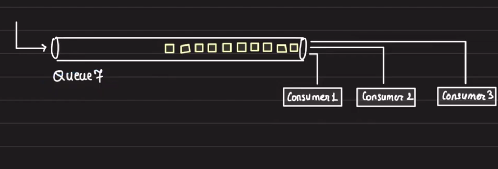
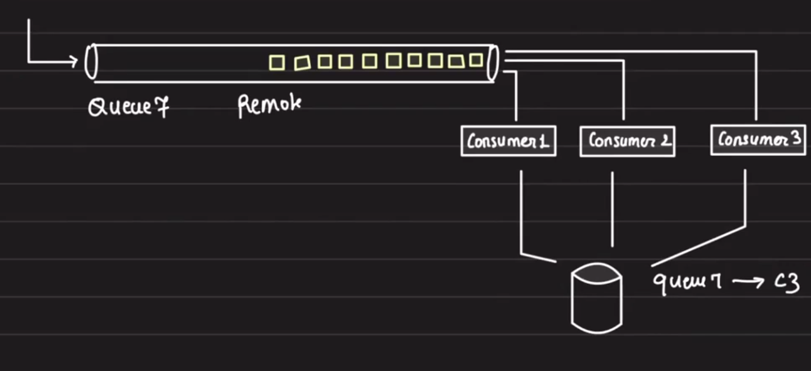
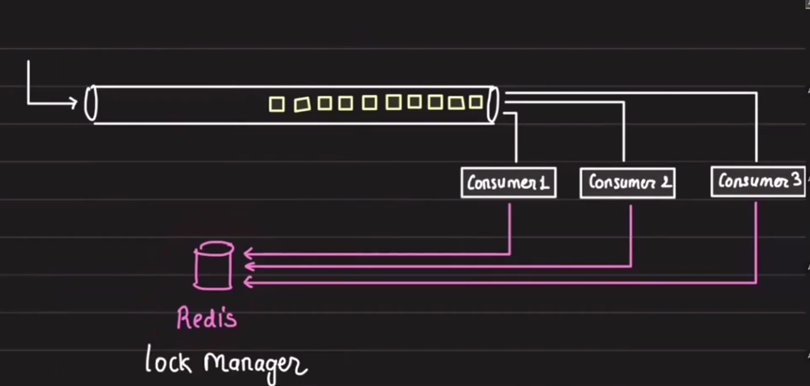

# Remote Locks

## Index

- [Overview](#overview)
- [Remote Lock Use Case](#remote-lock-use-case)
- [Brainstorm](#brainstorm)
- [Approach 1](#approach-1)
- [Redis and REDLOCK](#redis-and-redlock)
- [Implementation](#implementation)
- [Real-World Usage](#real-world-usage)
- [Why This Matters](#why-this-matters)

## Overview

Remote locks are managed by a central machine (lock manager).

- Multiple threads synchronize through `Mutex` and `Semaphore`.
- Multiple processes synchronize through `Disk`.
- Multiple machines synchronize through `Remote Lock`.

Example: `apt-get upgrade` cannot be run twice concurrently.

## Remote Lock Use Case

To understand remote locks better, let’s synchronize multiple consumers over an unprotected remote queue.


- The queue is unprotected.
- We want one consumer to make a call to the queue at a time.

## Brainstorm

- Locking
  - Core properties

We want exclusivity: when one consumer reads, other consumers should not read at the same time.



- This queue is a `Remote Queue`.
- Since it is a remote queue, every consumer must make an API call to the queue to read the data.
- We want only one consumer to read the data at a time.

## Approach 1

You create a database where you store the current lock owner:

```json
{
  "Queue7": "consumer1"
}
```

This tells which consumer is allowed to read the data.

- When `consumer1` reads the data, it will update the database and remove its name.



- What if `consumer1` took the lock, and before releasing it, it got killed?

Solution:

- Introduce TTL.
- If the key is not updated after expiry, it will automatically delete the key.

**Redis gives us this: `REDLOCK`.**

## Redis and REDLOCK

### Consumer pseudocode

```text
ACQ_LOCK()
READ_MSG()
RELEASE_LOCK()
```



Requirements from the lock manager:

- Atomic operations: so that two machines cannot acquire the lock at the same time.
- Atomic expiration: avoid peripheral locking.

So, what DB? Redis, DynamoDB.

Redis is a popular choice because it is in-memory and fast.

## Implementation

Set the key in Redis to indicate which consumer holds the lock and reads the message.

Example: `queue7: consumer2 [TTL: 300]`

```python
def acquire_lock():
    consumer_id = get_my_id()
    while True:
        v = redis.setnx(q, consumer_id, expiration=300)  # this command of Redis is atomic
                                                       # setnx: set the key if not exist
        if v == 1:
            return
        else:
            continue


def release_lock(q):
    consumer_id = get_my_id()
    v = redis.get(q)
    if v == consumer_id:
        redis.delete(q)
```

## Real-World Usage

`MongoDB` transactions use remote locks on involved rows.

Distributed Locks: `REDLOCK`

Idea: what we did in remote lock, just distribute it.

Five master nodes of Redis, no replication, all independent.


Acquire lock:

- The client goes through 5 nodes, trying to `ACQ_LOCK` with timeout.
- If the lock is acquired on more than 50% of nodes, then it is `ACQUIRED`.
- Otherwise, release the lock on acquired instances and return `FAILED`.

## Why This Matters

This approach ensures exclusive access across consumers and machines, avoids duplicate processing, and provides a mechanism to recover when a consumer fails while holding a lock.
