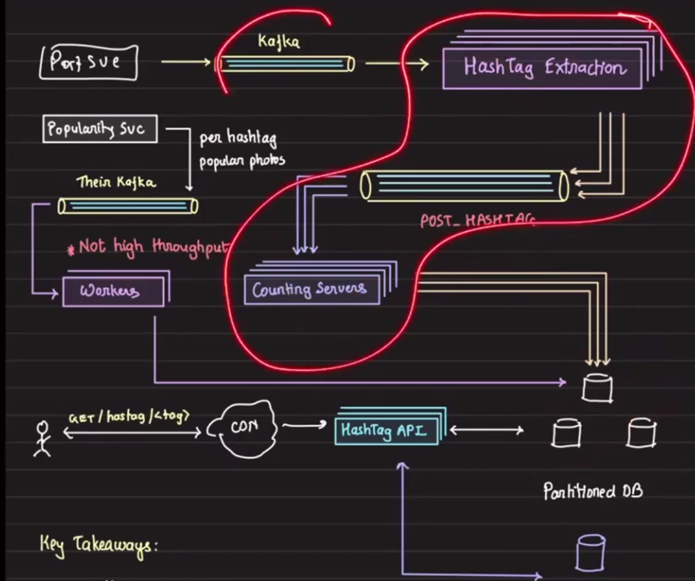
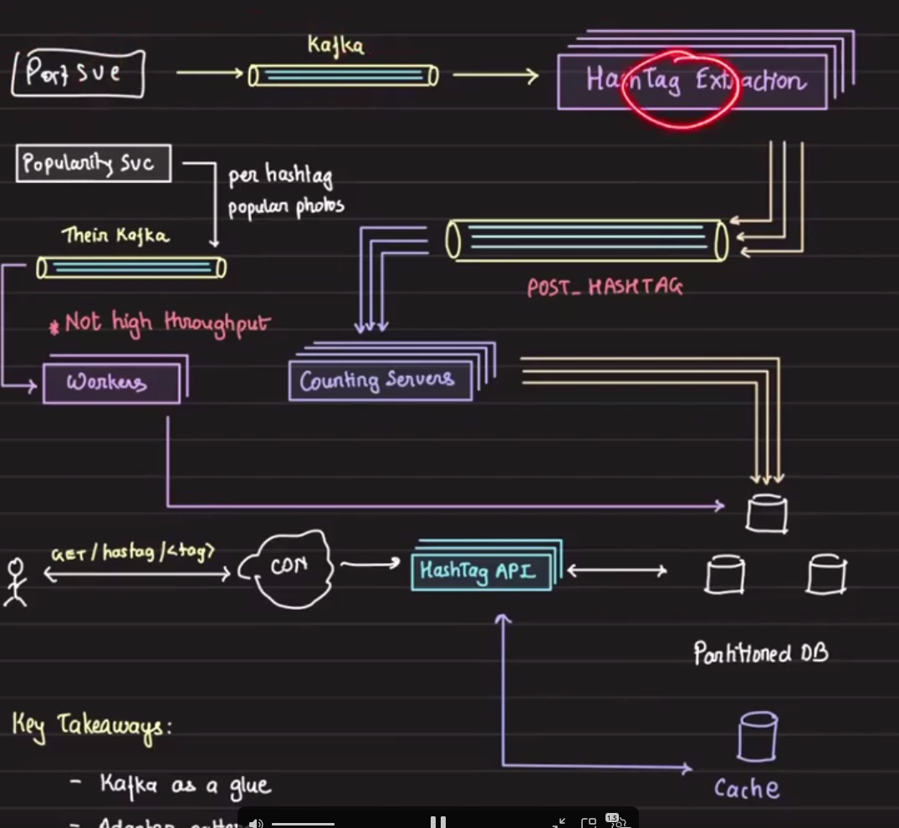
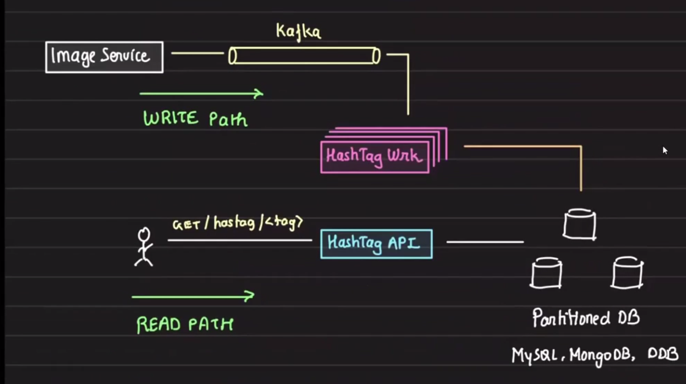
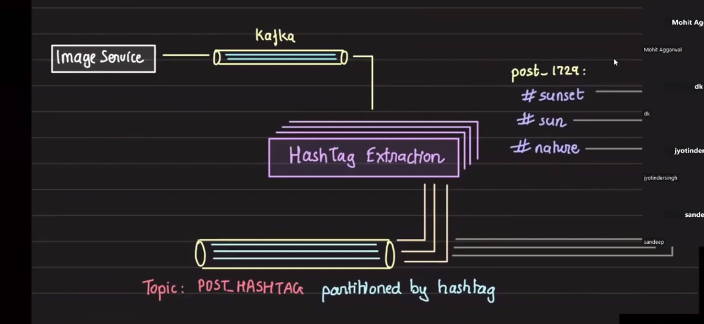
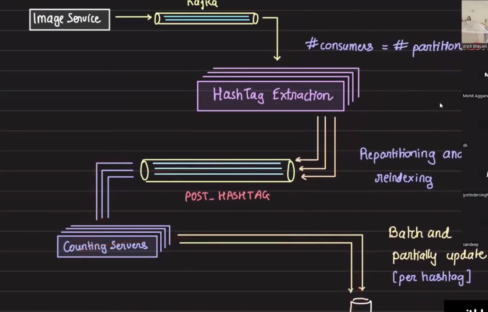
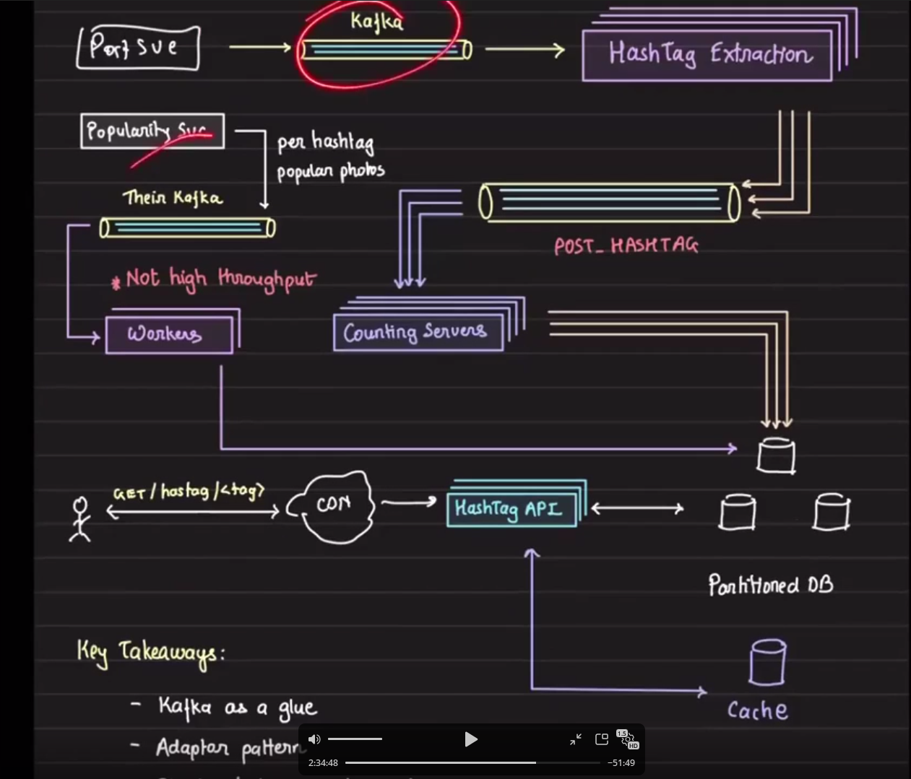

# Hashtag Service

## Index

1. Overview
2. Brainstorm
3. Top 100 storage options
4. How to update totals (pipeline)
5. Internal service communication
6. Final design (diagram references)
7. Challenges
8. Key takeaways

## Overview


- Millions of hashtags exist across the system.
- Assume there is a service that notifies us when it generates the "top" photos for a hashtag — this will be treated as a black box in our design.

## Brainstorm

- Storage
- Counting (very large volume)
- Inter-service communication (post service -> hashtag service)
- Very low latency / fast response times

## Top 100 storage options

There are two main ways to store the Top 100 posts for a hashtag.

### Option A — Store post IDs only

Example structure:

```json
{
    "tag": "sunset",
    "total": 100,
    "top100": [
        "postid1",
        "postid2",
        "postid3",
        "..."
    ]
}
```

Advantages:

- Lower storage usage
- Easier to cache (smaller payload)

Disadvantages:

- On render, the system must fetch each post's full data from the Post service (extra read calls)

### Option B — Store full post data (cached snapshot)

Example structure:

```json
{
    "top100": [
        { "id": "postid1", "caption": "...", "...": "..." },
        { "id": "postid2", "caption": "...", "...": "..." }
    ]
}
```

This will increase storage usage but can be acceptable since it's limited to Top 100 items per tag.

Advantages:

- Fast retrieval (single read returns ready-to-serve data)

Disadvantages:

- Higher storage cost
- Lower consistency: when a post's likes, caption, or other fields change, the Top 100 snapshot must be updated as well

## How to update total number of photos (pipeline)

We already have a `Post` publishing pipeline that produces Kafka events partitioned by `user_id`. We can leverage Kafka and an adapter stage to re-partition by hashtag so we can batch and count efficiently.

High-level flow:

1. `PostSVC` publishes `POST_PUBLISH` events to a Kafka topic partitioned by `user_id`.
2. An adapter consumer reads `POST_PUBLISH` events, extracts hashtags (using a `hashtag extractor` service), and publishes new events to a `POST_HASHTAG` topic partitioned by hashtag.
3. Counting workers consume from `POST_HASHTAG` and update counts and Top 100 entries in batches.

Notes:

- We will not have one partition per hashtag; partition assignment is hash-based (for example: `partition = get_hash(hashtag)`).
- When handling high-throughput event streams, leverage batching instead of issuing `count++` per individual event to avoid database hot-writes.
- This adapter stage is an example of the standard Adapter pattern: it transforms the event shape and re-partitions the stream for downstream consumption.

## Internal service communication

This highlighted part is the classic Adapter in our case.



### Diagram: Post publishing start

Final flow starting point: `PostSVC -> Kafka` (partitioned by `user_id`).



- A CDN can cache the JSON response for the Top 100 photos of a hashtag to accelerate reads.



A good optimization is to separate and optimize the read and write paths.

## Challenge

- The `POST_PUBLISH` topic is partitioned by `post_id` or `user_id`. For efficient batching and counting per hashtag, we require events partitioned by hashtag.
- If a post contains multiple hashtags (e.g., 8 hashtags), we must create one event per hashtag so downstream consumers can batch per hashtag.

Adapter responsibilities:

- Read `POST_PUBLISH` events from Kafka.
- Extract all hashtags from the post.
- Publish one `POST_HASHTAG` event per hashtag to a topic partitioned by hashtag.



The `POST_HASHTAG` topic is partitioned by hashtag. Counting servers then consume from the `POST_HASHTAG` topic and update counts in batches.



Final design (diagram):



## Key takeaways

- Use Kafka as the glue between services for decoupling and streaming.
- Use the Adapter pattern to transform events and re-partition streams.
- Effective batching is essential for scalable counting and write efficiency.
- Optimize read and write paths separately (cache Top 100, update via background workers).
