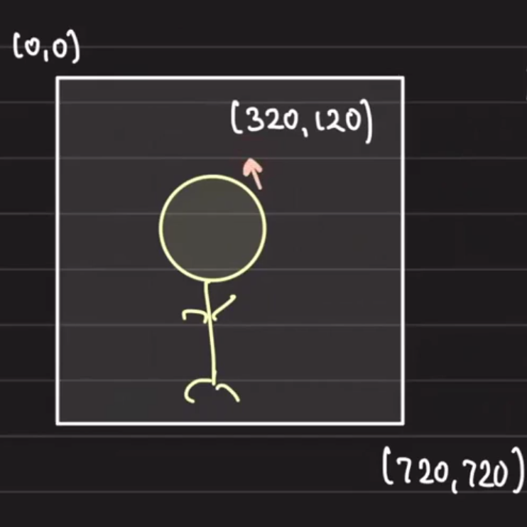
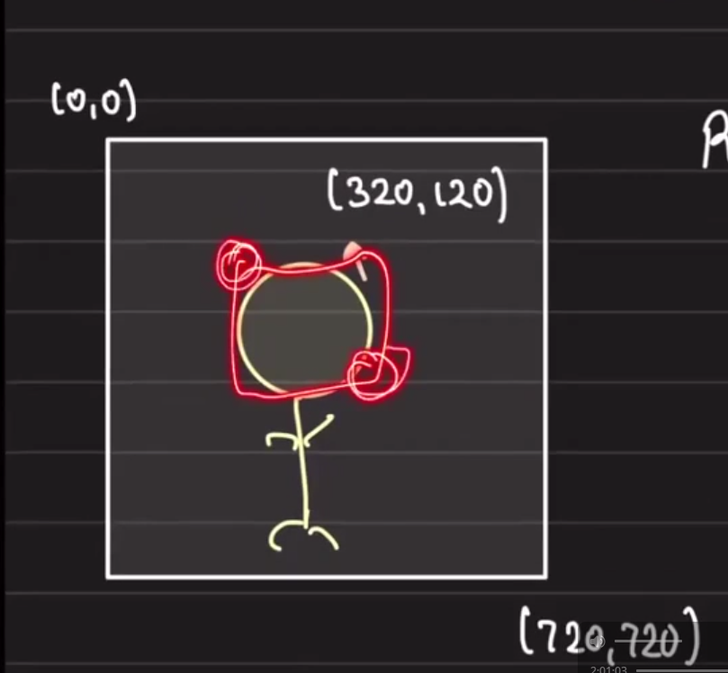

# Gravatar: Designing Profile Photo Upload and Serving at Scale

## Table of Contents

* [Overview](#overview)
* [Requirements](#requirements)
* [How Images Are Served](#how-images-are-served)
* [Gravatar Design](#gravatar-design)
* [Data Model](#data-model)
* [Active Photo Selection](#active-photo-selection)
* [Consistency and Transactions](#consistency-and-transactions)
* [API Design](#api-design)
* [Photo Rendering](#photo-rendering)
* [CDN Integration](#cdn-integration)
* [On-Demand Photo Optimization](#on-demand-photo-optimization)
* [Key Takeaways](#key-takeaways)

## Overview

This document covers the system design for a Gravatar-like service that allows users to upload, manage, and serve profile photos at scale.

## Requirements

- User can upload multiple pictures
- User can mark one picture as active
- The active picture is returned as part of the response
- Support on-demand image optimization (resizing, transformations)
- Serve photos efficiently at scale using CDN

## How Images Are Served


### Static Image Serving

When a request hits the server:

1. The server reads the URL.
2. It reads the file from the server path.
3. It sends the response.

### S3-backed Image Serving

1. The server reads the URL.
2. It reads the file from S3.
3. It sends the response.


- This is effectively a proxy from S3.

## Gravatar Design

Gravatar is a single embeddable URL for a profile picture.

`https://gravatar.com/{hash(email)}`

If `hash("abcd@gmail.com") = oeafd213`, then:

```html

```

### Requirements

- User can upload multiple pictures.
- User can mark one picture as active.
- The active picture should be returned as part of the response.


## Data Model

### Initial Approach

#### User Table

| Column | Notes |
| ------ | ----- |
| id     | Unique user identifier |
| email  | User email address |

#### Photos Table

| Column    | Notes |
| --------- | ----- |
| id        | Unique photo identifier |
| usr_id    | Foreign key to User |
| is_active | Boolean flag for active photo |

**Design Note:** Initially, we avoid storing the hash of the email due to the principle: "what can be derived should not be stored."

### Gravatar Lookup Flow

If someone requests `https://gravatar.com/oeafd213` (where `oeafd213 = hash("abcd@gmail.com")`), we need to map that hash back to the user's active photo.

Query attempt:

```sql
SELECT *
FROM PHOTOS
JOIN USERS ON PHOTOS.USR_ID = USERS.ID
WHERE HASH(USERS.EMAIL) = 'oeafd213'
  AND PHOTOS.IS_ACTIVE = TRUE;
```

### Pain Points

- **Query performance:** The `WHERE` clause computes `HASH(EMAIL)` on every row, resulting in poor index utilization
- **Index limitations:** Cannot efficiently index on computed values without stored hash
- **Risk:** Full table scans on large datasets

### Optimized Schema

Store the email hash to enable efficient lookups:

#### User Table (Revised)

| Column | Notes |
| ------ | ----- |
| id     | Unique user identifier |
| email  | User email address |
| hash   | Pre-computed hash of email for fast lookups |

#### Photos Table (Revised)

| Column    | Notes |
| --------- | ----- |
| id        | Unique photo identifier |
| user_id   | Foreign key to User |
| is_active | Boolean flag for active photo |

## Active Photo Selection

When a user marks a different photo as active, we need to track and update this carefully.

### Initial Update Flow (Problematic)

```sql
UPDATE PHOTOS SET is_active = FALSE WHERE id = ? AND is_active = TRUE;
```

```sql
UPDATE PHOTOS SET is_active = TRUE WHERE id = ?;
```

**Issues:**
- These queries are separate and unsynchronized—either could fail independently
- If the second query fails, the user has no active photo
- We need transactional guarantees

## Consistency and Transactions

### Transactional Approach

Wrap both updates in a transaction:

```sql
BEGIN TRANSACTION;
UPDATE PHOTOS SET is_active = FALSE WHERE id = ? AND is_active = TRUE;
UPDATE PHOTOS SET is_active = TRUE WHERE id = ? AND user_id = ?;
COMMIT;
```

**Security Fix:** The second query now includes `AND user_id = ?` to prevent unauthorized photo updates.

### Query Optimization

The most frequent query in the system is retrieving the active photo:

```sql
SELECT * FROM PHOTOS
JOIN USERS ON PHOTOS.user_id = USERS.id
WHERE USERS.email = ?
  AND PHOTOS.is_active = TRUE;
```

**Optimization:** Add `active_photo_id` to the User table to denormalize this lookup.

#### Optimized User Table

| Column         | Notes |
| -------------- | ----- |
| id             | Unique user identifier |
| email          | User email address |
| hash           | Pre-computed hash of email |
| active_photo_id | Foreign key to active Photo |

#### Simplified Query

```sql
UPDATE USERS SET active_photo_id = ? WHERE id = ?;
```

**Benefits:**
- Single query instead of complex join
- No need to mark old photos as inactive
- Eliminates UPDATE on Photos table entirely


## API Design

### API Endpoint

Base URL: `https://api.gravatar.com`

### Photo Upload Flow

#### 1. Request Upload

User requests a new photo upload:

```
POST /photos/upload/prepare
```

Response: Signed S3 URL

#### 2. Generate Signed URL

The photo upload service:
- Generates a random photo ID
- Creates a signed URL for S3: `s3://gravatar-images/{user_id}/{photo_id}`
- Returns the signed URL to the client

#### 3. Upload to S3

User uploads the photo directly to the signed S3 URL

#### Storage Schema

```
s3://gravatar-images/{user_id}/{photo_id}
```

## Photo Rendering

### Retrieve Active Photo

**Endpoint:**

```
GET https://api.gravatar.com/photos/{hash}
```

**Flow:**

1. Extract hash from URL
2. Query database:
   ```sql
   SELECT active_photo_id FROM USERS WHERE hash = ?
   ```
3. Retrieve file from S3: `s3://gravatar-images/{user_id}/{photo_id}`
4. Return image response

## CDN Integration

To serve photos at scale with low latency, configure a CDN to cache at the edge.

### CDN Configuration

```
gravatar.com → (origin) → api.gravatar.com/photos
```

**Request Flow:**

```
https://gravatar.com/{hash}
  ↓ (if cache miss)
https://api.gravatar.com/photos/{hash}
```

**Benefits:**
- Global distribution via edge locations
- Cache hit on subsequent requests for same hash
- Reduced origin load
- Low-latency delivery worldwide


## On-Demand Photo Optimization

Support dynamic image transformations via URL parameters.

### Query Parameter Approach

```
https://gravatar.com/{hash}?w=32
```

Where `w=32` requests a 32×32 pixel image.

### CDN Transformation Flow

When a request with transformation parameters arrives:

1. **Cache lookup:** Check if transformed version exists in CDN
2. **On miss:**
   - Fetch original from origin
   - Apply transformation (resize, format conversion, etc.)
   - Cache the result
   - Return response
3. **On hit:** Return cached transformed image

### Implementation

**Supported tools:** ImageMagick is optimal for CPU-intensive image transformations

**Deployment:** Offload transformation to cloud provider CDN (most providers offer this out-of-the-box)

**Note:** Transformations are synchronous and CPU-intensive; keep on origin server, not in async workers.

## Key Takeaways

1. **Denormalization for performance:** Store `active_photo_id` on User table for O(1) lookups
2. **Transactions for safety:** Use explicit transactions when multiple writes must be atomic
3. **Authorization:** Always include user context (user_id) in update queries
4. **CDN for scale:** Edge caching dramatically reduces latency and origin load
5. **On-demand optimization:** CDN-native transformation handles resizing without origin bloat


# Tagging People in Photos

## Overview

System design for a feature that allows users to tag other people in photos.

## Requirements
- who can tag me in their photos? (authorizations)
- max limit of poeole tag in a photo
    - if 5? can be stored in a single array [.....]
    - if 10k? then need seeparet enteries for each as it will bloat the db
- notification and throttling
- self removal from the tagged photos
- face recognition and suggestions of names based on the photo [SLA here as this needs to be qucik]
- profile/activity [DB]
- feed

# Tag peopel in photos



we store Relative positioning: 
location: (320/720, 120/720) 

allows us to ehandle multipel devices on demand trafsformation 

LTRB: left-top-right-bottom



# Schema

posts_tags
- post-id
- user_id
- locatoin

# services to interact with
- search
- face detection
- locaiton
- notiication
- RBAC (autohozed to tag? )

Key compoenet for extensibilty: Kafka


