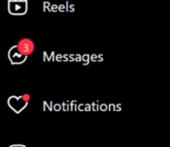
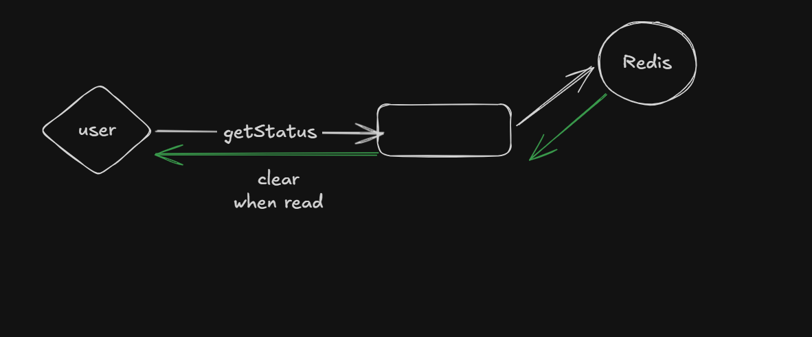
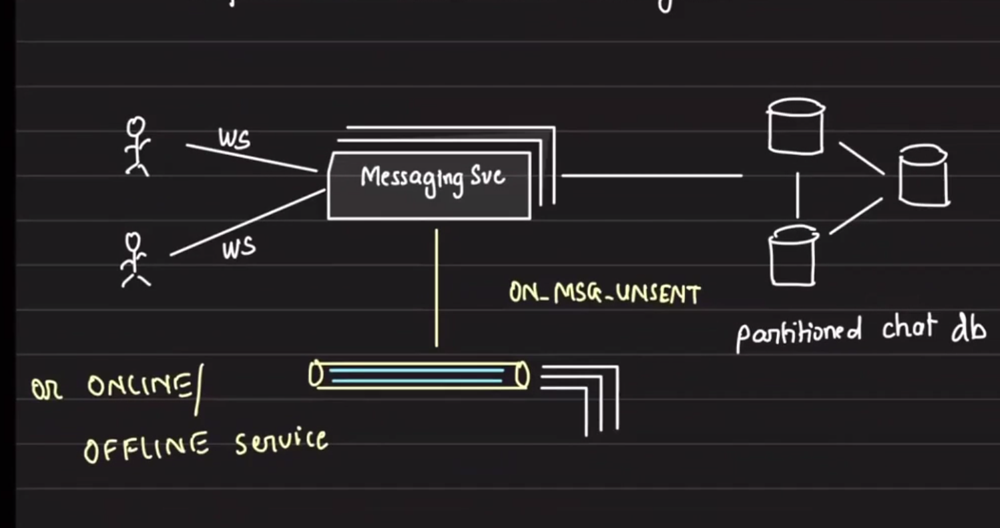
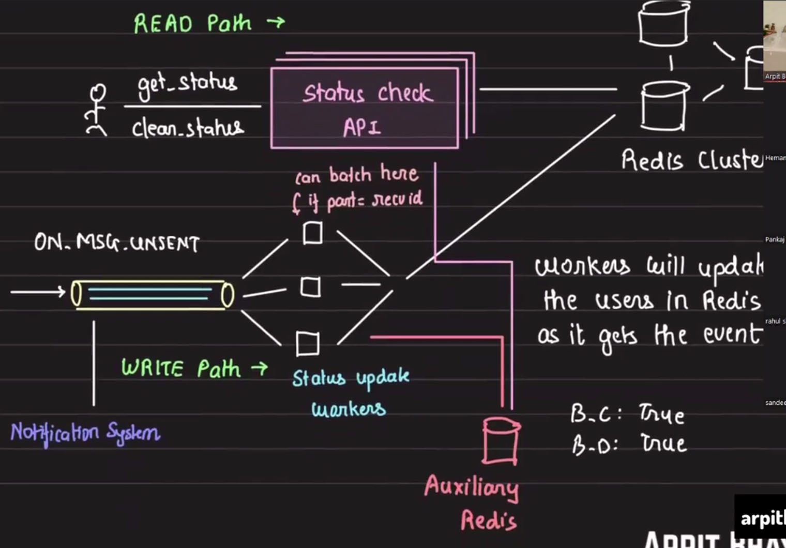

# Newly Unread Indicator

## Table of Contents
- [Overview](#overview)
- [Requirements](#requirements)
- [Core Concept](#core-concept)
- [Data Model](#data-model)
- [Architecture](#architecture)
- [Data Flow](#data-flow)
- [Scaling Considerations](#scaling-considerations)
- [Trade-offs](#trade-offs)

## Overview

We need to inform the user about the presence of new messages, not just unread or unaccepted messages.



The indicator represents newly unread messages. For example:
- `3` means there are 3 newly unread message senders.
- A user may have hundreds of unread messages, but the indicator only counts newly received conversations.

## Requirements

- Near real-time updates.
- Update on new messages received by the user.

## Core Concept

The goal is to avoid scanning all messages for unread state.

- We do not care about full message contents for this indicator.
- The naive query over messages is slow and requires multiple indexes.
- This is inefficient when the only requirement is a newly unread conversation count.

Either query the source of truth directly or precompute and store the data.

## Data Model

We can store the state as a per-user set of unique senders:

- `user_id` -> `unique_users_set<sender_id>`

When the user clicks the messages icon, delete the set.


This approach works at small scale.

### Storage choice

Which database is best for this data?

- A key-value store
  - `REDIS`



The read path is handled by Redis.

## Architecture

WebSockets know whether a user is connected or not, and this helps determine undelivered messages.



Input to this system is the Messaging Service.

The event `ON_MSG_UNSENT` becomes the input to our system.

Each event contains:

```json
{
  src,
  dest,
  msg
}
```

We want the count of unread senders grouped by unique users:

- `user_ids: {u1, u2, u3}`



Redis will contain the sender set.
When the user hits `get_status` API, we delete the entry from the set.

## Data Flow

### Write path

- New message arrives.
- Message service emits `ON_MSG_UNSENT`.
- The system updates Redis.

### Read path

- Client calls `get_status`.
- The system reads the sender set from Redis.
- The system clears the status after the read.

## Scaling Considerations

The Redis cluster is already handling a large number of reads and concurrent writes.

Questions for the write path:

- Is this causing unnecessary operations on the Redis cluster?
  - `get_status`: required.
  - clear status: required.

### Duplicate writes

When an event arrives for `ON_MSG_UNSENT`, the system updates Redis.
If a sender is already in the set, the state does not change.

Example:
- `user_a: {B, D}`
- If `B` sends another message, the set remains `{B, D}`.

To reduce I/O on the main Redis cluster, use an auxiliary store.

### Auxiliary state

Store sender state in auxiliary Redis keys:

- `A_B: TRUE`
- `A_D: TRUE`

Before updating the main set, check the auxiliary Redis state and decide whether the main Redis cluster needs an update.

This is a system design pattern: adding an `AUXILIARY DATABASE` to reduce main database I/O.

## Trade-offs

- If the auxiliary Redis is down, the system can still write to the main Redis cluster.
- Worst case: out of N writes, only one call goes to the main Redis again.
 
