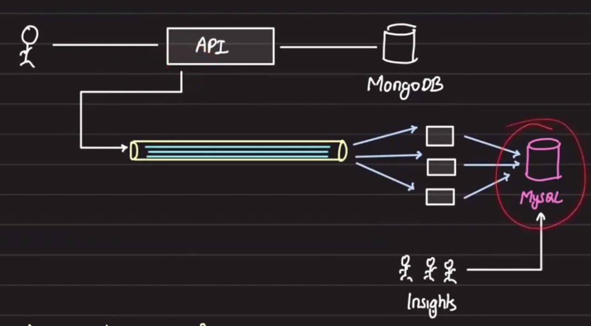
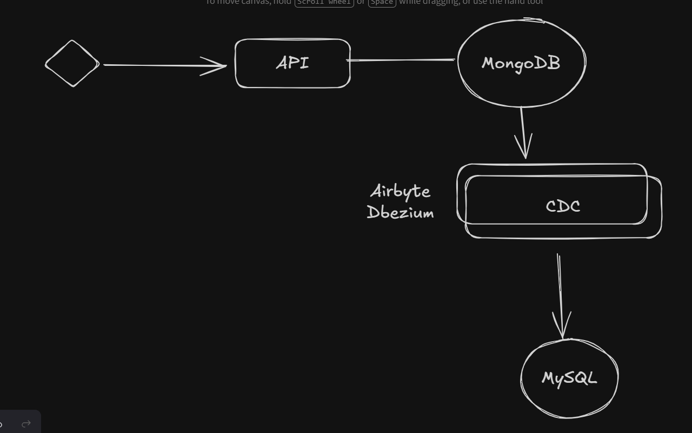
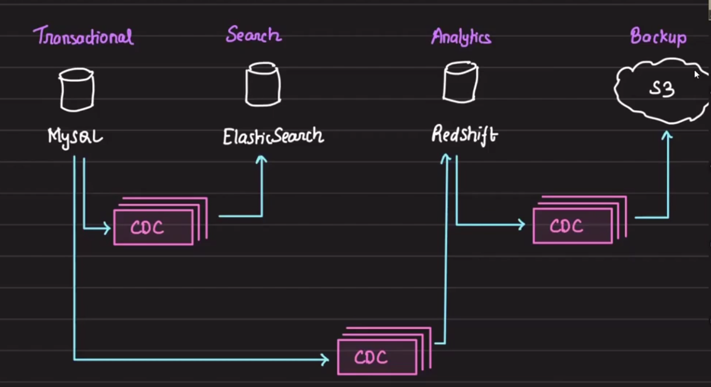
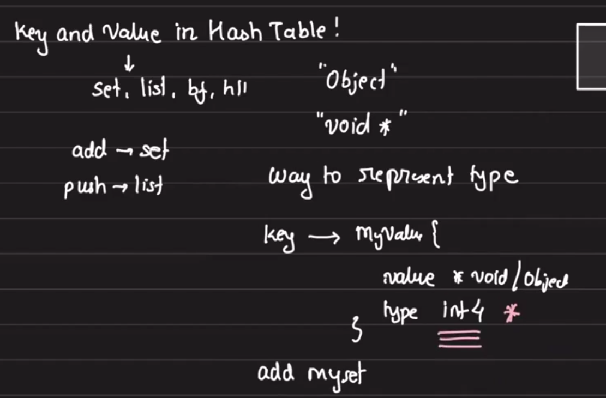
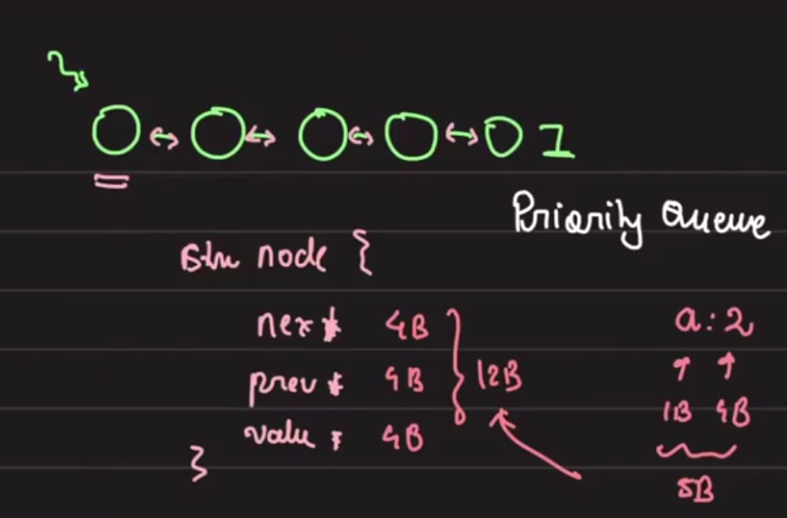
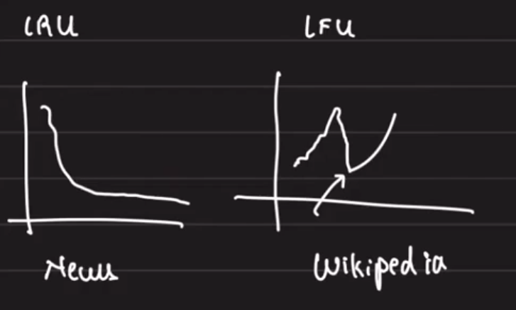
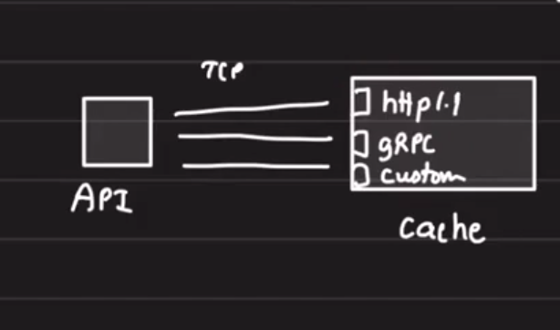
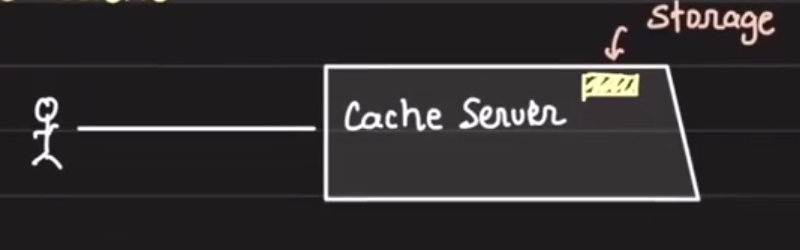

# Storage Engines

## Agenda
- ETL and tiered storage
- Designing a distributed cache

## Table of Contents
- [ETL and Tiered Storage](#etl-and-tiered-storage)
- [Change Data Capture (CDC)](#change-data-capture-cdc)
- [Designing a Distributed Cache](#designing-a-distributed-cache)
  - [Requirements](#requirements)
  - [Brainstorm](#brainstorm)
  - [Allocation](#allocation)
  - [Memory Management](#memory-management)
  - [Eviction](#eviction)
  - [Communication](#communication)
  - [Cache Architecture](#cache-architecture)
  - [Cache Full Handling](#cache-full-handling)
  - [TTL Handling](#ttl-handling)
  - [Concurrency](#concurrency)
- [Key Takeaways](#key-takeaways)

## ETL and Tiered Storage
Say we are building a multi-user blogging application in which the data is stored in a transactional database like MongoDB.

Our application grew big and now we want detailed reporting, stats, and a dashboard. For that, we have a dedicated insights team.

`But the insights team only knows SQL.`
So, how will they build dashboards on MongoDB when they only know SQL?

One way would be to send `events` from API to Kafka, then process them in a worker and put them into some SQL state.



But is this the best way?
- events have context of the application
- events might not contain all the data
- everything might not have an event
- what if changes are done but sending the event failed -> `Lacks Consistency`

## Change Data Capture (CDC)

`Change Data Capture` is a process of capturing changes to data in a database and storing them in a log or other data store.

Instead of relying on events, what if we rely on the source of truth?



CDC pulls the changes happening on the DB through its COMMIT_LOG/BIN_LOG and provides a way to:
- optionally transform the data
- put it into a "sink" database

You can also choose to do it manually or your own way. Just pick an appropriate sink, e.g. Kafka, SQL, Mongo (like the above case), Broker, and build your own complex transformations.

CDC is heavily used in building multi-tiered storage.



Before this we were using Kafka instead of CDC.

## Designing a Distributed Cache

### Requirements
- high throughput
- low latency
- distributed
- GET, PUT, DEL, TTL
- scale is default

### Brainstorm
- storage
- cache full
- eviction
- communication
- concurrency
- TTL



### Allocation
We can add set, list, bloom filter, etc. in our cache.

When we get an "add" operation: how would we know where to put it in set/list or what?

So in the value we can put an integer "type":
- 0: set
- 1: list
- 2: bloom filter

This is what Redis does. Along with this, Redis stores some other metadata as well.

### Memory Management
What happens when our heap memory is full?
- we will get SegFault

To make sure this does not happen, we have to cap the memory.
- to allocate we use `malloc(int size_alloc)`
- to free we use `free(void *ptr)`

So, how do you keep track of memory size allocated?
- when we do malloc, we have to do this computation
- but how would you do it?

We need a wrapper around malloc.

This is how Redis does `zmalloc` and `zfree`:

```
zmalloc(int b) {
    if(total_size + b > max_size) {
        return ERR;
    }

    o = malloc(b);
    total_size += b;
    return o;
}
```

This is how we know what total memory is consumed and put a restriction.


## Eviction

Most common eviction methods: LRU and LFU.

Where would we store the information like when a key was last used or what its frequency of use is? This we can store in the key value itself.

```
key -> myValue{
    value: *void/object
    type: int
    lru.bits: 28
}
```



This will require more memory.

Another way is `Random Eviction`.

### When to use LRU vs LFU

LRU:
- when we know this thing will not be significant in the future
- e.g. trends

LFU:
- when your keys are not recently used, do you want to evict them?
  - suppose it was accessed a lot of times in the past, but now accesses are not so much; still keep it for the future because of its past track record

- MAIN MANTRA: if some



## Communication



- HTTP: 3-way handshake and 2-way teardown
- gRPC: very complex, works on HTTP/2, does not terminate the connection
- Custom: Redis has its own custom protocol


## Formal Design

### Single Node Cache


```
object struct{
    type: list
    data: ....
}
```

The objects are stored in a hash table:

```
{
    key1: object{type list}
    key2: object{type set}
}
```

### Cache Server


Communication: TCP protocol - raw TCP/HTTP -> gRPC.
Every protocol has its own pros and cons, but we can support the three ways of communication for abstracting out the implementation.

Why should we use gRPC or custom/raw TCP?
- connection pool
- saving 3-way handshakes upon every request
- performant serialization and deserialization

## Cache is FULL, Eviction
Make place for newer entries.

- LRU: used in CDN, Google News
- LFU: Wikipedia
- Random: Redis

How would you find cache is full?
- cap on the max number of keys in the cache
- cap on cumulative size of the values inserted

`total_size += sizeof(obj)`
This is where we discussed Zmalloc.

You can trigger cache eviction only when you know the `Cache is full`.

## Handling TTLs
Every key has an associated expiry (absolute time).
Every cache server has a cleanup process running:
- refresh the expired keys -> garbage collector picks it up

How to efficiently find the key to be evicted?
- priority queue: key:expiry

Advantage: simple, consistent
Disadvantage: needs an additional data structure

Sampling: lazy deletion: `REDIS`
- sample 20 keys, free the expired ones
- repeat the process until sample < 25% expired

## Concurrency
When two or more update/delete operations on the same key come to the cache server at the same time.

Classic concurrency problem:
- pessimistic locking: one waits for the other to finish

```
ACQ_LOCK()
DELETE K
RELEASE_LOCK()
```

How to implement? mutex and semaphores, atomic variables to keep track of lock.

- optimistic locking: idea is to make updates conditional

```
only one of them will succeed
update a = 20 where a = 10
update a = 30 where a = 10
```

Implementation: Compare and swap
- `CAS(a, 20, 10): compare a to 20 when it is 10`
- `CAS(a, 30, 10): compare a to 10 when it is 30`

- single threaded: this is how Redis is built

Now, let's make the cache distributed.

## Key Takeaways
- CDC is a stronger source-of-truth approach than application events for analytics and multi-tier storage.
- Distributed cache design requires memory caps, eviction policies, TTL handling, and communication choices.
- Redis-style data typing, memory wrappers, and lock strategies are useful reference points.
