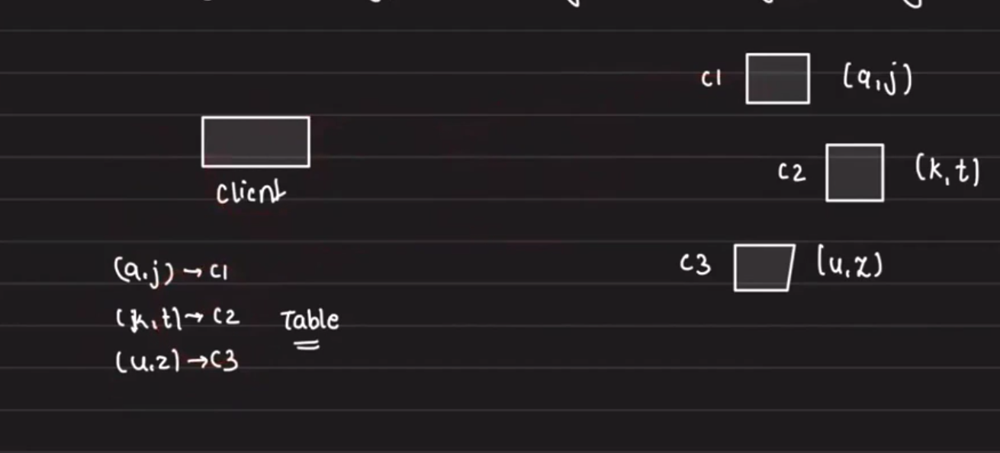
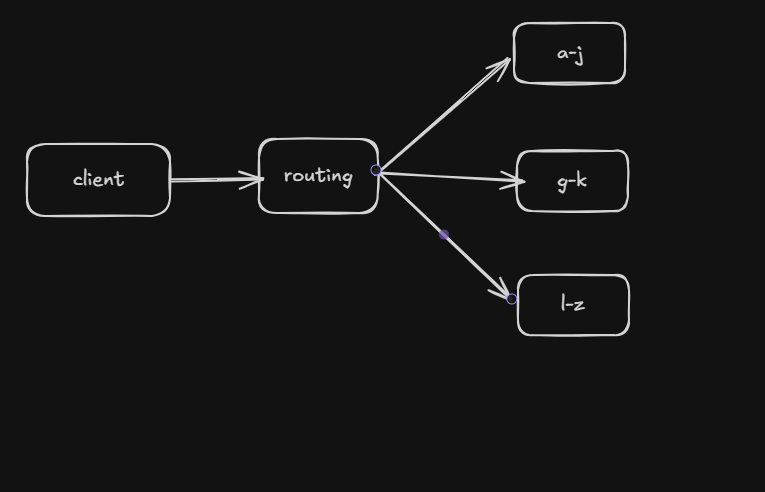
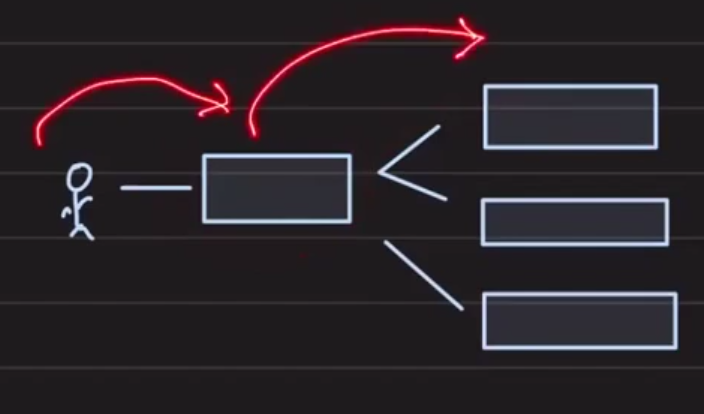
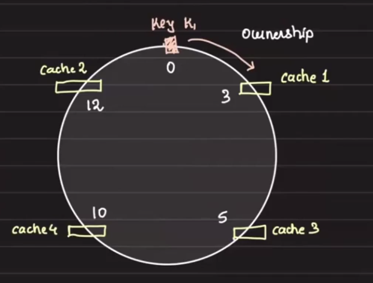
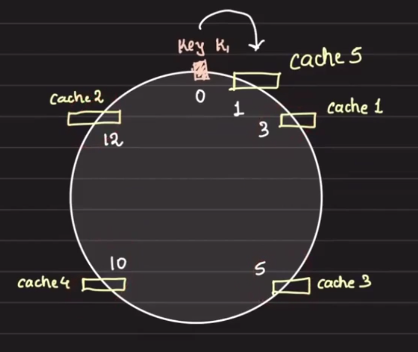
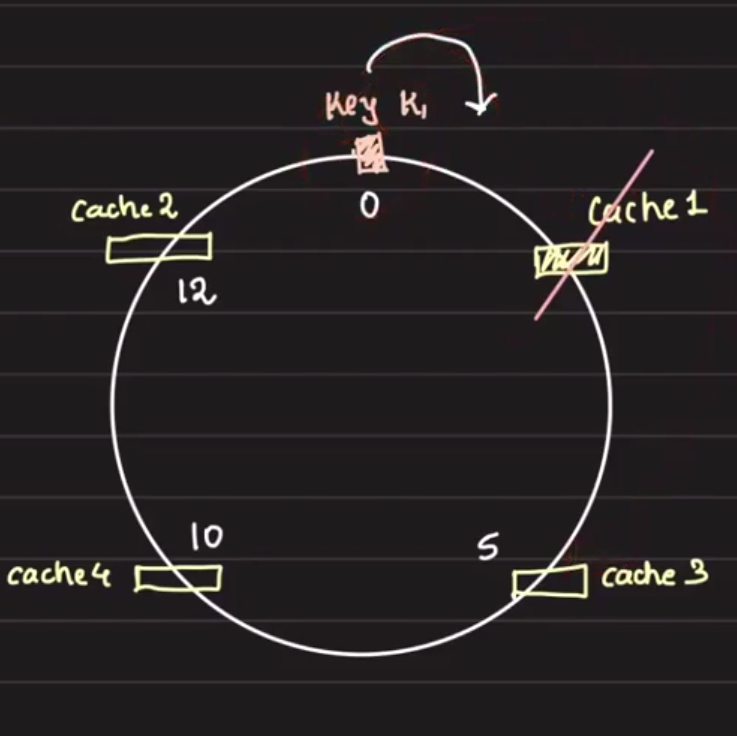

# Let's make the cache distributed

## Table of Contents
- [Overview](#overview)
- [Architecture](#architecture)
- [Routing models](#routing-models)
  - [Proxy-based routing](#proxy-based-routing)
  - [Direct client-to-server routing](#direct-client-to-server-routing)
  - [Blind client routing](#blind-client-routing)
  - [Client redirection](#client-redirection)
- [Availability](#availability)
  - [Hash-based routing issues](#hash-based-routing-issues)
  - [Consistent hashing](#consistent-hashing)
  - [Adding a node](#adding-a-node)
  - [Removing a node](#removing-a-node)
- [Distributed Hash Table](#distributed-hash-table)
- [High Availability](#high-availability)
- [Reliability](#reliability)

## Overview

Brainstorm:
- Storage
- Routing
- Availability
- Reliability
- Scaling

Suppose we distribute the cache across 3 servers and assign each server the keys it is responsible for.

## Architecture

This design assumes a distributed cache where each node holds a subset of the key space.

## Routing models

There are four main approaches for routing client requests when the cache servers are partitioned.

### Proxy-based routing

1. Client talks to the proxy.
2. Proxy routes the request to the correct cache server.

### Direct client-to-server routing

1. Client talks directly to the cache servers.
2. This saves one hop compared to proxy-based routing.

Disadvantage:
- Anytime the topology changes, the client must know the new mapping.

### Blind client routing

1. Client sends the request to the first server it finds.
2. That server checks the key and forwards the request to the correct server.

This is similar to how IDFS (Inter Directory File System) works.
Example: torrent.

### Client redirection

1. Client sends the request to a first server.
2. That server tells the client which server owns the key.
3. Client then sends the request to the correct server.

This is how DNS works.

> This is what `Redis` does.

## Availability

When each server owns a specific key range, adding or removing nodes requires redistributing ownership.
This is where the most famous algorithm comes into play: `consistent hashing`.

### Hash-based routing issues

Using a simple hash modulo approach can cause large data movement when nodes change.

Hash function: `hash = f(n) % 2`
Available caches: `cache0`, `cache1`

| Key | Hash | Server |
| --- | ---- | ------ |
| k1 | 0 | cache0 |
| k2 | 0 | cache0 |
| k3 | 1 | cache1 |
| k4 | 1 | cache1 |
| k5 | 1 | cache1 |
| k6 | 0 | cache0 |

Now add a new cache server: `cache2`

| Key | Hash | Server |
| --- | ---- | ------ |
| k1 | 0 | cache0 |
| k2 | 2 | cache2 * |
| k3 | 1 | cache1 |
| k4 | 1 | cache1 |
| k5 | 0 | cache0 * |
| k6 | 2 | cache2 * |

Result:
- `50%` of the data must move.

### Consistent hashing

Consistent hashing is used for determining ownership at the routing layer.

### Adding a node

When adding a new cache server, only the keys in the affected range move.

For example, adding `cache5` next to `cache1` in the ring causes keys previously owned by `cache1` in the new range to move to `cache5`.
Only the range from `12` to `1` is moved; the rest of the keys remain untouched.

- When a new cache server is added, the server will initially miss on all keys.
- To warm the new node, take a snapshot of the data from the previous owner and store it on the new node.
- Then remove the keys from the original server as ownership changes.

### Removing a node

Suppose we remove `cache1`.

- Keys that previously mapped to `cache1` now move to the next server, e.g. `cache3`.
- Only that range is moved; the rest of the key space is untouched.

Cases:
- Graceful shutdown: move all keys from `cache1` to `cache3` before shutting down.
- Abrupt outage: new requests go to `cache3`, old data is lost, but movement is still minimal.

## Distributed Hash Table

A distributed cache under the covers is a `D.H.T` (Distributed Hash Table), which maps values to keys spread across nodes.

DHTs are optimized for minimal data movement when nodes are added or removed.

DHTs are used for building:
- Distributed file systems
- DNS servers
- Instant messaging
- Peer-to-peer file sharing

`IPFS:`

Bittorrent uses DHTs.
- Watch Arpit's video on `KADEMLIA` -> Decentralized.

## High Availability

- Replicas (stale data)
  - Replication factor can be across nodes or across systems.
- Standby nodes

## Reliability

- Write-ahead logging

