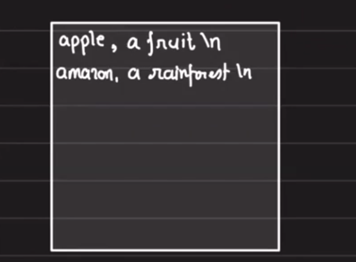
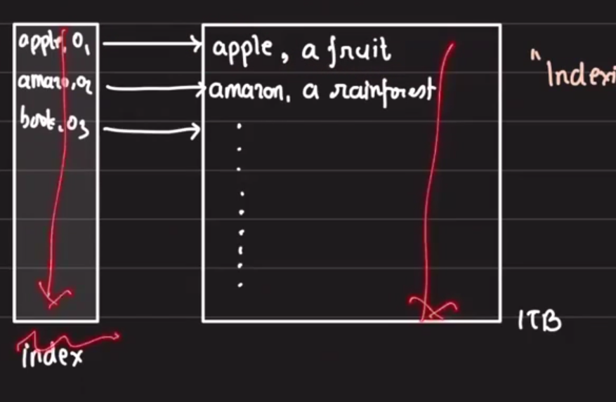
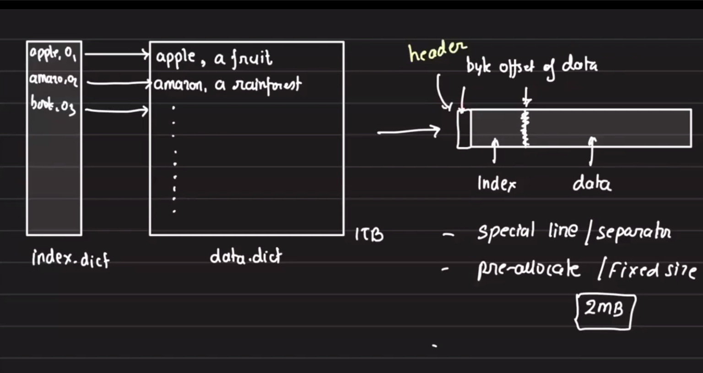
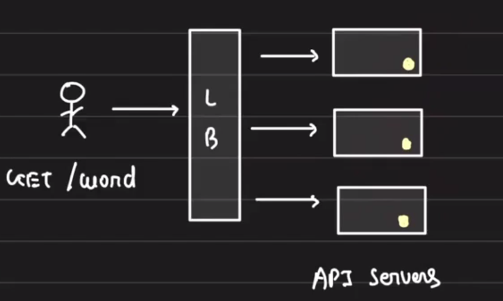
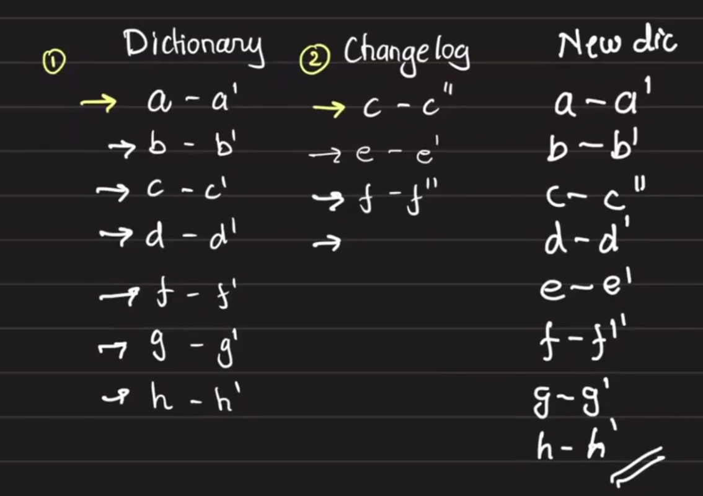
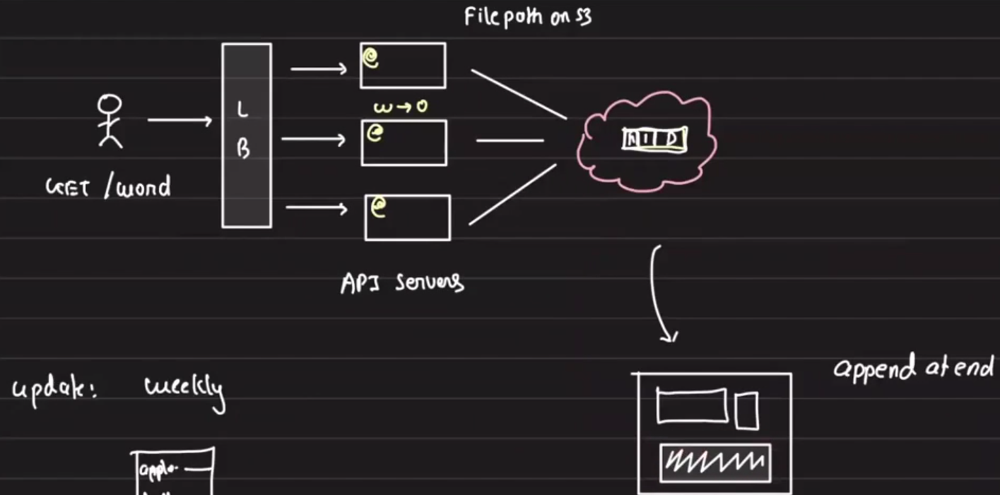
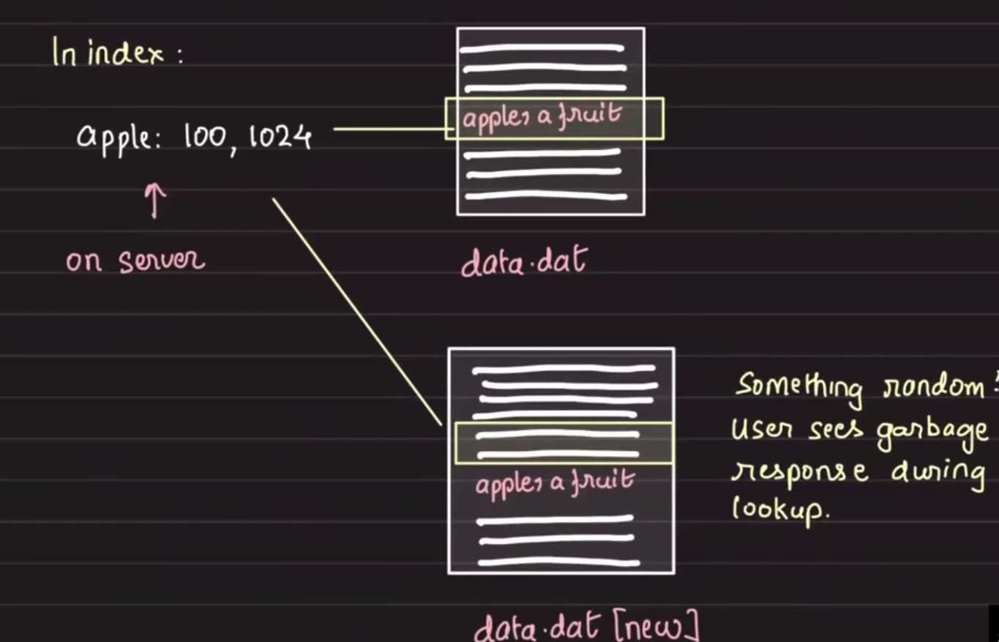
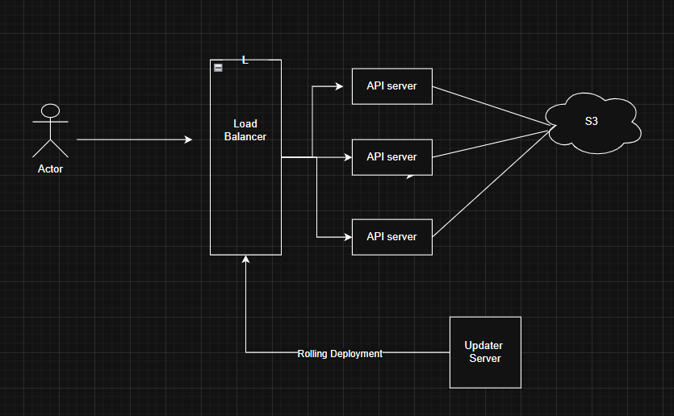

 # Storage Engines

## Table of Contents
- [Agenda](#agenda)
- [Overview](#overview)
- [Requirements](#requirements)
- [Storage Options](#storage-options)
- [Indexing and File Format](#indexing-and-file-format)
- [Portability and Deployment](#portability-and-deployment)
- [Updates and Merge Strategy](#updates-and-merge-strategy)
- [Smooth Rollout and Metadata](#smooth-rollout-and-metadata)
- [Real-world Application](#real-world-application)
- [Final Design / Diagrams](#final-design--diagrams)

## Agenda
- Word dictionary without using any DB
- Superfast KV store

## Overview
Notes and design ideas for building a large, portable read-optimized word dictionary (no transactional DB). The source dictionary is ~1 TB with ~170k words; updates arrive weekly as a changelog. Lookups are single-word queries and entries are unique.

## Requirements
- Scalable storage (portable) and API servers (response time can be high during cold start)
- No transactional DB
- Words and meanings updated weekly via changelog
- Single-word lookup only
- No duplicate entries
- Dictionary size: ~1 TB, ~170k words

## Storage Options

- JSON file
    - Not suitable: server would need to read and deserialize the whole file into memory for lookups — very slow.

- Sorted text file (key-sorted)
    - Efficient point lookup if combined with an index.
    - Linear scan is inefficient without an index.



When reads are slow, add an index to reduce scanned data.

## Indexing and File Format

Idea: maintain a compact index of word -> offset into a large data file. The index is tiny compared to the 1 TB data file.



Index entry: word <offset>
- Scans are over the index (much smaller) rather than the full data, e.g., offset is 4 bytes.

How big can this index file be?
- 170k words
- size = avg length(word) + offset + comma + newline
- avg length(word) ≈ 4.3

```
170000 × (4.3 + 4 + 2) = 175,100,000 bytes ≈ 1.751 MB
```

So the entire 1 TB dictionary can be indexed in ~1.75 MB.

### File layout approaches

- Approach 1 — single file with separators
    - Combine index and data into a single file and use start/end separators between index and data.

- Approach 2 — header with data offset (preferred)
    - Store a small header indicating where the data begins; no separators required.
    - Example header (16 bytes):
        - dictionary name: 8 bytes
        - version: 4 bytes
        - index size (bytes): 4 bytes

On application boot:
1. Read the header (first 16 bytes).
2. Read the index (`index size` bytes) and build an in-memory hash table for lookups.
3. Use the offset from the index to read the meaning from the data file.

- JSON lacks fixed headers and requires parsing the whole document, so it is slower for this use case.



## Portability and Deployment

Two-file layout: `index.dict` and `data.dict` (or single-file with header). These files are portable and can be stored on any network-accessible storage with file semantics.

Storage candidates:
- S3 (object storage)
- NAS (network-attached storage)

When an API server boots, it reads the header, loads the index, and serves requests. The server only needs to know the file path (or object path).



Drawbacks of loading the file on every API server:
- Updates are tedious
- Potential inconsistency during rollout
- Cost of storage and transfer

## Updates and Merge Strategy

Updates arrive weekly as a changelog file containing `word : meaning` pairs.

Update approaches:

- In-place edits
    - Filesystems generally append/overwrite; replacing content inside a large file is not practical.

- Merge-sort approach (recommended)
    - Write updates to a new sorted file and perform a merge-sort with the original sorted file (both are already sorted).
    - This requires temporary disk space equal to the size of the dictionary (original + new), so the merge server needs ≥2× disk space (e.g., 2 TB).




Example: updating "apple: a fruit" → "apple: a round fruit" requires replacing the entry via merge.

## Smooth Rollout and Metadata

Where to upload the new dictionary?
- Avoid overwriting the live path directly to prevent transient garbage reads.

Use versioned object paths, e.g.:
- `s3://wd/dic1.dict`
- `s3://wd/dic2.dict`

Maintain a `meta.json` containing the active dictionary path and optionally version:

```
{
    "path": "s3://wd/dic1.dict"
}
```

Deployment strategies to notify API servers of new paths:
- Poll `meta.json` on boot and periodically (simple, no extra infra).
- Use Redis Pub/Sub or another push mechanism to notify API servers (adds infra complexity).
- Rolling update / deployment: update the service deployment so new instances load the new dictionary — yields eventual consistency.



Example index entry representation:
- `apple: {offset: 100, bytes: 1024}`

## Real-world Application

- Multi-tiered storage example:
    - Historical orders on S3
    - Latest orders in MySQL

- Store historical data on S3 without losing query ability (data-lake pattern).

ATHENA-like approach: query CSV/object files directly (data lake).

## Final Design / Diagrams

Include diagrams and design sketches here (preserved as-is):



## Key Takeaways
- A compact index makes point lookups over very large sorted files efficient (index ≪ data).
- Use a header containing metadata (index size, version) to enable single-file layouts without separators.
- Merge-sort updates are simple and safe but require temporary duplicate storage during merges.
- Use versioned object paths and a small metadata file to enable smooth rollouts.

---
Revision notes: preserved original images and examples; corrected spelling, normalized headings, and reorganized content for clarity.