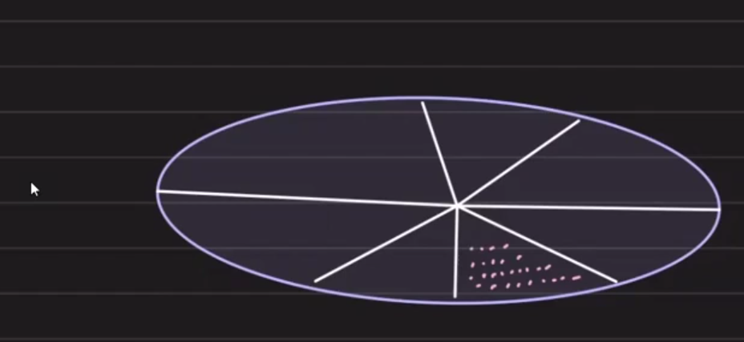
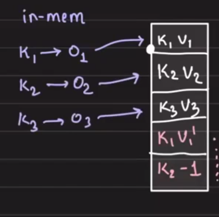
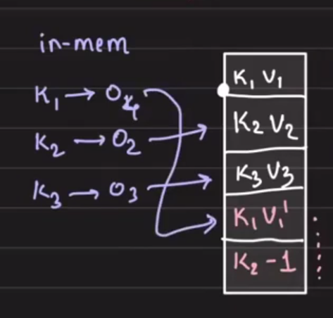
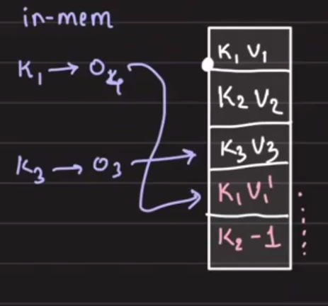
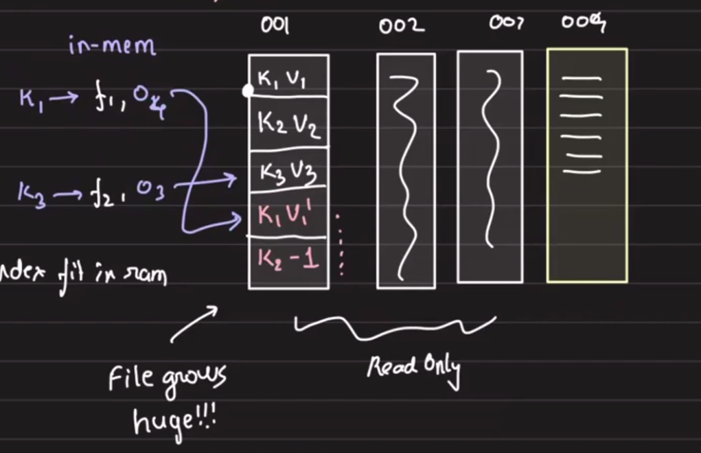
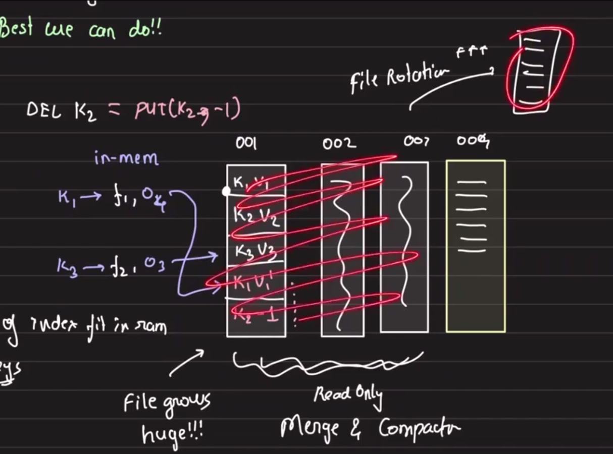
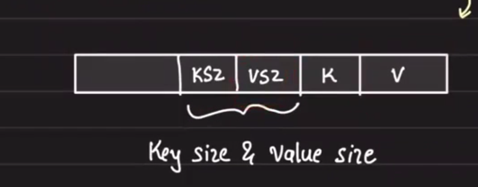
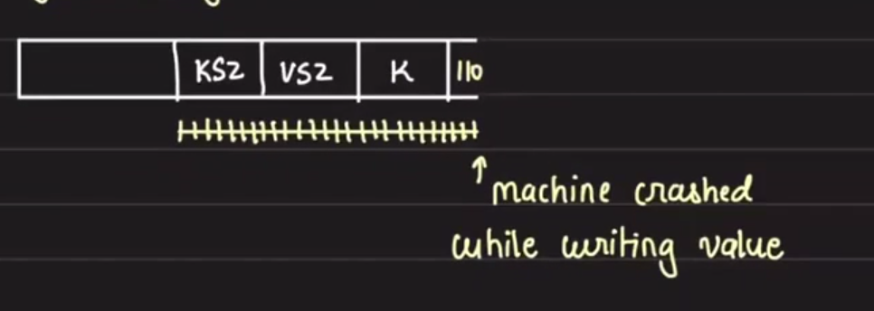
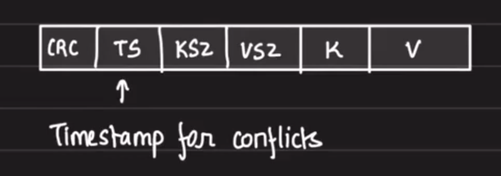
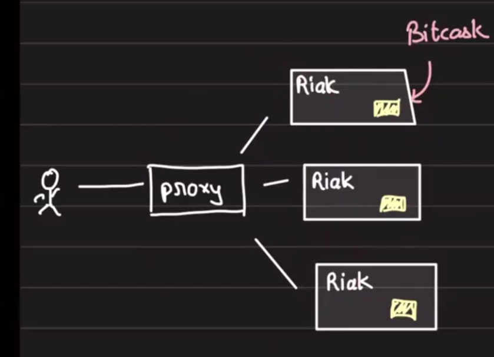

# Bitcask: Superfast Key-Value Database

## Table of Contents
1. [Requirements](#requirements)
2. [Core Concepts](#core-concepts)
3. [Formal Design](#formal-design)
4. [Data Storage](#data-storage)
5. [Data Integrity](#data-integrity)
6. [Strengths](#strengths)
7. [Limitations](#limitations)
8. [About Bitcask](#about-bitcask)

## Requirements
- Superfast reads, writes, deletes with `persistence`

## Core Concepts

### Storage Fundamentals

**HDD (Hard Disk Drive)**: Magnetic disk-based storage that organizes data by sector and offset.

Data is stored on disk at specific locations:
- Disk identifier
- Sector location
- Byte offset

### Append-Only Files

Use an append-only file (AOF) strategy: data is never modified in place, only appended. In-memory, we maintain an index storing:
- Key
- Offset in the file

**Updates**: To update key `k1`, we append the new value and update the offset in the in-memory index to point to the new location.

**Deletes**: To delete a key, simply remove the entry from the in-memory hash table.

Example: Key `k2` is deleted.

**Recovery**: If the process crashes and the in-memory hash table is lost, we can recover by scanning the AOF again and rebuilding the index.

### File Rotation

**Challenges with unbounded AOF**:
- Index may not fit in RAM
- File grows indefinitely

**Solution: File Rotation**
- Once a file reaches a certain size threshold, start writing to a new file
- New writes go only to the new file
- Older files become read-only
- In-memory index now stores: Key, FileName, Offset

This prevents unlimited file growth and index memory growth.

### Merge and Compact

Read-only files accumulate stale entries (old versions of keys). To reclaim space:

**Merge and Compact Process**:
1. Scan through read-only files
2. Ignore stale entries (keep only the latest version of each key)
3. Write all active keys from read-only files to a new consolidated file
4. Delete the old read-only files and replace with the new compacted file
5. Update the in-memory index accordingly

**Disk Utilization Pattern**:

This pattern reveals:
- Maximum disk capacity needed
- Optimal flush frequency
- When to trigger merge/compact operations

Critical: Update the index atomically to maintain consistency.

## Formal Design

### Basic Operations

**Simplest Design**: Single file of key-value pairs

- `PUT(K, V)` → Append to file (⚡ Lightning fast operation)
- `DELETE(K)` → Special PUT operation with sentinel value (e.g., `-1`)

## Data Storage

### File Organization

**Characteristics**:
- Append-only
- Sequential writes
- No random updates
- **No disk seeks during writes** ← Key performance advantage

**Result**: High write throughput even on mechanical HDDs (since sequential I/O is fast).

### Entry Format

How does one entry in the file look?

**Challenge**: Keys and values are variable length. We cannot read "until newline"—we need to know exactly how many bytes to read.

**Solution**: Store size metadata with each entry.

**Read Protocol**:
1. Read KSZ (key size) — 4 bytes
2. Read VSZ (value size) — 4 bytes
3. Read KSZ bytes for the key
4. Read VSZ bytes for the value

## Data Integrity

### Checksums (CRC)

To detect corruption, include CRC (cyclic redundancy check) with each entry. Write CRC first (before data) during flush.

**CRC Basics**: CRC is a hash computed over the data. It's a standard practice in data persistence:
- **PostgreSQL**: Commit logs use CRC
- **MySQL**: Binary logs use CRC
- **Network protocols**: CRC is a convention for ensuring data integrity

This approach is industry-standard for detecting silent data corruption.

## Strengths

- **O(1) operations**: Reads, writes, and deletes all constant time
- **High throughput, low latency**: Sequential I/O maximizes performance
- **I/O saturation**: Achieves near-maximum disk bandwidth
- **Easy backups**: Since data is append-only, backup is straightforward

## Limitations

- **Keys must fit in memory**: The entire key index is held in RAM, so total key size is bounded by available memory

## About Bitcask

The design we've outlined is **Bitcask**, one of the most efficient key-value databases:

- Originally designed by Basho
- Used in production as the backend storage engine for **RIAK**
- Each Riak node runs an instance of Bitcask

