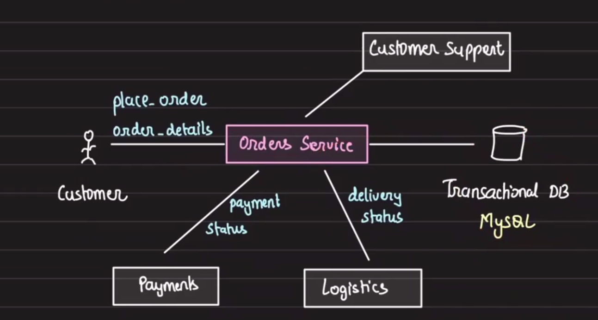
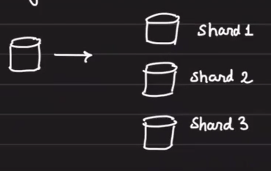
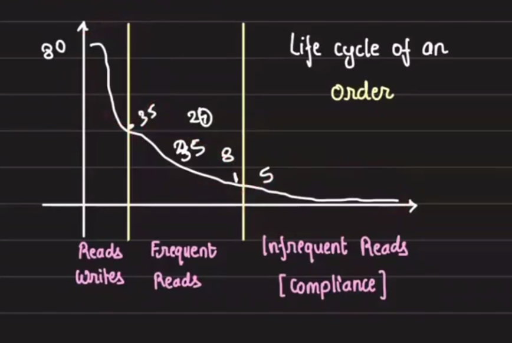
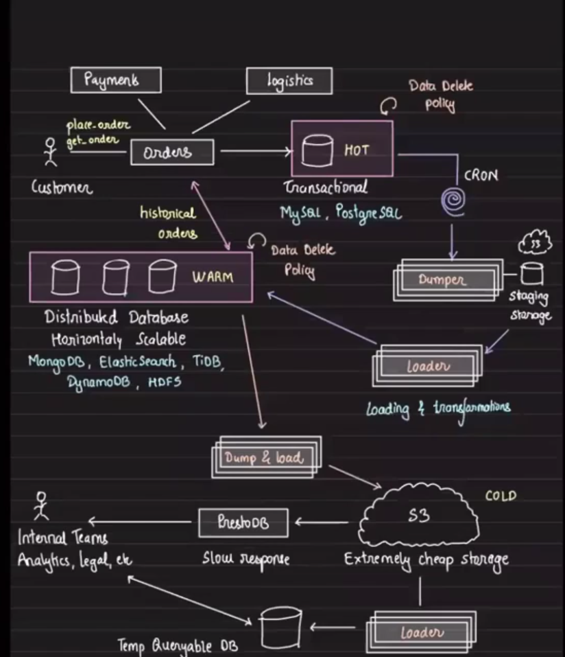

# High Throughput Systems

# Cost effiient order storage system

# Mutli-tiered Datastore:

Transactional Systms: 
Orders-> all orders that happend on Amazon goes here

you realize that Order server just not only serves the end user but alxo servers the other servies like paymets, logistics, customer suppport, etc.

everythign works fine for first few motnyths, and then 
Database Perforamce degrades: large number of writes and reads

we can sacle up the DB: smaller DB to largeer DB [veritaclly scale]
if having large number of reads, just make read replicas

The next ofphase of DB scaling seems: 

- sharding: it is not a great coice always

- multi-tenent isolation
- operational overhad

What next after repclias? 
- Root cause of DB degreadtin: `Table is too large`
Computations takes time
Index lookups are disk-bound

- Can we reduce the table size? Do we need all of the data? 

evetyrtime in table some data is itially accessed very frequencey and thenn it access pattern reduces

The idea: Move orders from one DB to anogther depnedig on it 's age to reduce laod on the transactional Database.  

# Tiered Datastore: 
By moving data from one tier to anothe rwe are reducingg the time to computation

# Hot store:  Transactions Stoer (Read/write)
- transcational 
- loow latency
- strong consistancy
- * Expesnive

# Warm store: Read only worklaod
- Read-only
- Non transactional
- Frequent reads
- could be litter slower
- horizontally sacallable
- less expensive

# Cold Store: Infrequency reads, cheeap, very sloow
- read only
- very infrequeney reads
- compliance and accounting 
- offline analytics

- all servcies orders/payment/logistics first write to HOT DB
- then after sometime, cron runs and sstore the data in stagigin storage `TYPICALLY S3`
    - here we accualute whole data for an order like pament detais, logisitics details etc in single json and dump it to S3
    - everything part of one single document
    

