# Designing S3

## Table of Contents
1. [Overview](#overview)
2. [Core Concepts](#core-concepts)
3. [Requirements](#requirements)
4. [Storage Layer](#storage-layer)
5. [Routing](#routing)
6. [Hot Node Management](#hot-node-management)
7. [Partition Management](#partition-management)
8. [Data Durability and Integrity](#data-durability-and-integrity)

## Overview

### What is S3?
S3 is fundamentally a key-value store where:
- **Key**: file path (e.g., `bucket/path/to/file`)
- **Value**: file content

### Why S3 Uses Embedded Databases
- Cheap storage
- Cold storage with infrequent access capabilities
- Embedded database architecture

### Why We Study Bitcask
Log-structured storage is essential for understanding S3 because:
- Kafka and similar high write throughput systems rely on it
- Metrics, analytics, and clickstream systems use log-structured storage for high write ingestion

**Key Principle**: Whenever designing high write throughput systems, a log-structured storage approach is necessary.

## Core Concepts

### Log-Structured File Systems
- Sequential write-only appends (no random writes)
- Each write goes to disk sequentially across sectors
- When a disk fills, data moves to the next disk (linked list-like structure)
- This approach provides a side effect: **Object Versioning** — historical versions are preserved naturally

## Requirements

| Requirement | Challenge |
|------------|-----------|
| Storage | **Biggest Challenge** — must be elastic and scalable |
| Routing | Cannot rely solely on consistent hashing |
| Hot Partitions | Need load balancing strategy |
| Access | Performance isolation and tenant isolation |

## Storage Layer

### Storage Requirements
- Storage must be **elastic**: it should grow when needed
- Users can pre-allocate expected file sizes, and data is appended sequentially

### Approach: Log-Structured File System

#### Disk Selection
- **HDD vs SSD**: Choose HDD for cost efficiency
- HDDs perform poorly on random writes, so append-only sequential writes are required

#### Storage Architecture

**Index Mapping**:
- Path → Inode: Inode contains the location (disk number and offset) of the file on disk

**Storage Rack**:
- Multiple disks connected in sequence (like a linked list)
- Device drivers maintain a head pointer to track the active disk
- Disks are managed by storage rack drivers

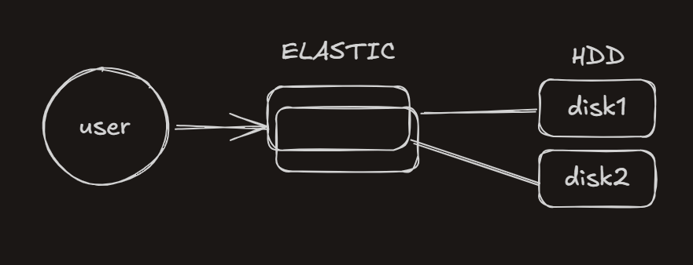

**Sector-Level Sequential Writing**:
- Writing happens in a strictly sequential manner across sectors (Sector1, Sector2, etc.)
- No disk seeking allowed


**Multi-Disk Growth**:
- When Disk 1 fills up, writing continues to Disk 2
- Multiple storage racks can be chained together
- Load Balancer → Head Pointer → Storage Rack

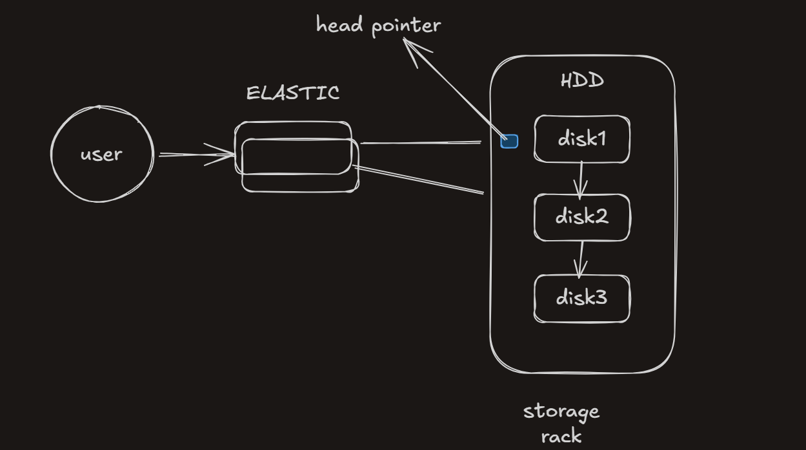

#### Disk Sizing and Capacity
- **Typical disk size**: 200–600 TB
- **Spinning HDD**: Cost-effective for append-only workloads
- **Threshold for switching disks**: Switch to the next disk at ~70% capacity to avoid write stalls

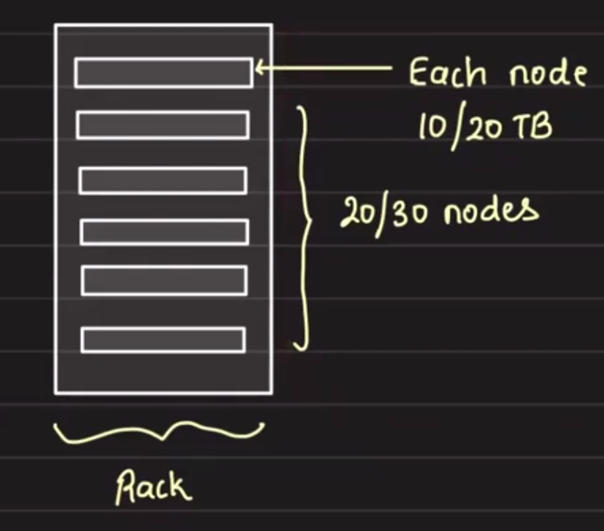

**Why 70% threshold?**
- Switching too late (e.g., at 100%) risks impacting ongoing writes
- Example: A 1000 GB disk at capacity with an active write could cause performance degradation

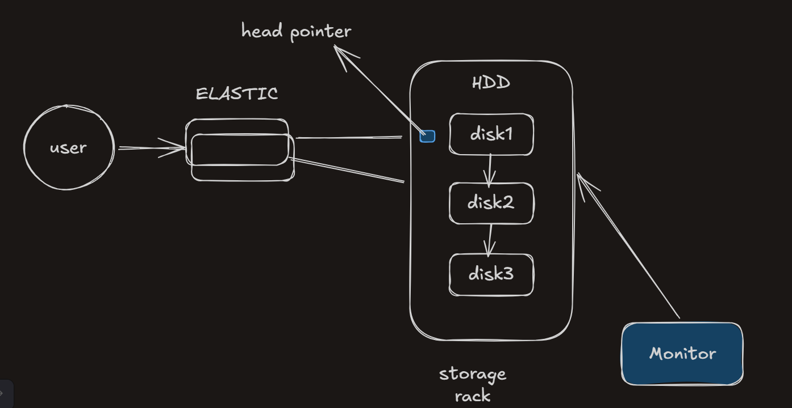

### File Operations in Log-Structured Storage

#### Update Operations
- Files are never modified in place; a new file is written instead
- Original file path remains the same
- New file is written to the current active disk
- **Side Effect**: Object Versioning becomes a natural feature
  - Historical versions are preserved due to sequential writes
  - `bucket:key → [filePath1, filePath2, filePath3]` stored in a metadata database

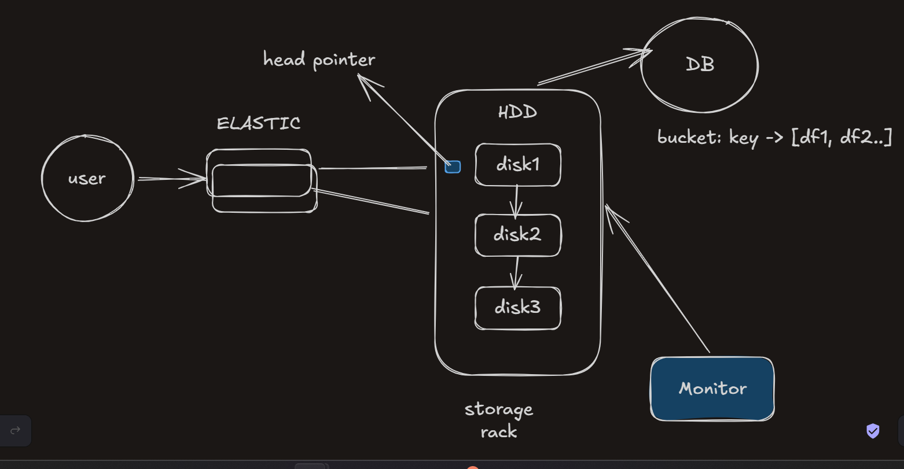

#### Delete Operations
- Classic case of merge and compaction
- Stale files are removed and data is rewritten
- Reclaims available storage space

### Storage Metadata Database
- Maintains the mapping: `bucket:key → [file paths]`
- Tracks all versions of an object for versioning support

Most important design discussion: **Directories are logical and virtual** — they don't have separate storage, only keys and paths.


## Routing

The routing layer determines where data is stored and retrieved. Two main approaches exist:

### Approach 1: Hash-Based Routing

**How it works**:
- Hash the key to determine which disk stores the data
- Request from multiple tenants routes to the same disk

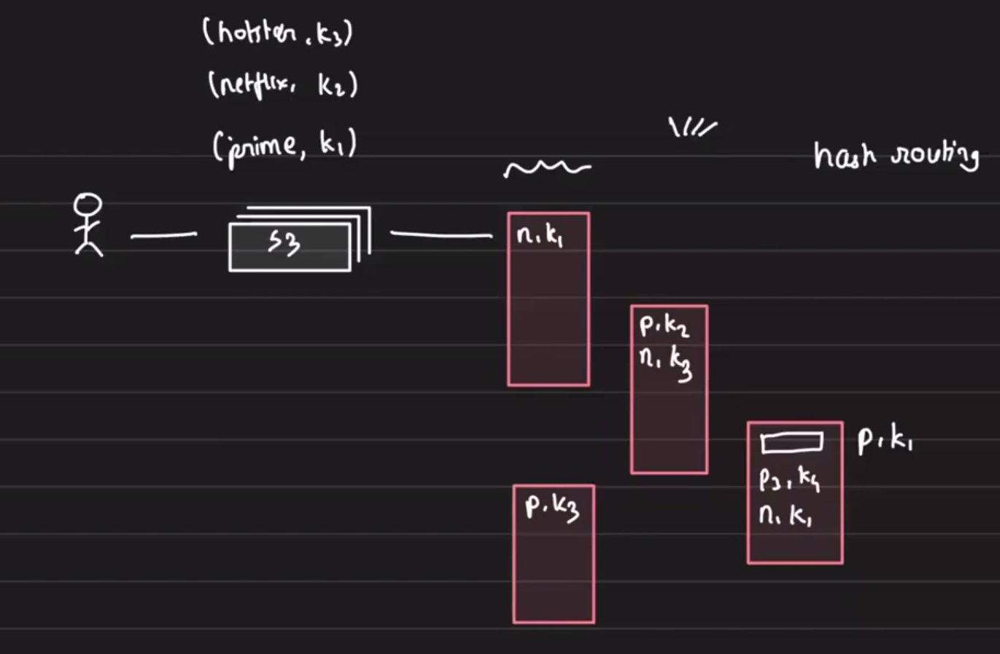

**Problem: Hot Partition**
- Multiple tenants on the same disk cause throttling
- Example: Prime Video and Netflix both hashing to the same disk creates a performance bottleneck

**Why this fails**:
- No tenant isolation
- Loss of locality for related objects
- Hot partition problem is unavoidable

**Conclusion**: Hash-based routing is not suitable for S3. When you need control over data placement, consistent hashing is not the answer.

### Approach 2: Range-Based Routing

**How it works**:
- Objects are stored based on key ranges: `[l, r] → /bucket/key/path`
- Example: `[l, r] → /prime/shows/rings_of_power/s1/ep1`

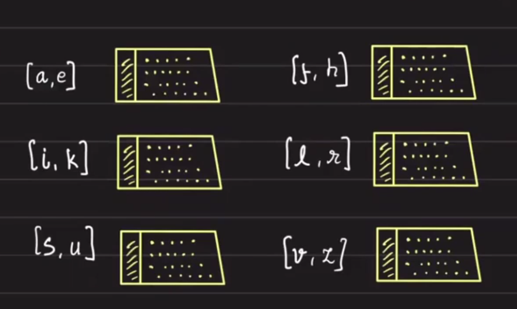

**Advantages**:
- **Locality of objects**: Related objects are stored together
- **Performance isolation**: Better control over where objects reside
- **Tenant isolation**: Prime Video and Netflix data are separated

This is the preferred approach for S3 and similar blob storage systems.

## Hot Node Management

When a single node becomes a hot partition (overloaded with requests), we need a strategy to distribute load. Two common approaches:

### Approach 1: Horizontal Split (Most Common for S3)

**Strategy**: When a node becomes hot, split it into multiple smaller ranges.

**Before**:
- Range: `[l, r]` → Single node

**After**:
- Range: `[l, m]` → Node A
- Range: `[m+1, r]` → Node B

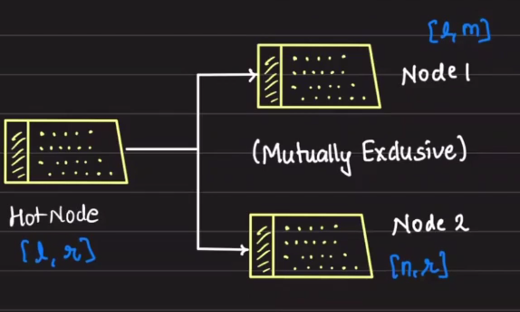

**Benefits**:
- **Locality**: Related objects (e.g., all Prime Video files) remain close to each other
- **Tenant Isolation**: Netflix load does not affect Prime Video performance
- **Natural load distribution**: Each range has its own independent capacity

This is the approach S3 and other blob storage systems use.

### Approach 2: Logical Partitions on Physical Machines

**Strategy**: Have a large number of logical shards (partitions) spread across fewer physical machines.

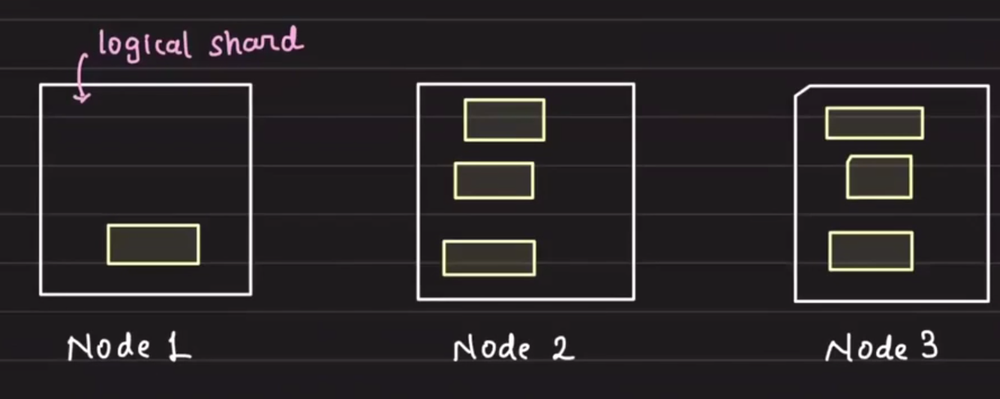

**Examples**:
- Elasticsearch uses this with the **HEAD Plugin**
- Instagram used this with their main posts table

**How it works**:
- Each physical server (white box) hosts multiple logical partitions (yellow boxes)
- When a partition on a node becomes hot, move that entire partition to another physical node
- Partition movement is efficient because it's an exclusive subset of data (similar to a database dump)

**Key Advantage**: Moving one exclusive subset of data across data nodes is simpler and more efficient, enabling effective **load balancing** without data loss.


## Partition Management

### Architecture Overview

The system requires several key components to manage partitions:

1. **Partition Map Table**: Central registry of which partition lives on which physical node
2. **Partition Manager**: Orchestrates partition movements and health monitoring
3. **Partition Servers**: Handle read/write operations for assigned partitions
4. **Physical Storage**: Disks/racks that store the actual data

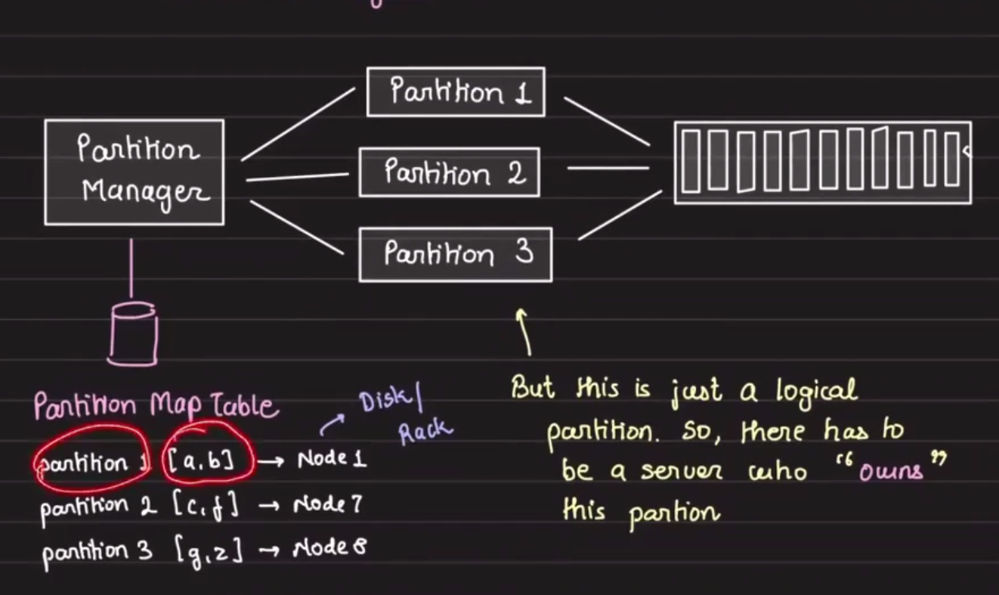

### Partition Server Responsibilities

Each Partition Server owns one or more logical partitions and maps to physical storage nodes:

```
Partition Server 1 → Partition [a, b] → Node 1 (disk/rack)
Partition Server 2 → Partition [c, f] → Node 7 (disk/rack)
Partition Server 3 → Partition [g, z] → Node 8 (disk/rack)
```

**Key constraint**: One partition is owned by exactly one Partition Server, but one Partition Server can own multiple partitions.

### Load Balancing via Partition Reassignment

When a Partition Server becomes overloaded:

```
Before: Partition Server 1 → Partition [a, b]

After: 
  Partition Server 1 → Partition [a]
  Partition Server 2 → Partition [b]  (now owns b)
```

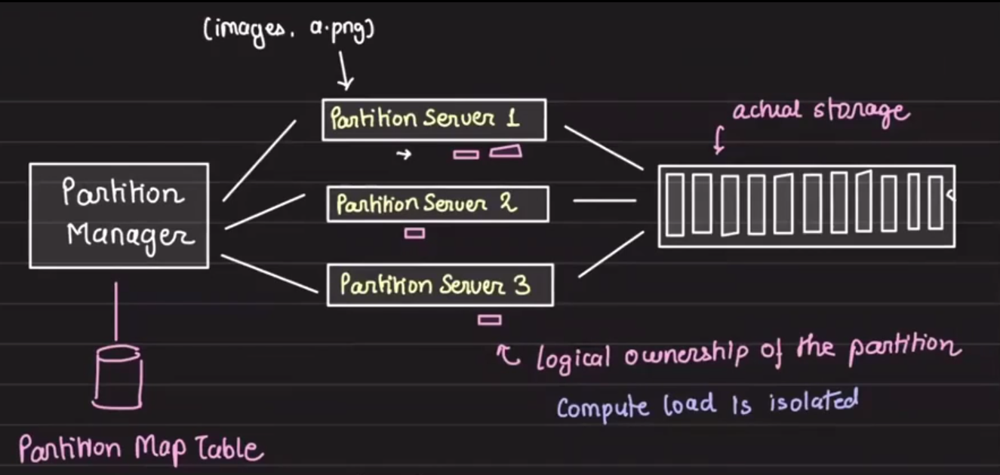

### High Availability: Leader Election

Since the Partition Manager orchestrates all partition movements and health checks, it becomes a critical component. To avoid it being a Single Point of Failure (SPoF):

- Multiple Partition Manager instances run concurrently
- **Leader Election** ensures only one manager is active at a time
- On leader failure, another manager takes over automatically

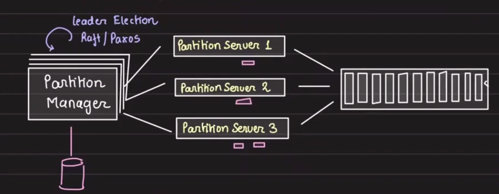

### Critical Design Decision: No Proxying via Partition Manager

**Data Flow**:
```
User → Partition Map Table → Partition Server → Write to Partition
                              ↑
                              └─ Health checks by Partition Manager
```

**Why not proxy through the Partition Manager?**
- Volume of data is very large (files can be GBs or TBs)
- Proxying a 1 GB file through the Partition Manager adds unnecessary hops and latency
- Minimize the number of hops for efficiency

**Comparison**: Transactional databases proxy through a manager because data is small (KBs to MBs), making the overhead acceptable.

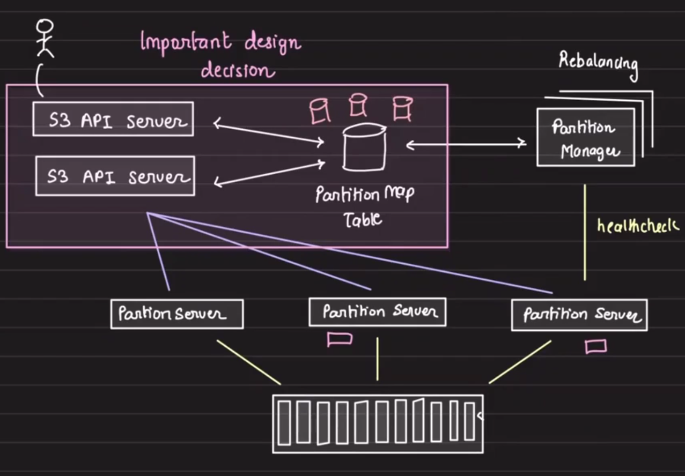

### Handling Partition Server Failures

When a Partition Server goes down:
- Its assigned partitions are seamlessly reassigned to other Partition Servers
- The Partition Map Table is updated to reflect the new ownership
- Clients query the updated map and route to the new server (no data loss)

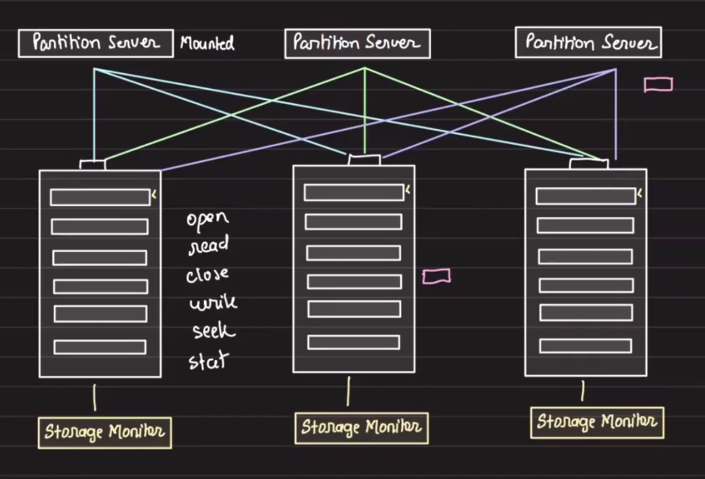


## Data Durability and Integrity

### Data Durability

**Primary Strategy**: Duplication is the only way to achieve durability.

When data is written to a partition on a storage node:

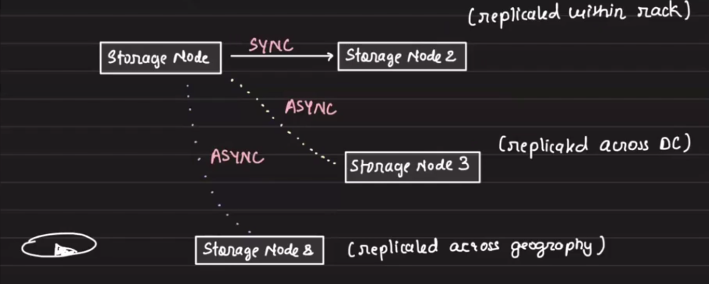

**Risk**: If the partition (or sector) where data is stored becomes corrupted, the original data is lost.

### Within-Node Durability: RAID

**RAID (Redundant Array of Independent Disks)**:
- Multiple copies of data written to different sectors within a single storage node
- Protects against single disk or sector failure
- Used internally by storage systems

### End-to-End Data Integrity: Checksums

**Strategy**: Checksums validate data integrity at every stage.

**Process**:
1. Client sends data
2. **Verify checksum** at entry point
3. Chunk data into segments
4. **Compute checksum** for each chunk
5. **Verify checksum** before combining chunks
6. **Verify checksum** before storage
7. **Verify checksum** on retrieval before returning to client

**Key Principle**: Never save or return corrupted data. Validate checksums at multiple stages throughout the storage and retrieval pipeline to ensure the data received by the user is exactly what was stored.


