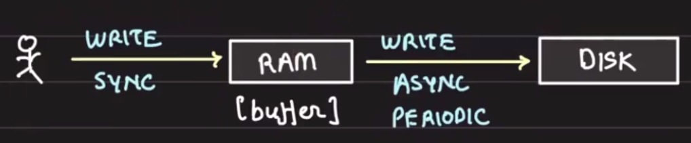
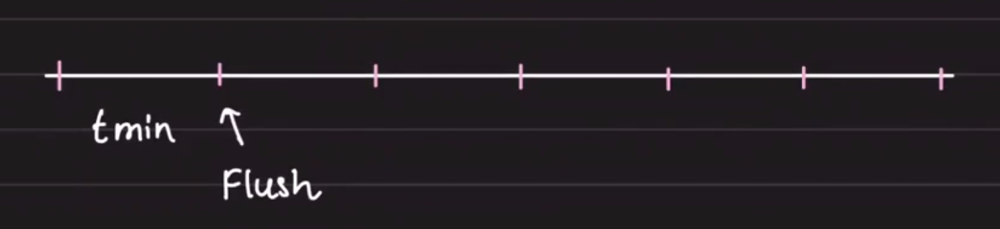
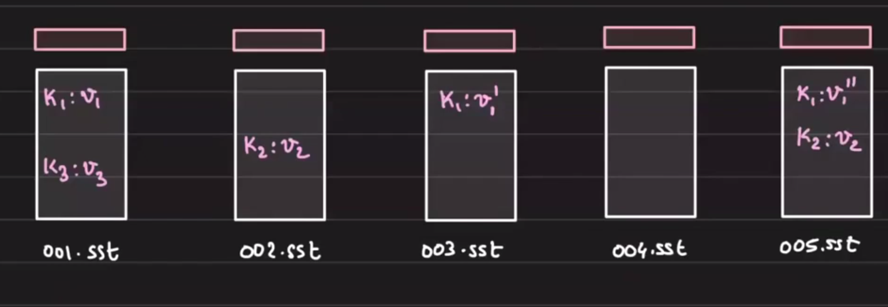
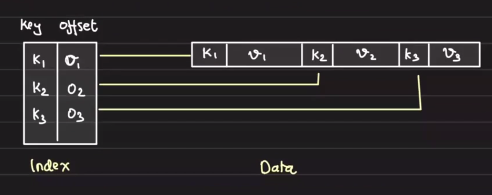
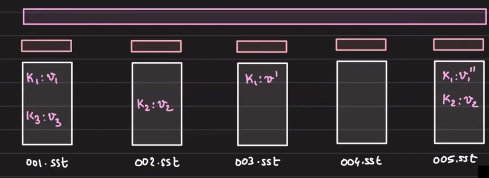
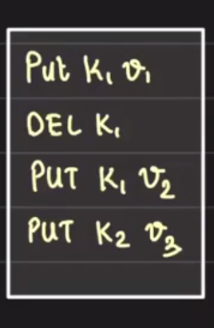
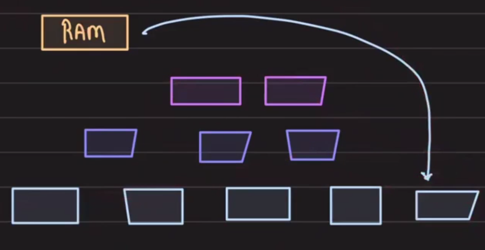

# High Throughput Systems

## Table of Contents
- [Overview](#overview)
- [Core Motivation](#core-motivation)
- [Architecture](#architecture)
- [Read Operations](#read-operations)
- [Sorted String Tables (SSTables)](#sorted-string-tables-sstables)
- [Compaction](#compaction)
- [Bloom Filters](#bloom-filters)
- [Data Loss Prevention](#data-loss-prevention)
- [LSM Trees vs Bitcask](#lsm-trees-vs-bitcask)
- [Real-World Usage](#real-world-usage)
- [Key Takeaways](#key-takeaways)

## Overview

**LSM Trees** (Log-Structured Merge Trees) are data structures designed for high-throughput write-intensive workloads. Common implementations include RocksDB, LevelDB, and BadgerDB.

**Use cases requiring high write throughput:**
- Screen capture and user movement tracking (e.g., Storefox with PostHog integration; cursor tracking generates substantial data volume)
- High-frequency trading
- Location tracking systems


## Core Motivation

### Improving on Bitcask

Bitcask achieves low write latency through:
- Append-only files (no disk seeks during writes)
- In-memory index (quick lookups)

**Limitation:** Keys are memory-bound—the number of keys is limited by available RAM.

### The Core Idea: Buffer in RAM

To achieve even higher write throughput:
1. **Write directly to RAM** instead of disk (eliminates disk I/O latency)
2. **Periodically flush** the in-memory buffer to disk in batches

This approach gives us **high write throughput** while using the disk as eventual storage.



**Trade-off:** Accept potential data loss in case of machine crash. This is acceptable for high-throughput use cases that can tolerate some loss (tracked separately with optional WAL for critical data). 

## Architecture

### Periodic Flush Strategy

Every 't' minutes, flush the in-memory buffer to disk at once.

**Flushing approach:**
- Create a **new file on each flush** (faster and more efficient than appending to existing file)
  - Existing file approach: file grows too long, flush takes too long
  - New file approach: flush completes quickly as a single atomic write




These diagrams show how memory utilization cycles: data accumulates in memory, then releases on each flush.

## Sorted String Tables (SSTables)

**Definition:** A Sorted String Table (SSTable) is a sorted, immutable key-value structure that can exist both in memory and on disk.

**Properties:**
- In-memory: hash table structure
- On-disk: serialized format with index file and data file
- Data is already sorted, enabling efficient merging



### Data Structure Details

Each flush creates a new file representing an SSTable. Internally, an SSTable contains:
- Index information for fast lookups
- Sorted key-value pairs enabling range queries and merging


## Read Operations

### Multi-Tiered Read Process

1. **Request arrives**
2. **Check in-memory SSTable first**
   - If key exists → return the latest value immediately
   - If key not found → proceed to disk
3. **Check disk files** (start from most recent flush)
   - Search files in reverse chronological order
   - Return value if found
4. **If not found anywhere** → return "not found"

**Characteristic:** Reads are slightly slower than writes, but the design prioritizes **high write throughput** as the primary requirement.

## Compaction

### Why Compaction Matters

Over time, periodic flushing creates many immutable files on disk. This leads to:
- High disk utilization
- Many files to search during reads (worst case: check all k files to determine a key doesn't exist)

### Merging SSTables

**Merge operation complexity:** O(n) because data is already sorted.

Since SSTables maintain sorted data, merging multiple tables is efficient—we can merge-sort them without re-sorting.


**Compaction process:**
- Merge multiple SSTable files into fewer, larger files
- Reclaim disk space
- Reduce number of files to search during reads

**Result:** Disk utilization decreases after compaction.


## Bloom Filters

### The Problem with Negative Lookups

**Worst case scenario:** Search through all k files on disk only to determine a key does **not** exist. This requires unnecessary disk I/O.

### Solution: Bloom Filters

**Bloom Filter:** A probabilistic data structure that tests membership in a set using constant space.

**Behavior:**
- Returns "yes" → key **could** be present (false positives possible)
- Returns "no" → key **definitely is not** present (no false negatives)

### How Bloom Filters Work

A bloom filter is an array of bits (0/1). Multiple hash functions map keys to bit positions:

```
apple → hash() → 3
banana → hash() → 2
cat → hash() → 3
```


**Example lookups:**
- `dog → hash() → 6`; `bit[6] = 0` → dog **definitely does not exist**
- `elephant → hash() → 2`; `bit[2] = 1` → elephant **might** exist (but we never inserted it—false positive)

### Bloom Filters in LSM Design

Create one bloom filter per SSTable, spanning all keys that exist in that table.



**Benefit:** Eliminate read operations for keys that are definitely not present, significantly reducing disk I/O for negative lookups.

### Why Bloom Filters Over Sets

| Aspect | Bloom Filter | Set |
|--------|---|---|
| **Space** | Constant, minimal space | Proportional to number of elements |
| **Serialization** | Easily persisted to disk (often kept in RAM anyway) | Requires full serialization before disk lookup |
| **RAM overhead** | Critical advantage: RAM is expensive and reserved for buffering live writes | Consumes significant RAM |
## Data Loss Prevention

### Optional: Write-Ahead Logging (WAL)

**Problem:** Data in RAM is lost if the machine crashes before flush.

**Solution:** Write-Ahead Log (WAL) file
- Append all insert/update/delete operations to a WAL file
- Truncate the WAL file on every successful flush
- Kept in RAM for fast writes



**Usage:** WAL is optional and used only for tenants/teams that require 100% durability and cannot tolerate data loss. High-throughput systems may skip WAL entirely.

## LSM Trees vs Bitcask

| Aspect | Bitcask | LSM Trees |
|--------|---------|-----------|
| **Key Storage** | Memory-bound (limited by RAM) | Disk-bound (RAM buffers, disk stores) |
| **Scalability** | Limited by available RAM | Can store more data than available RAM |
| **Write Amplification** | Comparable to LSM | Comparable to Bitcask |
| **Write Throughput** | High within memory limits | High with disk-based eventual storage |
| **Read Performance** | Fast (memory index) | Slightly slower (multi-tiered) but acceptable |

**Key Advantage:** LSM trees support unbounded key counts while maintaining high write throughput.

## Real-World Usage

### Who Uses LSM Trees?

- **RocksDB** – Facebook's embedded key-value store
- **LevelDB** – Google's embedded key-value store
- **BadgerDB** – Go key-value store
- **Use cases:** Bidding, AdTech, high-frequency data capture

### LSM vs Redis

| LSM Trees | Redis |
|-----------|-------|
| Disk is eventual storage; RAM buffers hot data | All data must fit in RAM |
| Scales to datasets larger than memory | Limited to RAM capacity |
| Optimized for write-heavy workloads | Optimized for in-memory speed |

### When to Use LSM Trees

**Use LSM trees when:**
- You have high-volume write workloads
- Your dataset exceeds available RAM
- You can tolerate occasional data loss (or use WAL for critical data)
- You need to read recently written keys efficiently



This diagram shows the overall LSM tree structure across multiple levels.

## Key Takeaways

1. **LSM trees optimize for write throughput** by buffering in RAM and periodically flushing to disk
2. **Multi-tiered architecture** (RAM → sorted SSTables on disk) balances write speed with scalability
3. **Compaction** reduces disk usage and read amplification over time
4. **Bloom filters** minimize unnecessary disk reads for negative lookups
5. **SSTables remain sorted**, enabling efficient O(n) merging during compaction
6. **Keys are disk-bound**, not memory-bound, unlike Bitcask
7. **Data loss trade-off** can be mitigated with optional WAL for critical data
8. **Use LSM when:** dataset > RAM AND write throughput is critical
