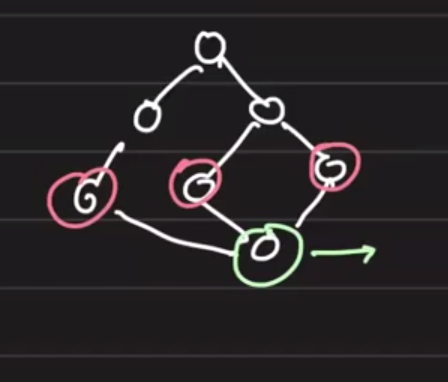
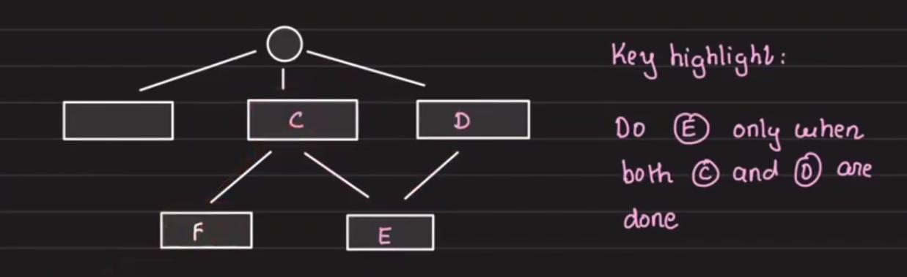
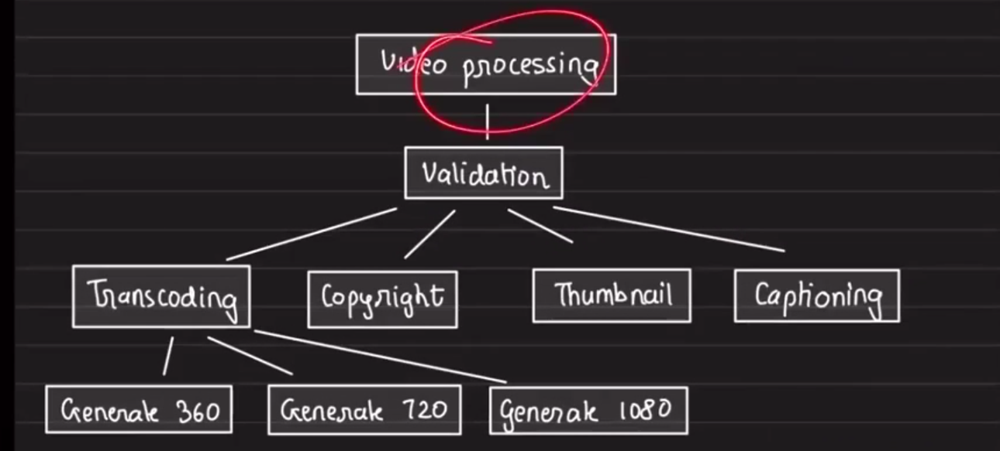
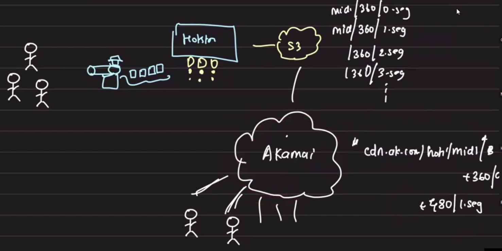
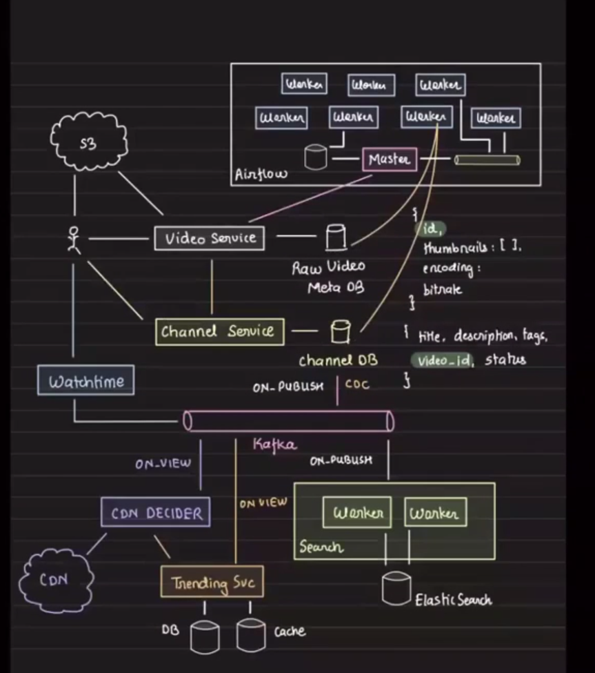

# Youtube Video Processing System

## Table of Contents
- Overview
- Requirements
- Post-upload Processing
- Workflow Orchestration
- Transcoding Rationale
- Caching and Delivery
- Data Model
- Publish Flow
- Notes

## Overview
A YouTube-style video processing system includes upload, processing, and distribution.
The upload flow is similar to Instagram photo upload but adds chunking and video-specific downstream work.

## Requirements
- Video upload
- Video processing
- Video distribution

## Post-upload Processing
### Core processing steps before publishing
- Transcoding: create different resolutions such as 360p, 480p, 720p, 1080p.
  - Question: should this happen before publishing or after publishing?
  - Publish as soon as any resolution is complete rather than waiting for every output.
- Generating thumbnails
- Objectionable content detection

### Post-publish work
- Transcript generation
- Frame extraction
- Recommendation generation

### Workflow questions
- How do you trigger transcoding, thumbnail generation, and objectionable-content detection in parallel once a video is uploaded?
- Simple solution: add Kafka and use three different consumers.
- Transcoding itself may spawn multiple resolution pipelines (360p, 480p, 720p).
- Should each resolution use a separate topic?
- Because resolutions take different times, publish should wait for any resolved encoding output plus thumbnails plus content checks.
- How would you build this on Kafka so that when all three are done, publishing is triggered?



We are in a situation where three tasks must complete before triggering publish.
That suggests some kind of orchestrator rather than pure Kafka.
When conditional joins are required, Kafka alone is not the right tool.

This problem belongs to `WORKFLOW MANAGEMENT SYSTEMS`.
Common workflow management tools:
- Apache Airflow
- Luigi [Spotify's product]
- AWS Step Functions



These systems allow blocking a trigger until conditions are met.

## Transcoding Rationale
- Recorded video may be in a format such as `.mov`.
- Client devices may not support the source format.
- Video bitrate affects quality and requires more processing and faster internet.
- Not all devices have fast internet, so transcoding is necessary.

### Two components
- Container: `.mp4`, `.avi`, etc.
- Codec: `H.264`, `VP8`, `HEVC`, etc.

Use `ffmpeg` to transcode.

## Full Workflow


## Should we transcode all videos?
- No, transcoding every video is very expensive.
- Use on-demand video optimization similar to on-demand image optimization.
- Live streaming and low-latency video are examples where on-demand optimization is needed.

## Caching and Delivery
### CDN caching is expensive
- Only videos that are worthy should be cached.

### Segment-based delivery
From a video camera, video may be sent in batches, for example every 10 seconds.
- Hot-start transcode on cloud and store transcoded chunks in S3:
  - `cdn/360/0.seg`
  - `cdn/360/1.seg`
- Users connect via CDN:
  - `cdn.akamai.com/hotstar/mid1/.../{360p}/{segment-number}`
  - CDN retrieves the file from S3 on demand.



## Final Design


## Data Model
### Raw video record
```json
{
    id,
    thumbnail,
    encoding:
    bitrate
}
```

### Channel record
```json
{
    title:
    description:
    video_id,
    status:
}
```

## Publish Flow
1. User interacts with video service.
2. Video service creates an entry in raw video DB.
3. Video is uploaded to S3 and a signed URL is generated.
4. Video metadata is recorded in the video DB.
5. Video server optionally creates a channel DB entry with title/description placeholders for the user.
6. When the video is published, an event is pushed to Kafka.
7. Elasticsearch indexing is performed.
8. Other services consume the Kafka event and perform additional work.

## Notes
- Preserve user-provided placeholders and follow-up content as part of the final publish workflow.
- The core design challenge is coordinating multiple asynchronous tasks before publishing.
