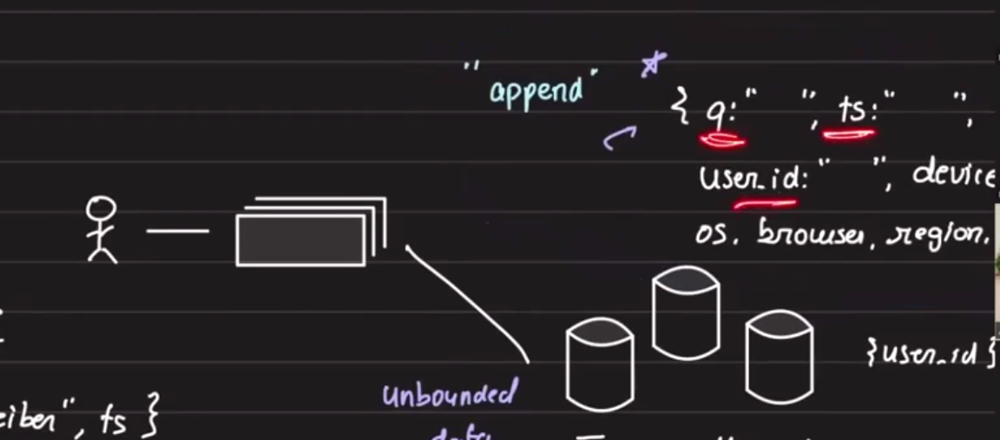
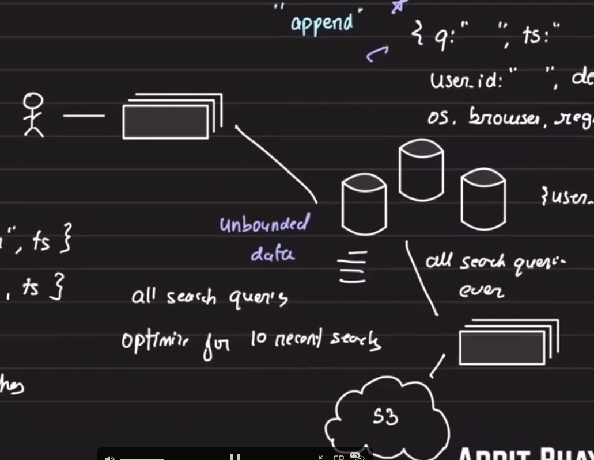
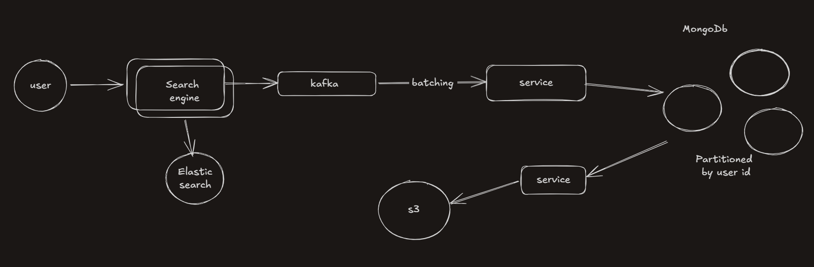
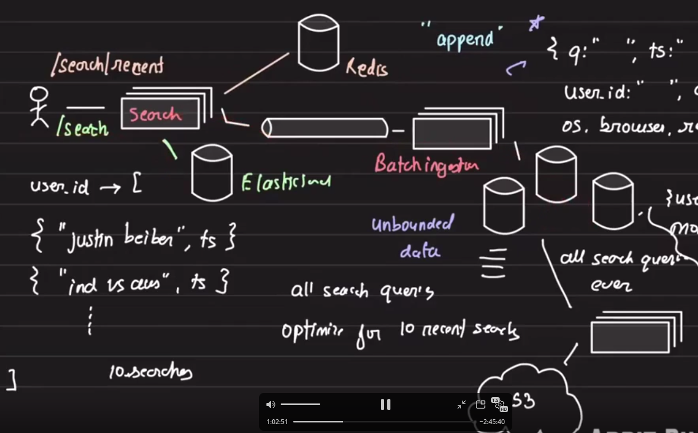
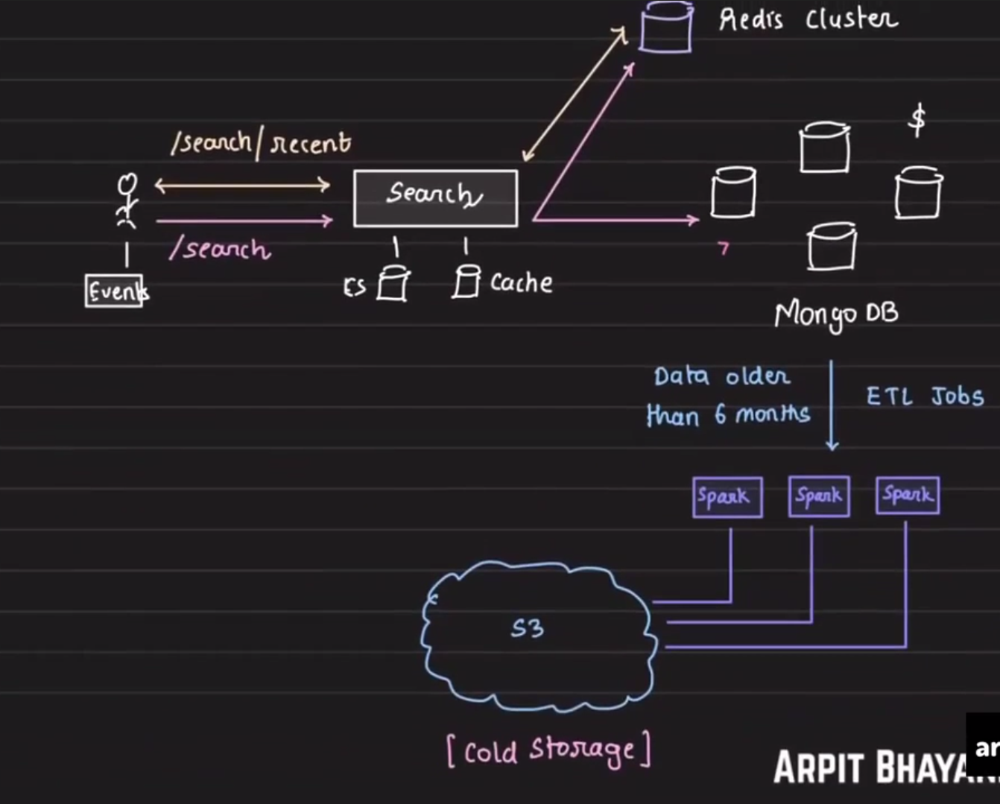

 # Recent Search Design

 ## Table of Contents
 - [Overview](#overview)
 - [Problem](#problem)
 - [Core Concepts](#core-concepts)
   - [Data model options](#data-model-options)
   - [Business requirements](#business-requirements)
 - [Data storage](#data-storage)
   - [Unbounded vs bounded storage](#unbounded-vs-bounded-storage)
   - [Cold data retention](#cold-data-retention)
 - [Write path](#write-path)
   - [Write strategy](#write-strategy)
   - [Write path summary](#write-path-summary)
 - [Read path](#read-path)
   - [Recent-search reads](#recent-search-reads)
   - [Cache layer](#cache-layer)
 - [Cache population](#cache-population)
   - [Redis key format](#redis-key-format)
   - [Write ordering](#write-ordering)
 - [Design decision](#design-decision)
   - [Consistency and reliability](#consistency-and-reliability)
   - [Redis capacity estimate](#redis-capacity-estimate)
 - [Trade-offs](#trade-offs)
 - [Schema](#schema)
 - [Final design summary](#final-design-summary)
 - [Questions](#questions)
 - [Key takeaways](#key-takeaways)

 ## Overview

 This note explores a recent-search feature that returns the top 10 most recent queries made by a user. It focuses on optimizing for write-heavy search logging while providing low-latency read access for the recent-search experience.

 ## Problem

 - Return the top 10 recent searches for a user.
 - 50% of users tap the search bar within the first 5 seconds.
 - 30% of searches happen through recent-search suggestions.

 Key constraints:
 - bounded data vs unbounded data
 - time sensitivity
 - stale-data tolerance
 - cross-device consistency

 Questions:
 - Is stale recent-search data acceptable?
 - How important is cross-device consistency?

 ## Core Concepts

 ### Data model options

 1) Bounded recent-search list per user

 ```text
 user_id -> [
   "justinbeiber",
   "ind vs aus",
   ... up to 10 recent searches
 ]
 ```

 2) Recent search with timestamps

 ```text
 user_id -> [
   <"justinbeiber" -> 1582342342>,
   <"ind vs aus" -> 1582342342>,
   ... up to 10 recent searches
 ]
 ```

 ### Business requirements

 - Persist all search queries for analytics and product insights (unbounded store).
 - Serve the top 10 recent searches quickly (bounded, low-latency store).

 Required fields per record (persisted store):
 - `user_id`
 - `query`
 - `timestamp`
 - `deviceId`

 ## Data storage

 ### Unbounded vs bounded storage

 - Storing all searches is an unbounded data problem; persist them for analytics.
 - Recent-search retrieval can be bounded to the latest 10 entries to optimize reads.
 - Use a document store or write-optimized database partitioned by `user_id` for the persisted events.

 This is a classic unbounded-data workload.

 

 ### Cold data retention

 - Most search queries older than one year are unlikely to be accessed.
 - Archive older data to object storage such as S3.

 

 ## Write path

 ### Write strategy

 - Search queries are high-volume.
 - Use asynchronous writes to the persistent database.
 - Publish query events to Kafka and perform batch ingestion into the persisted store.
 - The search service returns search results immediately; ingestion runs in the background.

 

 ### Write path summary

 1. User makes a search request.
 2. Search service handles the query and returns results (e.g., from Elasticsearch).
 3. Search service publishes the query event to Kafka.
 4. Batch-ingestion consumers write events to the persisted database.
 5. Periodic archival moves older data to S3.

 ## Read path

 ### Recent-search reads

 - The recent-search endpoint is `/search/recent`.
 - Querying the persisted DB for the top 10 recent searches under high traffic is expensive.
 - Given the high read ratio (50% tap within 5s), offload reads to a cache layer.

 Problems with direct DB reads:
 - High read traffic on the DB.
 - Maintaining a timestamp index per user speeds reads but slows writes due to index updates.

 Trade-off:
 - Optimize the DB for writes and use a cache (Redis) for low-latency reads.

 ### Cache layer

 - Add Redis to store bounded recent-search lists for fast reads.

 

 Read path summary:

 1. User requests recent searches.
 2. Search service reads the cached list from Redis.
 3. Redis returns the cached top 10 recent queries.

 ## Cache population

 ### Redis key format

 - Redis key per user: `recent:<user_id>` (example key format).
 - Value: a list with the most recent queries at the front.
 - Use `LPUSH` to prepend and `LTRIM` to keep the list length at 10.
 - Consider Redis AOF persistence to reduce data loss.

 ### Write ordering

 - Options:
   - Write to Redis first, then publish to Kafka (Redis-first). Favours user-visible latency.
   - Publish to Kafka first, then update cache from the ingestion pipeline (Kafka-first). Favours durable persistence.

 Rationale for Redis-first in this design:
 - Low-latency recent-search reads depend on Redis availability.
 - Missing a small fraction of persisted events is acceptable for the UX in this workload.

 ## Design decision

 - Persist all search queries in the DB for analytics and long-term storage.
 - Use Redis to store bounded recent-search state for fast reads.
 - Use Kafka for asynchronous, batch ingestion into the database.
 - Prefer Redis-first writes to prioritize latency for recent-search UX.

 ### Consistency and reliability

 - Strong consistency is not required for every search query in this product context.
 - Occasional missing events in the persisted store are tolerable; primary UX is served by Redis.

 ### Redis capacity estimate

 - Example estimate: 10M users × 10 queries × 16 chars/query ≈ 1.6 GB of Redis memory (plus overhead).

 ## Trade-offs

 - Pros:
   - Fast recent-search reads via Redis.
   - Write-optimized DB ingestion for analytics.
   - Small Redis storage footprint relative to persisted data.

 - Cons:
   - Potential inconsistencies between Redis and the persisted store.
   - Dual-write complexity.
   - Risk of lost persisted events if Kafka or ingestion fails.

 ## Schema

 1) Bounded recent list (cache representation):

 ```text
 user_id -> [
   "justinbeiber",
   "ind vs aus",
   ... up to 10 recent searches
 ]
 ```

 2) Persisted event (document store):

 ```json
 {
   "user_id": "...",
   "query": "...",
   "timestamp": 1582342342,
   "deviceId": "..."
 }
 ```

 Persisted store should retain all searches (unbounded) for analytics; the cache remains bounded to the latest 10 per user.

 ## Final design summary

 

 - Returns top 10 recent searches per user from Redis.
 - Writes are published to Kafka for batch ingestion into a persisted store.
 - Redis-first writes are used to prioritize latency; ingestion provides eventual persistence and analytics data.

 ## Questions

 - Is stale data acceptable for the recent-search UX (short-term staleness tolerated)?
 - How important is cross-device consistency (do searches made on device A need to appear immediately on device B)?

 ## Key takeaways

 - Use a small Redis cache (bounded list) per user for low-latency reads.
 - Persist all events in a write-optimized store via Kafka for analytics (unbounded).
 - Favor Redis-first writes when latency matters and full durability for every event is not strictly required.
