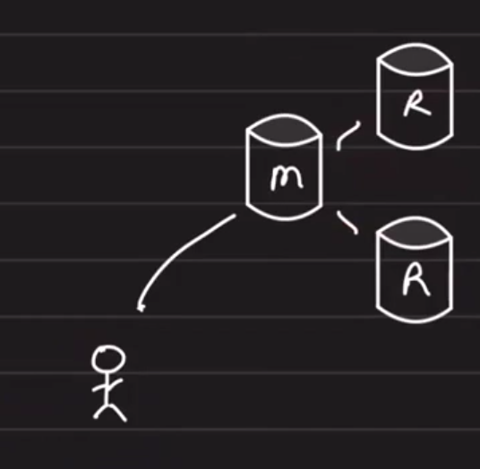
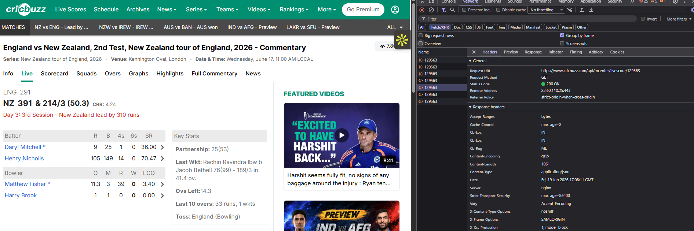
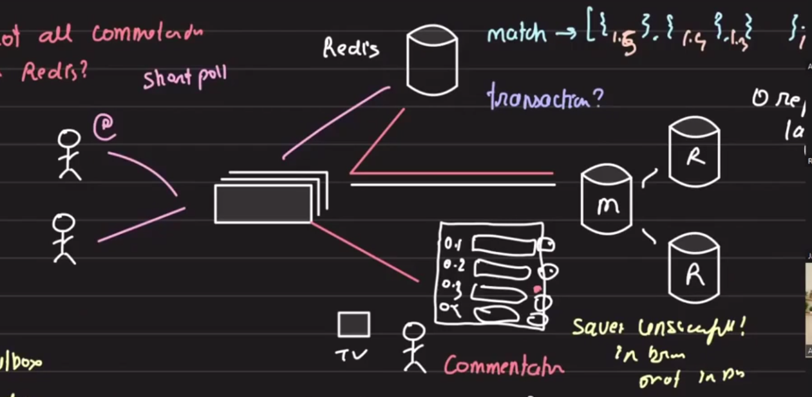

# Cricbuzz live commentary

## Table of Contents
- [Overview](#overview)
- [Requirements](#requirements)
- [Brainstorm](#brainstorm)
- [Storage](#storage)
  - [Data size](#data-size)
  - [Caching recent deliveries](#caching-recent-deliveries)
- [Read path](#read-path)
- [Write path](#write-path)
- [Trade-offs](#trade-offs)
- [Key takeaways](#key-takeaways)

## Overview

A live text commentary system where one commentator writes updates and many users read them. The design emphasizes cost-efficient architecture, a good user experience, and a read-heavy workload.

## Requirements

- User should see live text commentary.
- Cost-efficient architecture.
- Good user experience.

## Brainstorm

- Storage
- Access
- Cost optimization
- Communication

Observations:
- One person writes the commentary.
- Many users read it.

## Storage

### Data size

For an ODI match:

- 2 innings
- 300 balls per match
- 1 KB of commentary per ball
- 20,000 matches

Estimated storage:

- 2 × 300 × 1 KB × 20,000 matches = 12 GB

This is not huge, so one node can handle the data without sharding the database.



Since writes are not heavy, replication lag is not a major concern. A simple master-replica system is enough.

### Caching recent deliveries

Cricbuzz loads the recent over or last few balls immediately, and older commentary is loaded on demand.

Cache recent balls in Redis, for example the last 15 deliveries.

Redis key-value example:

```text
match -> [ball1, ball2, ..., ball15]
```

Because only one ball is added at a time, sending the whole match history for every update is unnecessary.

## Read path

How users pull the latest ball commentary:

Option 1: WebSockets
- Maintain a persistent connection.
- But a ball is bowled roughly every 30 seconds.
- Commentary size is around 1 KB per ball, so transfer is small.
- A persistent connection would sit idle most of the time and add system complexity.

Option 2: Short polling every 5 seconds
- Allows up to 30 seconds delay between balls.
- Simpler and likely sufficient for this use case.

This is the approach Cricbuzz appears to use.



Read flow:

1. User polls the server.
2. Server reads from Redis.
3. Server returns the latest commentary.

## Write path

How commentators write commentary:

Options:
- Write to Redis then write to DB.
- Use CDC from Redis to DB.
- Use a transactional outbox pattern.

In this case:
- The system is not write-heavy.
- The commentator is an employee.
- Writes are infrequent and can be handled synchronously.

Commentator UI:

- Ball number
- Commentary
- Save button

When the writer saves:

1. Server updates Redis.
2. Server updates the database.

If either update fails, show `Save unsuccessful` and retry.

Because writes are light, the probability of a database failure is low.


This is likely what Cricbuzz does in practice.



## Trade-offs

- WebSockets add complexity and long-lived connections.
- Short polling is simpler and acceptable for 30-second commentary intervals.
- A small Redis cache can serve recent balls quickly.
- Persisting commentary to a durable DB ensures long-term history.

## Key takeaways

- Use a read-heavy architecture with Redis caching for recent deliveries.
- Prefer short polling over WebSockets for this use case.
- Keep writes simple: update cache and DB synchronously for low-volume commentary.


