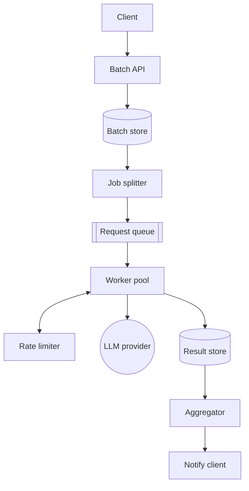

# LLM-Based Batch Processing System

## Table of Contents
- [Overview](#overview)
- [Use Case](#use-case)
- [Example Representation](#example-representation)
- [Architecture](#architecture)
- [Initial Plan](#initial-plan)
  - [Candidate models](#candidate-models)
- [Key Questions](#key-questions)
- [Rate Limiting](#rate-limiting)
  - [Token bucket algorithm](#token-bucket-algorithm)
  - [Distributed enforcement](#distributed-enforcement)
  - [Backoff and reconciliation](#backoff-and-reconciliation)
  - [Multi-tenant fairness](#multi-tenant-fairness)
- [Storage Model](#storage-model)
  - [Batch manifest record](#batch-manifest-record)
- [Querying for Batch Completion](#querying-for-batch-completion)
- [Optimization](#optimization)
  - [Atomic counters over scans](#atomic-counters-over-scans)
  - [Priority queuing](#priority-queuing)
- [Performance Considerations](#performance-considerations)
  - [Throughput](#throughput)
  - [Network efficiency](#network-efficiency)
- [Scaling Considerations](#scaling-considerations)
- [Summary](#summary)

## Overview
Accept large batches of LLM prompts, process every item against a provider API, and return results — without exceeding the provider's rate limits (requests-per-minute and tokens-per-minute).

## Use Case
- Let clients submit a batch (list of prompts + target model) and get a `batch_id` back immediately.
- Process every item asynchronously, tracking per-item and per-batch progress.
- Respect provider-imposed RPM/TPM limits across many concurrent workers and tenants.
- Notify the client when the batch completes.

## Example Representation
- `batch1`: 50,000 prompts against `claude-sonnet-4-6` — `in_progress`, 31,204 completed
- `batch2`: 200 prompts against `gpt-4` — `completed`

## Architecture

- **Batch API**: client-facing submission endpoint, returns `batch_id` immediately.
- **Batch store**: parent manifest — total/completed/failed item counts, status, locations.
- **Job splitter**: explodes a batch into individually trackable request items.
- **Request queue**: partitioned by provider/model, since limits differ per model.
- **Worker pool**: calls the LLM, but only after clearing the rate limiter.
- **Rate limiter**: shared, distributed TPM/RPM enforcement (see below).
- **Result store + aggregator**: per-item output, batch completion detection, client notification.

## Initial Plan
- Treat each batch as a parent record plus N child item records, not one giant blob.
- Track completion via counters on the parent, not by scanning child rows.

### Candidate models
1. Single batch row holding all prompts and results inline (e.g. one large JSON column)
   - Simple to write, but unworkable past a few hundred items — no per-item retry, no partial progress visibility, lock contention on every update.
2. Parent manifest row + child item rows (queue + results table)
   - Each item is independently retryable and trackable.
   - Parent row aggregates progress via atomic counters, not a join/scan over children.

## Key Questions
- Single provider or multiple providers/models with independent rate limits?
- Strict per-item ordering required, or is eventual, best-effort completion acceptable?
- Do tenants need isolated rate-limit shares, or is one shared pool acceptable?
- What's the SLA — minutes, hours, or a 24-hour batch window like provider-native batch APIs?

## Rate Limiting

### Token bucket algorithm
- One bucket per `(provider, model, api_key)`.
- Bucket capacity = TPM limit; refill rate = TPM / 60 tokens per second.
- A separate counter (sliding window or its own bucket) enforces RPM in parallel — both must pass before a call is allowed.
- Before calling the LLM, a worker estimates prompt tokens locally (tokenizer, not an API call) and atomically tries to deduct that estimate from the bucket.
- If the bucket can't cover the estimate, the worker does **not** call the API — it requeues the item with a short delay instead of guaranteeing a 429.

### Distributed enforcement
- A per-process bucket is useless once the worker pool scales beyond one machine — every worker would think it has the full TPM budget.
- The bucket lives in shared state (Redis), with check-and-decrement done as a single atomic operation (Lua script or `MULTI`/`EXEC`) so concurrent workers can't both pass the check and jointly overshoot.

### Backoff and reconciliation
- Pre-call token estimates drift from actual usage (response tokens are unknown until the response arrives). Deduct the estimate up front, then true up with actual completion tokens after the response lands — the bucket can briefly run "in debt" and self-corrects on the next refill tick.
- Where the provider exposes rate-limit response headers (e.g. `x-ratelimit-remaining-tokens`), periodically reconcile the local bucket against them to catch estimation drift.
- On a 429, apply exponential backoff with jitter, and honor `Retry-After` by feeding it back into the limiter so the same provider isn't hit again immediately.

### Multi-tenant fairness
- If multiple tenants share one provider API key, a single large batch can starve everyone else.
- Give each tenant a sub-bucket inside the global provider bucket — weighted fair queuing across tenant queues, capped at some max share of the global TPM — so no single batch monopolizes the limit.

## Storage Model
- One manifest row per batch (parent); one row per item in a separate queue/results table (child).
- Large payloads (prompts, full outputs) live in object storage, not inline in the manifest row — the manifest only stores references.

### Batch manifest record
```json
{
  "batch_id": "batch_7a2e9f01",
  "tenant_id": "org_1182",
  "model": "claude-sonnet-4-6",
  "status": "in_progress",
  "total_items": 50000,
  "completed_items": 31204,
  "failed_items": 12,
  "input_location": "s3://batches/org_1182/batch_7a2e9f01/input.jsonl",
  "output_location": "s3://batches/org_1182/batch_7a2e9f01/output.jsonl",
  "priority": "standard",
  "estimated_tokens": 9500000,
  "consumed_tokens": 5910344,
  "created_at": 1750420000,
  "started_at": 1750420012,
  "completed_at": null,
  "expires_at": 1750506412,
  "callback_url": "https://customer.example.com/webhooks/batch-complete",
  "error_summary": null
}
```
- `completed_items` / `failed_items` are incremented atomically by workers as items finish — the aggregator triggers off the count crossing `total_items`, not off a scan of child rows.
- `input_location` / `output_location` keep large payloads out of the relational row entirely.
- `status` is indexed alongside `tenant_id` so "this tenant's batches" and "all in-progress batches" are both cheap queries.
- `estimated_tokens` / `consumed_tokens` feed both cost tracking and the rate limiter's per-tenant fairness accounting.
- `expires_at` lets a sweep job mark stale batches `expired` instead of leaving them `in_progress` indefinitely.

## Querying for Batch Completion
Workers update the manifest as items finish; the aggregator never needs to scan the items table to know if a batch is done:

```sql
-- Step 1: worker finishes an item, atomically advances the parent counters
UPDATE batches
SET completed_items = completed_items + 1,
    consumed_tokens = consumed_tokens + :item_tokens_used
WHERE batch_id = :batch_id;

-- Step 2: check completion as a cheap follow-up read (or trigger/CDC on the row)
SELECT batch_id
FROM batches
WHERE batch_id = :batch_id
  AND completed_items + failed_items >= total_items
  AND status = 'in_progress';

-- Step 3: if step 2 returns a row, transition status and hand off to the aggregator
UPDATE batches
SET status = 'completed', completed_at = :now
WHERE batch_id = :batch_id
  AND status = 'in_progress';
```
- The final `UPDATE ... WHERE status = 'in_progress'` is the guard against two workers both completing the last item concurrently and double-firing the aggregator — only one of them will see the row still `in_progress` and win the transition.
- At high item-completion rates, step 1 becomes the hot path; see [Atomic counters over scans](#atomic-counters-over-scans) for how to keep it off the DB entirely.

## Optimization

### Atomic counters over scans
- Counting completed items by querying the items table (`SELECT count(*) FROM items WHERE batch_id = ? AND status = 'done'`) doesn't scale once batches hit millions of items.
- Have workers increment a counter in Redis instead of hitting the DB on every single item, and flush the aggregate to the manifest row periodically (every N items or every few seconds) rather than per item.

### Priority queuing
- Partition the request queue by `(model, priority)` so a "fast-lane" tier isn't stuck behind a slow bulk batch on the same model.
- The rate limiter's per-tenant sub-buckets (see [Multi-tenant fairness](#multi-tenant-fairness)) compose with priority — priority decides queue order, the limiter decides how fast any tier can actually drain.

## Performance Considerations

### Throughput
- The token-bucket check-and-decrement (Redis Lua script) is the per-call hot path — keep it O(1) and avoid round-tripping to the DB on every item.
- Worker pool should be stateless and horizontally scalable; provider call latency, not local compute, is the bottleneck.

### Network efficiency
- Reuse HTTP connections / connection pools per provider host instead of a new connection per call.
- Batch multiple small prompts into a single provider call where the provider's API supports it (reduces RPM pressure independent of TPM).
- Apply a circuit breaker per provider so sustained outages don't tie up the whole worker pool retrying.

## Scaling Considerations
| Concern | What happens at scale | Mitigation |
|---|---|---|
| Hot manifest row | High-throughput batches generate thousands of counter increments/sec on one row | Aggregate in Redis, flush to the manifest periodically instead of per item |
| Token bucket contention | All workers for a model hit the same Redis key | Atomic Lua script keeps the check O(1); shard the bucket by API key if a model has multiple keys |
| Tenant starvation | One large batch consumes the entire shared TPM budget | Per-tenant sub-buckets with a capped share of the global limit |
| Provider outages | Worker pool retries pile up against a dead provider | Circuit breaker per provider/model, fail fast and requeue instead of blocking workers |
| Queue depth | Millions of queued items for a single huge batch | Partition the queue by model/priority; size worker pool to sustained drain rate, not peak submission rate |

## Summary
- Split each batch into a parent manifest plus independently retryable child items — never store a batch as one inline blob.
- Enforce TPM and RPM with a distributed token bucket per `(provider, model, api_key)`, checked atomically before every call.
- Estimate tokens pre-call, reconcile with actual usage post-call, and back off with jitter on 429s.
- Give tenants fair sub-buckets within the shared limit so no single batch starves the rest.
- Track batch completion via atomic counters on the manifest, not scans over child items — aggregate in Redis if the increment rate gets hot.