## Kademlia - a pure P2P Distributed Hash Table

To gert information about peers, a node in the BitTorrenet network talks to the `Tracker`. 
Haviing a centail entity is still prone to attack and failures
SO, we can do a pure p2p netowrk without Tracker

# Kademlia 
Say, we ave a gigantic set of K-V pairs tat one nmode cannot store or handle

Hence we have to distribute. hence it is called a Distributed Hash Table

1. how do we distribute? 
2. how would a node know hhow to find a KV? 
3. how to gracefully andle nodes joininng/leaving? 

# Representation 
Every node(machine) participating eta unique 160bit or 20 Byte ID

The unique id can be 
- explicitliy assined
- implicity derived - for P2P

The data that i s stored across te netowk is also ased and identified by 160b ID 
.ie KV pair

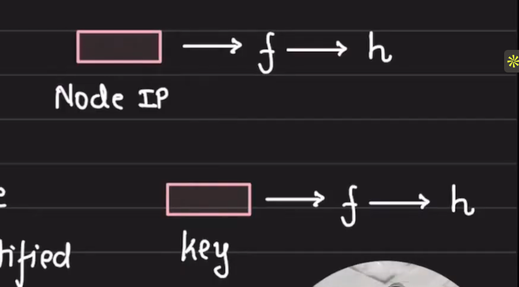

Thhis is a enric DHT, nothing specifc to bittorrent
In the conrtext of BitTorre,nt, the only thing tat changes is teh kind of information (rechanle peers) stored on te node.

# Owndership

key: k1 -> hash(k1) 
    Node_N1 -> HN1

The node that is closesst to the key, owns the key (*not the ring)

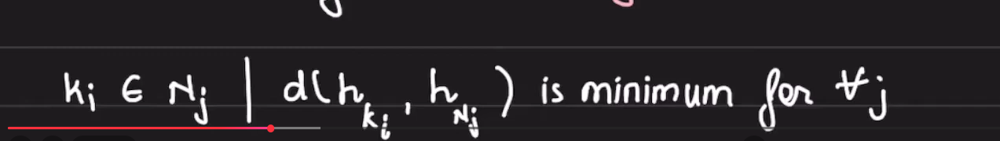

- Requriement from a ditance metric

1. d(x, x)  = 0                 -- distance to self is zero
2. d(x, y)  > 0 if x!=y       -- distrance to other is +ve
3. d(x,y) + d(y,z) >= d(x,z)   -- Triangle inequality

For two nodes/keys in kademlia disstribution, the ditrance metrix ids 

d(x,y) = X ^Y (xor)
bitwise xor of 160 bit IDs

# Visualizing Ditrance

for simp;lication, sayy we work wit 4 bit ID
i.e nodes and keys are given in 4 bit IDs

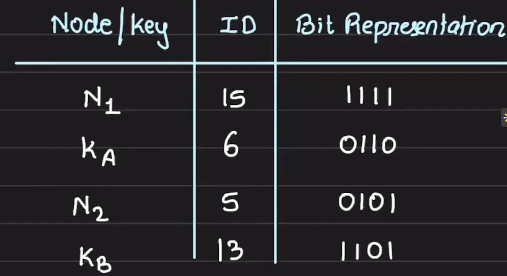

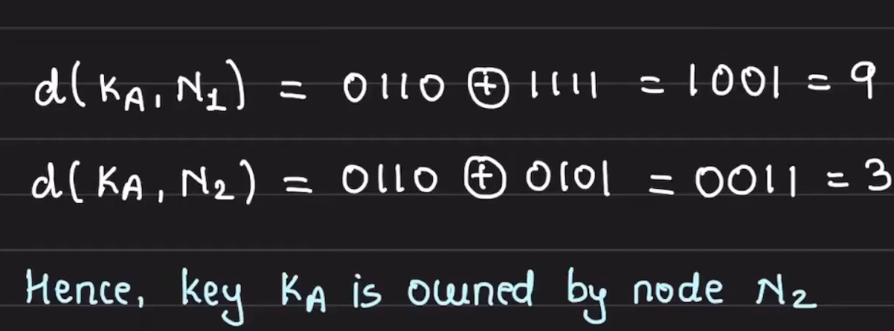

A paater we see iss that the ` Commo the prfix, smaller te distacnce`
the bits that are same would XOR to 0
So, IDssaring the same preix are closer

Hence, we visualzie this a a `TRIE`

we can ese hhow (N1, KB) are `closse` and (N2, KA)  are `closse`

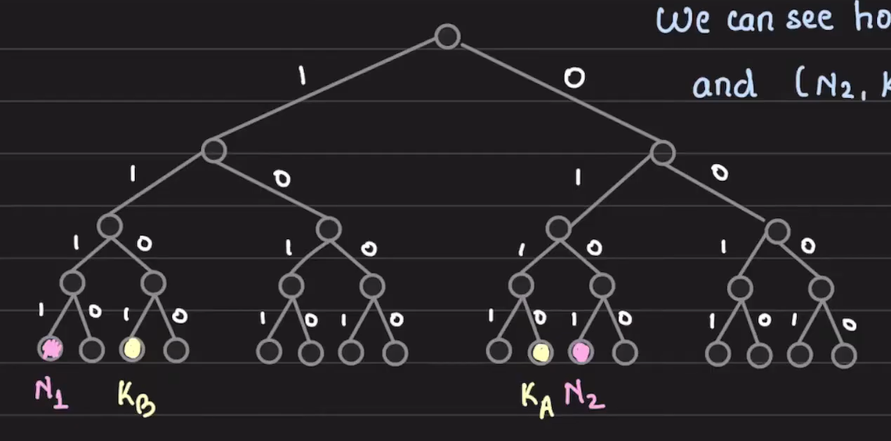

Instreaf of creating the complete BVinary tree, we create the path as needed. 
insteaf of creating complete path, we carve it till it minimally disambigous 

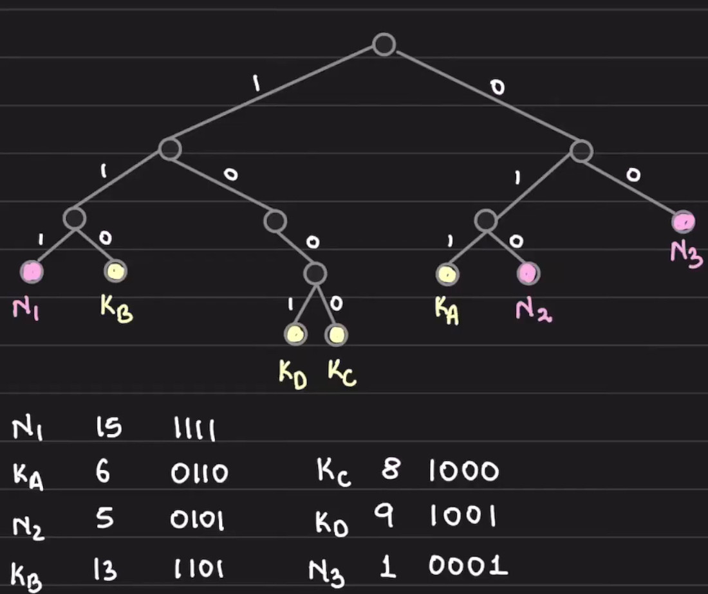

i.e we try to place them at smallest height posssible

## Routing

iven that tyhere i not cental entrityy to hhhold the address of all the nodes
How would one nore access the KV on the other? 

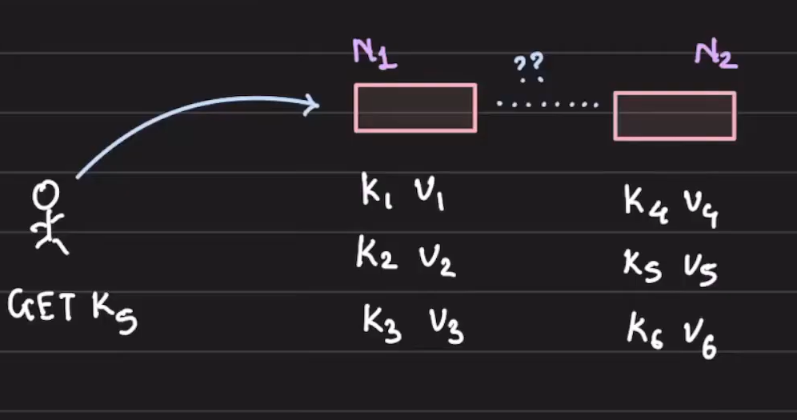

Every nodes in the networ would need to keep the track of a few neightbouting nodes, and hope they keep trackc of other and sso on.
Eventaully we swoul ave coverewd the entrie network. 

Peer nodes that each nodes keep track of cannot be `Random` as we need guranteed convergence qucikly

Core Idea: Every nodes knonws at alreat one node in each sub-tree that it is not part of. 

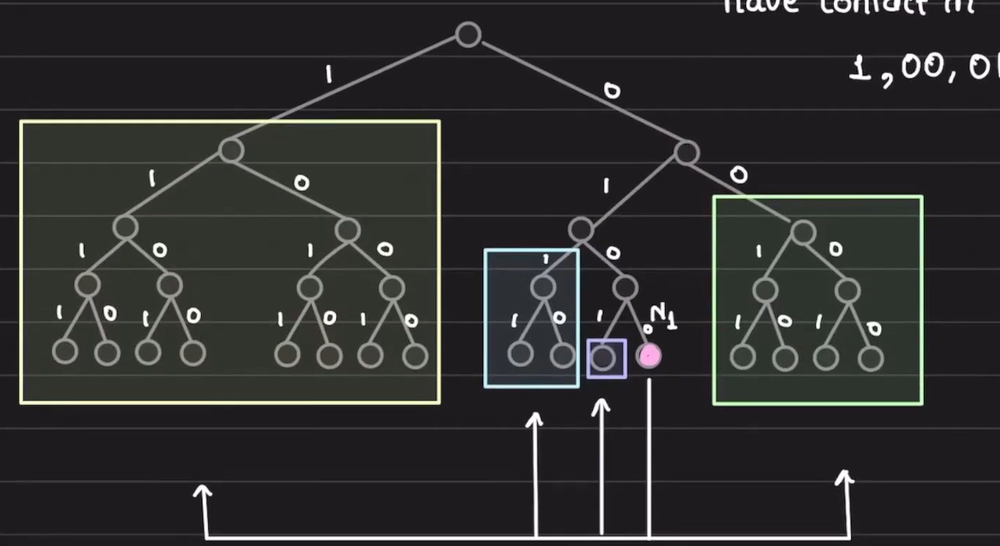

Routrin table of node N1 shold have contract in the 4 subtrees. 

let N1 = 0100

so, it has to keep track of 4 subtrees that is is not part of
1, 00, 011, 0101

IF every node int he network keep trakc of atleats one node in each subtree, we would converge to the desired node in `log(n)` time

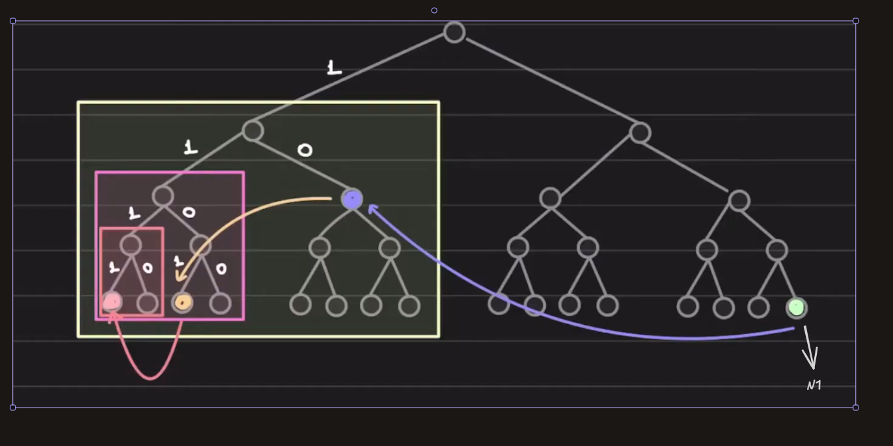

Sayy, N1(0000) want to reach N2(1111) that it does not have direct connection with, sso it will elverage intermediate nodes in the routing table. 

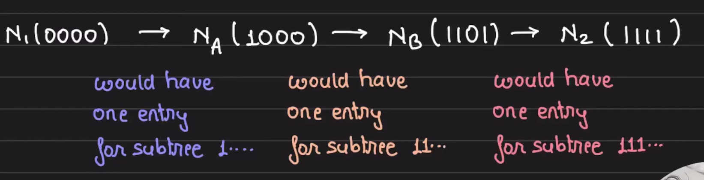

Thus each node only ha to keep track of small susbset odff nodes and the routing takes care of convergint to the traget nodes. 

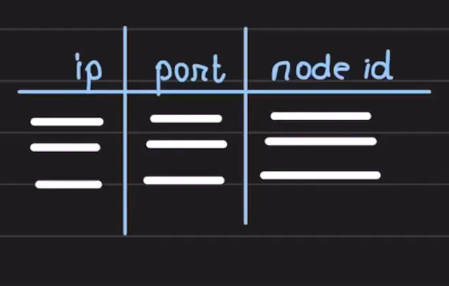

- Communiation happendss over UDP and routing table holdss

node id -> <ip, udp port>

As the routing cvonvered when eveyr noders has a few contract in every substree that t i not part of 
- the problem statemnt reduces to makeing fault tolernace

# K buckets
- everyuy nodes, for each ubtree holds k entries 

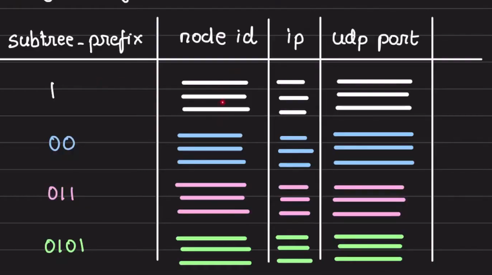

each k0bucket i sorted by time laxt  seem
 - mot recently seen at the tail
 a typic k iis s20, i.e for each ubtree, each nodess holds 20 ccontracts. 

 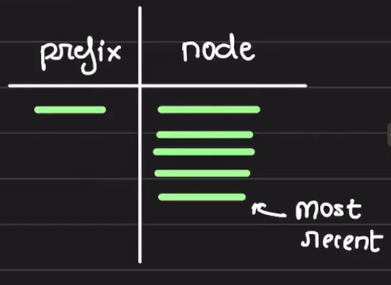

 # Updatingg the route table

 - when a ndoe receives anyy messae from the other node in trhe netwoek, it updates it's appropriate k0bucket with the node id. 
1. entry iss alway added at the tail
2. entry is alwayys created at the tail

if the k-bucket is full
- node pings sthe least recently seen node in the bucket (at the head)
- if no response, newthen evict and inserst new node at the tail
- if responsds, new node is disscarded and first node is moved to the tail

It is observed, that if a node is online for a long time, it would continue to remain online in the furture

# Communcation interface: 

Everuy node part of Kademila exposes 4 RPS

PING: proble a node to see if it is online
FIND_NODE: the node return <ip.port, node id> for the k nodes it knows about that are closer to the rewquirested node

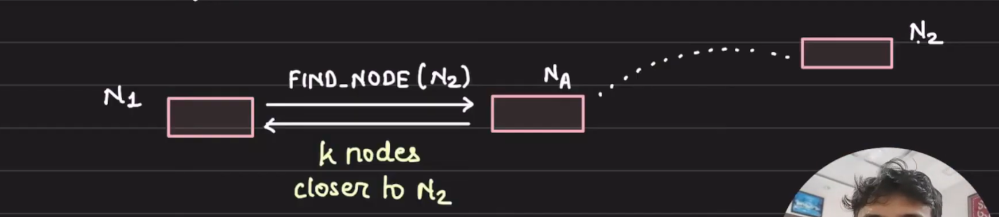

FIND_VALUE: it is like FIND_NODE but the machine that holds the key, it would return the stored value

Note: the intermediate nodes do not forward the requierst, theyy just return the nodess through which we could reach the traget.

The lookup continue until we reach the traget and complete desired action. 

## Stroing KV

insstruact a node to tore KV pair

to tore a KV pair, a node locate k-cloets nodes and end them STORE RPC
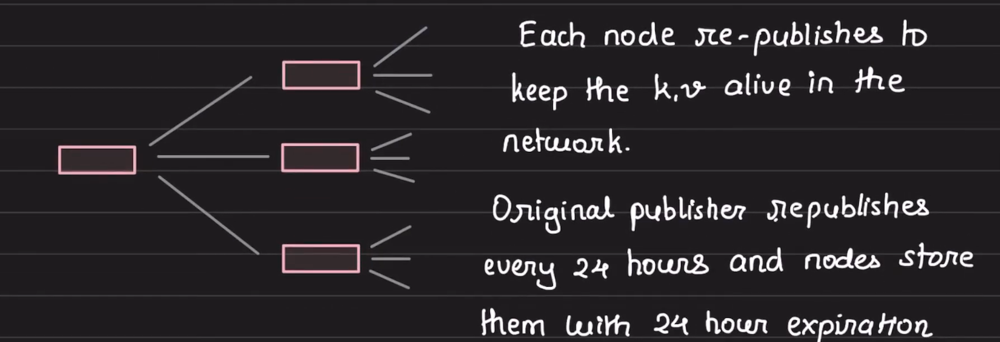

- The implemenation of STORE varie a per the usecae
- inle-copyy/mulitple copies
- expireation/no expirawtion
- readx//write responssisbilites

# Performance Optimization
- cache the KV pair thorught the chain
If node goess down, neightboin nodes would aleady haver the KV pairs

