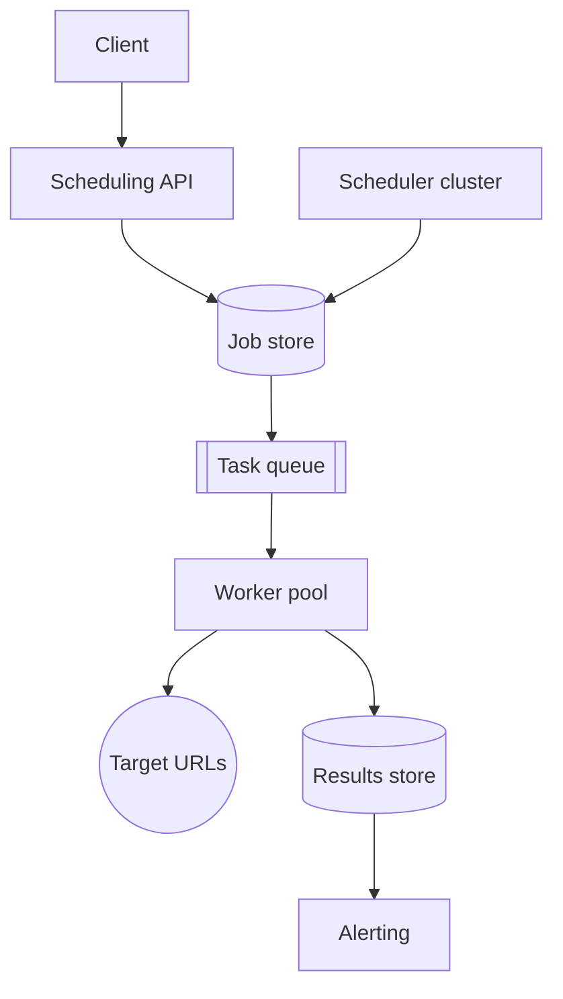

# Scheduled HTTP Ping System

## Table of Contents
- [Overview](#overview)
- [Use Case](#use-case)
- [Example Representation](#example-representation)
- [Architecture](#architecture)
- [Initial Plan](#initial-plan)
  - [Candidate models](#candidate-models)
- [Key Questions](#key-questions)
- [Scheduling Precision](#scheduling-precision)
- [Storage Model](#storage-model)
- [Optimization](#optimization)
  - [Due-jobs-only dispatch](#due-jobs-only-dispatch)
  - [Dedup and idempotency](#dedup-and-idempotency)
- [Performance Considerations](#performance-considerations)
  - [Throughput](#throughput)
  - [Network efficiency](#network-efficiency)
- [Scaling Considerations](#scaling-considerations)
- [Summary](#summary)

## Overview
Fire HTTP requests against configured URLs on a recurring schedule (cron-like), reliably and at scale, without double-firing or silently dropping jobs.

## Use Case
- Let users register jobs with a target URL, method, and a schedule (cron expression or interval).
- Execute each job at its scheduled time and record the outcome.
- Support a large number of jobs with independent, possibly overlapping schedules.

## Example Representation
- `job1`: `https://api.example.com/health` every `5m`
- `job2`: `https://example.com/webhook` at `0 * * * *` (hourly)

## Architecture

- **Scheduling API**: client-facing CRUD for jobs.
- **Job store**: source of truth, indexed by `next_run_time`.
- **Scheduler cluster**: leader-elected or sharded; polls due jobs and enqueues them.
- **Task queue**: decouples "what's due" from "actually calling it."
- **Worker pool**: makes the HTTP call, retries on failure, writes results.
- **Results store + alerting**: execution log and failure notifications.

## Initial Plan
- Use a key-value / relational model for job definitions.
- Derive "due now" from a stored next-run timestamp rather than re-evaluating the cron expression on every tick.

### Candidate models
1. `job_id -> cron_expression`
   - Recompute "is this due" on every scheduler tick by evaluating the cron expression.
   - Simple, but expensive at scale — every tick re-parses every job's schedule.
2. `job_id -> next_run_time`
   - Precompute the next run time once, store it, and index it.
   - Scheduler query becomes a cheap range scan: `WHERE next_run_time <= now`.

## Key Questions
- How precise does "scheduled time" need to be (second-level vs minute-level)?
- Polling vs an in-memory timing wheel — does the use case tolerate poll latency?
- What happens when a target URL is slow, down, or returns an error?
- How many scheduler replicas run concurrently, and how do they avoid double-firing the same job?

## Scheduling Precision
- The acceptable drift between scheduled time and actual fire time is subjective.
- Minute-grained cron jobs tolerate a poll interval of 10–60 seconds.
- Sub-second precision needs an in-memory timing wheel instead of DB polling.
- Finalize the poll interval (or wheel granularity) based on the application's tolerance for drift.

## Storage Model
- Store one row per job:
  - `job_id`: identifier
  - `url`, `method`, `headers`, `body`: request definition
  - `schedule`: cron expression or interval
  - `next_run_time`: indexed, drives the scheduler query
  - `timeout`, `retry_policy`: execution behavior
- For millions of jobs, the dominant cost is the `next_run_time` index, not the row payload itself — keep it narrow and indexed.

## Optimization

### Due-jobs-only dispatch
- The scheduler never scans the whole job table — only the `next_run_time` index range that's due.
- After dispatch, atomically advance `next_run_time` to the job's next occurrence so it isn't picked up again before then.

### Dedup and idempotency
- Tag each dispatched task with a `(job_id, scheduled_time)` key.
- If a queue message is redelivered (at-least-once delivery), the worker can detect and skip a duplicate execution for the same key.

## Performance Considerations

### Throughput
- Scheduler claims should use row-level locking (e.g. `SELECT ... FOR UPDATE SKIP LOCKED`) so multiple scheduler replicas don't contend on the same due jobs.
- Worker pool should be stateless and horizontally scalable, since HTTP call latency to external targets is the main bottleneck, not local compute.

### Network efficiency
- Reuse HTTP connections / connection pools per target host instead of opening a new TCP (and TLS) connection per ping.
- Apply a circuit breaker per target URL so a single dead endpoint doesn't tie up the whole worker pool.
- Connection setup (TCP + TLS handshake) can add multiple round trips per request if not pooled.

## Scaling Considerations
- Shard the job table or the scheduler's claim range by `job_id` hash to spread load across scheduler replicas.
- Use a message queue (Kafka, SQS, Redis streams) to absorb bursts of due jobs without blocking the scheduler.
- Persist execution results in a write-optimized store, since result volume scales with execution frequency, not job count.

## Final Desgin

## Summary
- Drive scheduling off a stored, indexed `next_run_time` rather than re-evaluating cron expressions on every tick.
- Decouple "deciding what's due" (scheduler) from "doing the work" (worker pool) via a task queue.
- Use leader election or sharding to avoid duplicate dispatch across scheduler replicas, plus a dedup key to avoid duplicate execution.
- Use connection pooling and per-target circuit breakers to keep worker throughput high against slow or failing endpoints.

