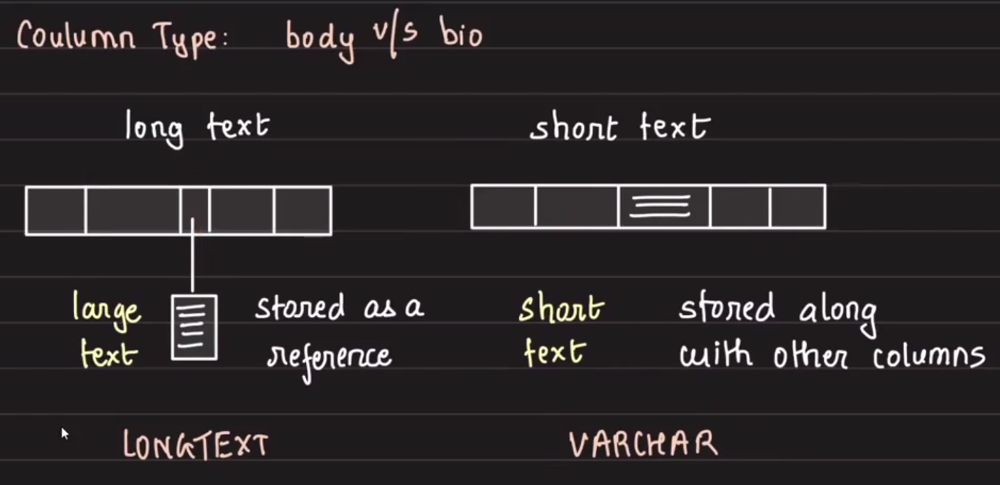

## Medium App

### Functional requirements

- User can create a blog
- User can view all blogs

### What DB?

Users:
- id
- name
- bio

Blogs:
- id
- author id
- title
- body
- published_at
- is_deleted [soft delete]

### Importance of `is_deleted`

- Soft delete

Why do we do soft delete?

- Recoverability
- Archival
- Audit

Main reasons:
- Easy on DB engine [no tree re-balancing]

## Bio and body column

- `body` is big in size
- `bio` is short text

body: long text
bio: short text

This long text is stored on disk.

So there are two calls: one to read the column and one to read the reference point to the disk.

## Storing datetime in DB (`published_at` column)

- Store it as a datetime object in DB
  - Example: `2020-07-07T12:00:00Z`
  - Serialized in this format
  - It will be around 20 bytes
  - On disk it may be stored as a string
  - Then DB reads the string and converts it to a datetime object for comparisons
  - This is expensive

- Store datetime as epoch integer
  - This is seconds since 1st Jan 1970
  - Example: `1594104000`
  - Will take only 4 bytes
  - Not human readable
  - Efficient, optimal, and lightweight

- Store datetime in a custom format
  - Example: `YYYYMMDD` -> `20200707`
  - Stored as integer
  - Still 4 bytes
  - Human readable
