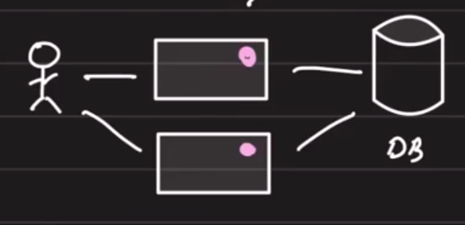
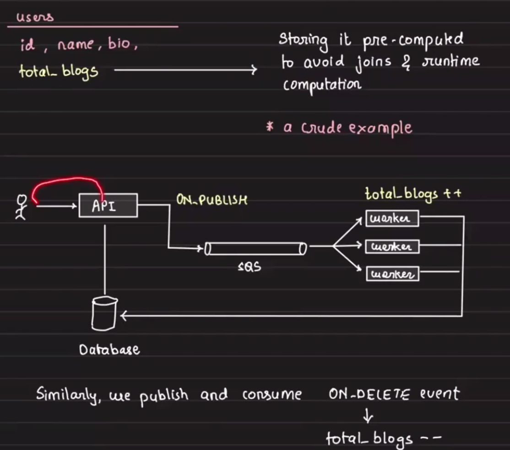
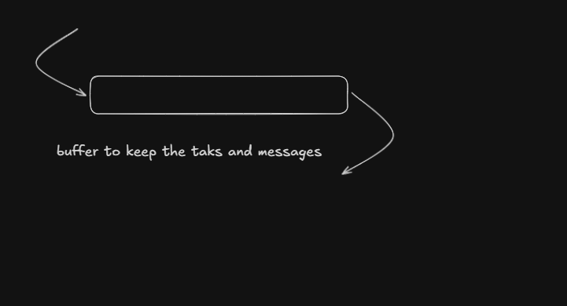
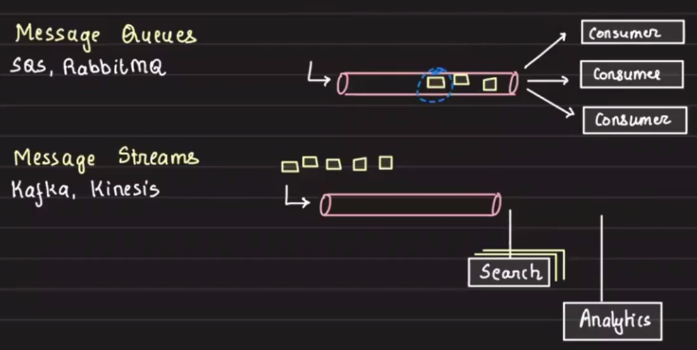
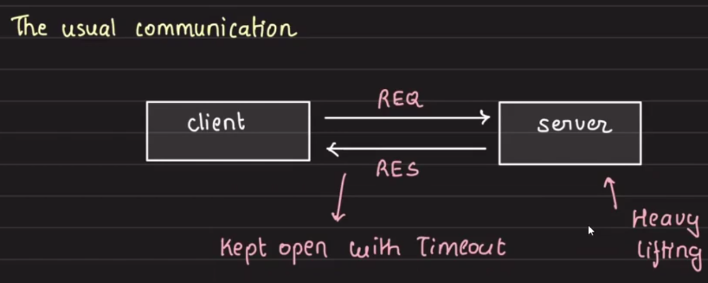
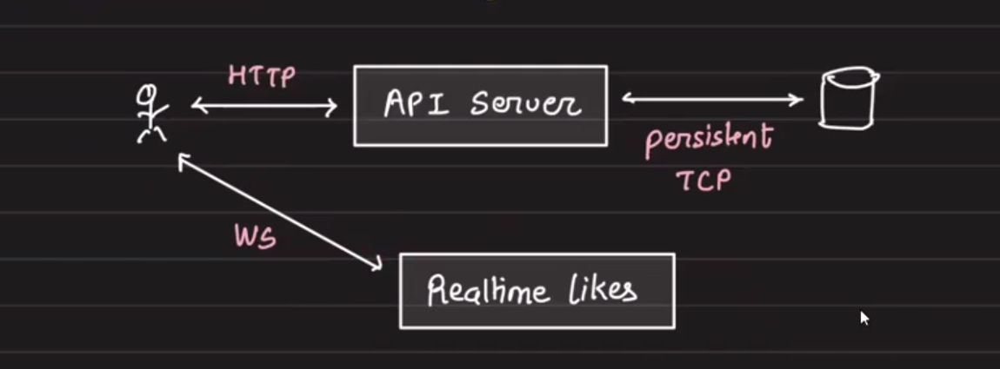

# System Design Notes: Caching, Scaling, Delegation, and Communication

## Foundation Topics

### Caching at Different Levels
1. API server memory cache
   - limited capacity
   - API server cache can fail when data is down
   - high inconsistency risk
   
   

2. Database views (materialized views)
   - useful when queries involve joins across multiple tables
   - pre-join tables and store as a separate table
   - best when data is mostly static

3. Browser cache (local storage)
4. CDN cache
5. API server disk cache
   - servers typically have attached disk storage, such as EC2 instance storage
   - disk is often underused, so it can be leveraged for caching
6. Load balancer cache (nginx)
7. Remote central cache (Redis)

## Scaling
- ability to handle large numbers of concurrent requests
- vertical scaling vs horizontal scaling

### Scaling for a Medium App
- initially scale vertically, then scale horizontally

### Scaling the Database
- vertical scaling
- create read replicas
  - replicas pull changes from the master
- sharding

## Delegation
- example: add basic analytics to a blog site
- *performance mantra*: if it does not need to be done in real time, it should not be done in real time
- handle those tasks with workers
- example: total number of blogs a user has written

Core idea: delegate and respond.

## Brokers

### Two Common Implementations

- Message queue: typically one consumer
  - examples: SQS, RabbitMQ
- Message streams:
  - examples: Kafka, Kinesis
  - supports multiple consumers

### Kafka Limitation
- example: 1 topic, 3 partitions, 5 consumers
- only 3 consumers can work concurrently, and the remaining consumers idle
- this reduces parallelism

## Concurrency
- communication between threads
- concurrent use of shared resources such as database and in-memory variables

### Handling Concurrency
- locks (optimistic and pessimistic)
- semaphores
- lock-free approaches

## Communication Patterns

### Common Communication Styles

- Short polling
  - disadvantages:
    - HTTP overhead
    - repeated requests and responses
- Long polling
  - reduces request frequency

### Long Polling vs Short Polling
- short polling sends responses immediately
- long polling sends a response only when work is complete
- long polling keeps the connection open for the entire duration

## WebSockets
- bidirectional communication
- advantages:
  - real-time data transfer
  - low communication overhead

### Server-Sent Events
- server proactively sends data to clients
- use cases:
  - stock market tickers
  - streaming deployment logs

## Using Real-Time Features in a Medium Blog App

Real-time interactions:
- live update of counts without refresh
- Instagram-style live interaction updates
- on Medium, article clap counts should update in real time for other readers

