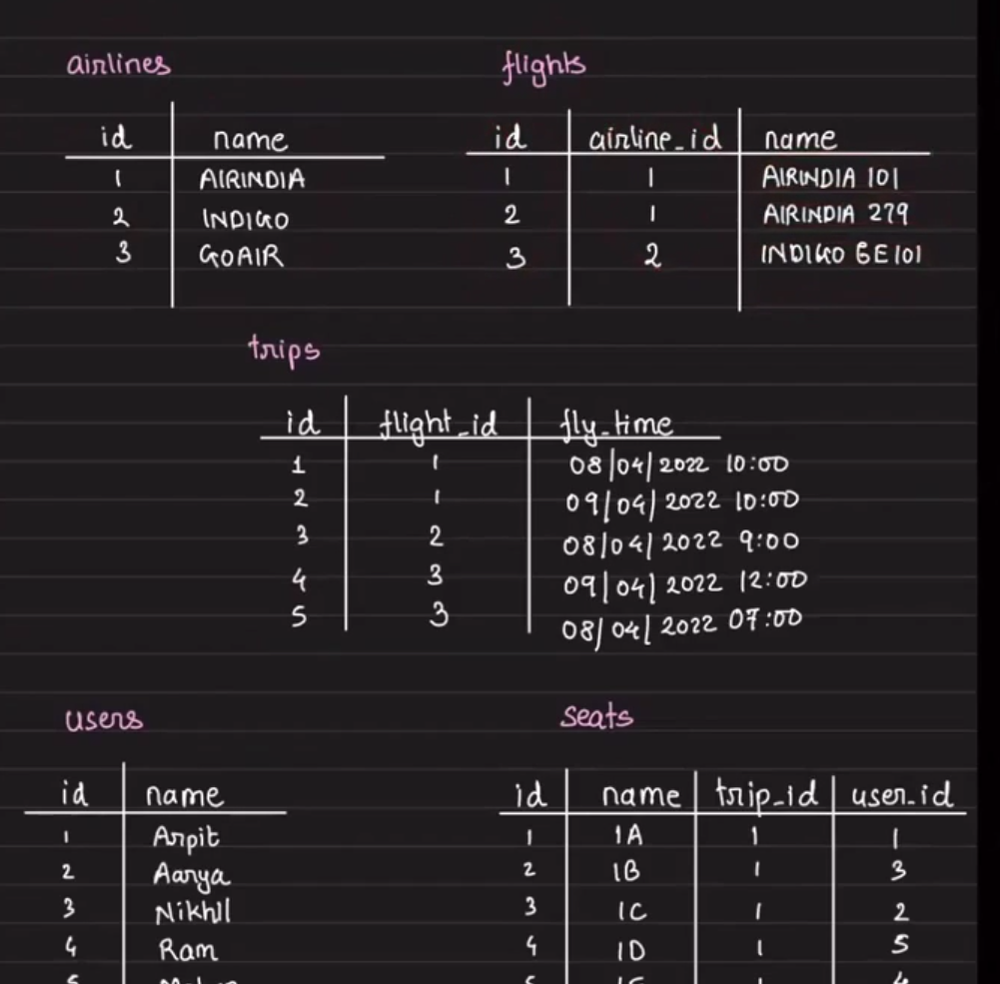
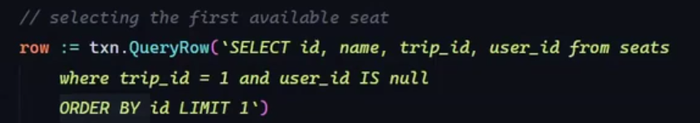
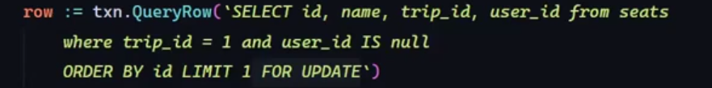
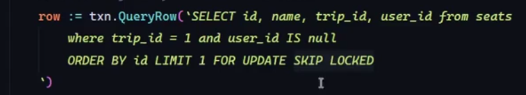

# Relational Databases

## Topics Covered
1. Relational databases and pessimistic locking
2. Designing an airline check-in system
3. Designing a key-value store on a relational database

## Indexes
- Indexes make reads faster and writes slower.
- Writes are slower because:
  - The new row is written to the table.
  - The indexed column value is inserted into the index.
  - The index structure may need rebalancing or reorganization.
- Similarly, when updating an indexed column:
  - Remove the old index entry.
  - Add the new index entry.
  - Maintain the index's internal structure.

## Database Locking (Pessimistic Locking)

- Core idea: acquire the lock before processing.

### Locking flow-
1. `acquire_lock()`
2. read / update
3. `release_lock()`

### Locking strategies

#### Shared lock
- Reserved for read by the current transaction.
- Other transactions can read the locked rows.
- Other transactions cannot modify the locked rows.
- If the current transaction wants to modify the row, the lock is upgraded to an exclusive lock.

#### Exclusive lock
- Reserved for write by the current transaction.
- Other transactions cannot read or modify the locked rows.

### Why locks are needed
- To protect the sanity of data.
- Sanity means consistency and integrity.
- To protect data from concurrent updates.

### Risks
- Transactional deadlock.
- The transaction that detects the deadlock may kill itself to resolve it.

## Locking Clauses

| Clause              | What it does                                                                                        |
| ------------------- | --------------------------------------------------------------------------------------------------- |
| `FOR UPDATE`        | Exclusive lock. Prevents others from updating or deleting the selected rows.                        |
| `FOR SHARE`         | Shared lock. Others can read but cannot update the rows.                                            |
| `FOR NO KEY UPDATE` | PostgreSQL-specific. Weaker than `FOR UPDATE`; allows some operations that don't affect key values.   |
| `FOR KEY SHARE`     | PostgreSQL-specific. Protects foreign key relationships.                                            |
| `NOWAIT`            | Don't wait for a lock. Fail immediately if locked.                                                  |
| `SKIP LOCKED`       | Skip rows that are already locked by another transaction.                                           |

## Designing an Airline Check-in System

### System assumptions
- Multiple airlines.
- Each airline has multiple planes.
- Each flight has 120 seats.
- Each flight has multiple trips.
- A user books a seat on one trip of a flight.
- The system must handle multiple people trying to pick seats on the same plane.

### Check-in scenario
- Passengers have already booked flights.
- They are now checking in and selecting seats.

## Check-in Approaches

### Approach 3

- Only a few seats will be filleds
- Using `ORDER BY`, the query picks the first seat where `user_id` is `NULL`.

### Approach 4

- All seats will be filled.
- While one transaction is in progress, other transactions wait.
- When the first transaction commits, the second transaction reevaluates the query and picks the next seat.

- Time taken: 1.7 seconds

### Approach 5

- `SKIP LOCKED` causes the query to re-evaluate immediately.
- No other transaction waits.

- Time taken: 147 ms
- This made the system about 10x faster.

## Key takeaway
- Fixed inventory plus contention leads to locking.
- When this case arises, use locks to manage concurrency.

 

