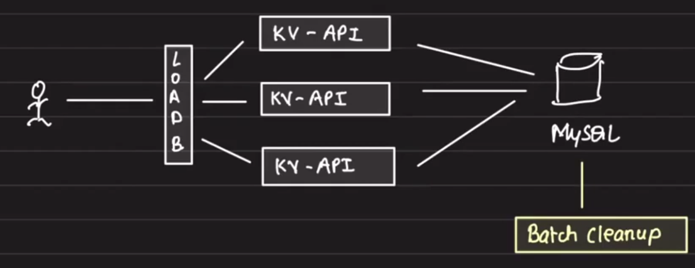
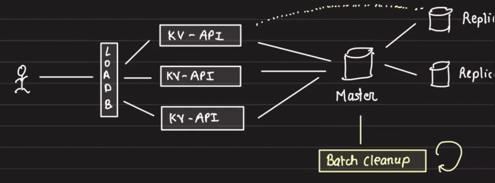
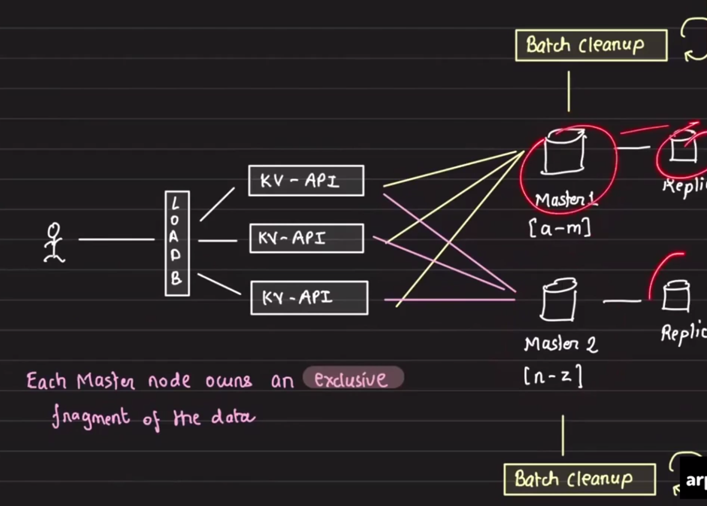

# Key-Value Store on a Relational Database

## Requirements
- Infinitely scalable
- `GET`, `PUT`, `DEL`, `TTL`

## Brainstorm
- Storage design
- Storage optimization
- Insert / update behavior
- TTL / expiration handling

Example: Apache Ignite is a key-value store built on a relational database.

## Storage
- `KEY` is the primary key.

### Storage design options

1. Full table scan on key lookup
   - This is the worst query because it must scan the entire table to find the key.
   - We do not need `CRT_TS` for this design.

2. Secondary index on `expired_at`
   - Use a single index on the `expired_at` column.
   - Store `-1` in `expired_at` for manually deleted keys.

   Example:
   ```sql
   UPDATE store SET expired_at = -1 WHERE key = k;
   DELETE FROM store WHERE expired_at < NOW();
   ```

3. Soft delete with an `is_deleted` column
   - Mark rows as deleted first, then hard delete later.
   - This can optimize storage and reduce write amplification.

## Insert behavior

### Option 1: plain insert
```sql
INSERT INTO store VALUES (k, v, e);
```
- This is bad if the key already exists.
- We want to insert when the key does not exist, and update when it does.
- A plain insert would fail for duplicate key values.

### Option 2: upsert
- Use upsert to handle insert-or-update logic.
- PostgreSQL supports `INSERT ... ON CONFLICT ... DO UPDATE`.
- MySQL supports `REPLACE INTO` or `INSERT ... ON DUPLICATE KEY UPDATE`.

## TTL / key expiration

### Question: how do we expire keys?

#### Lazy deletion
- When fetching a key, filter by expiration time:
  ```sql
  SELECT * FROM store WHERE key = k AND expired_at > NOW();
  ```
- On delete, mark the key as expired:
  ```sql
  UPDATE store SET expired_at = 0 WHERE key = k;
  ```
- If a key is never fetched, it may remain in the table until cleanup runs.

#### Hard delete cleanup
- Run a periodic cleanup job to remove expired rows.
- This minimizes disk usage and avoids retaining stale data.

## Implementation choices

### Storage backend
- Start with a single MySQL node.
- Scale horizontally if system demands increase.

### Schema: `store`
- `key`
- `value`
- `ttl`
- `is_deleted`

### Why use `is_deleted`?
- It allows soft deletes without immediately removing rows.
- Soft delete plus periodic cleanup avoids repeated index churn.
- Use absolute expiration time in `ttl`, and `-1` to mark deleted entries.

### Hard delete strategy
- Batch and periodic cleanup:
  - Run a separate cleanup job to hard delete soft deleted rows.
  - Minimize I/O and index rebalancing.

## Insert / update flow

1. If the key exists, update it.
2. If the key does not exist, insert it.

```sql
REPLACE INTO store VALUES ('key', 'value', ttl);   -- MySQL
UPSERT INTO store VALUES ('key', 'value', ttl);    -- PostgreSQL-style
```

### Handling concurrent writes
- Multiple `PUT` requests require locking.
- Use row-level locking for the key being updated.

```sql
SELECT * FROM store WHERE key = k FOR UPDATE NOWAIT;
UPDATE store SET value = v2 WHERE key = k;
```

## TTL strategies

### Approach 1: batch cleanup
- Use a cron job to delete expired keys.

### Approach 2: lazy deletion
- Delete a key only when it is fetched and found expired.
- Problem: if a key is never fetched, it remains in the table.
- Add periodic cleanup to remove expired keys.

### Approach 3: random sampling cleanup
- Not suitable for disk-backed databases.
- Randomly sample a set of keys with expiration times.
- Delete expired keys from the sample.
- If more than 25% of the sample is expired, repeat the process.

> If the sample contains 25% expired keys, the overall population likely has less than 25% expired keys remaining.

This approach is used by Redis. The sample size `20` is motivated by the central limit theorem.

## Delete behavior

```sql
UPDATE store SET ttl = -1 WHERE key = k1 AND ttl > NOW();
```
- The `ttl > NOW()` condition reduces disk load.
- Only delete keys that are not already expired.

## Batch cleanup

```sql
DELETE FROM store WHERE ttl <= NOW();
```
- Removes expired and soft-deleted entries.

## Read implementation

```sql
SELECT * FROM store WHERE key = k AND ttl > NOW();
```

- The `ttl` column should always be indexed.

## High-Level Architecture



- Add as many KV API servers as needed to support the load.
- If reads are 99:1 and the database is the bottleneck, add read replicas.



- Add replicas only when:
  - reading stale data is acceptable
  - read:write ratio is very high (for example, 99:1)

### Scaling writes
- If the master is seeing a lot of writes:
  1. first vertically scale up the master
  2. if that is still not enough, partition the data



- Each master node owns an exclusive fragment of data.
- The KV API layer routes requests to the correct master.
