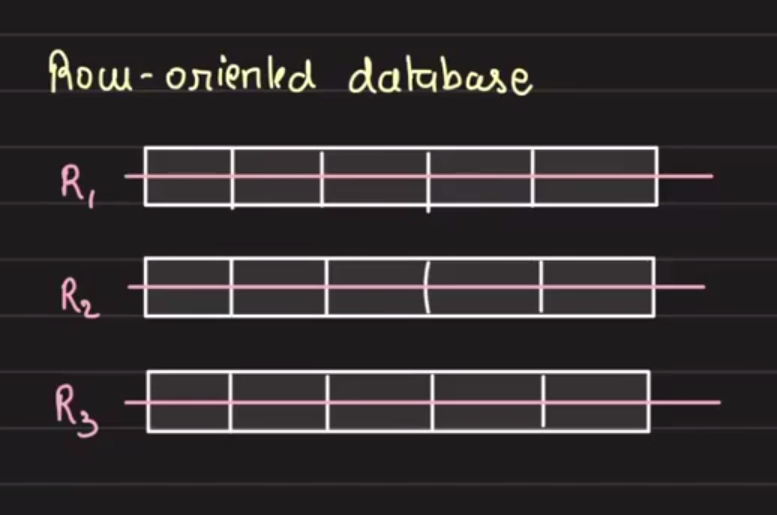
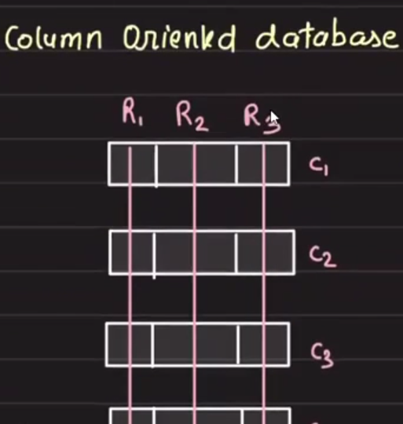

# Non-Relational Databases

**NoSQL:** Data structured in a non-relational format.

In most cases, NoSQL databases provide scalability and availability by compromising consistency. Most NoSQL databases are `eventually consistent`.

## Types of NoSQL Databases

### 1. Document Databases

- Mostly JSON-based
- Support complex queries
- Partial updates to documents possible
- Closest to relational databases
- Examples: `MongoDB`, `ElasticSearch`

### 2. Key-Value Stores

- Key-wise access pattern
- Heavily partitioned
- No complex queries supported
- Examples: `Redis`, `DynamoDB`, `Aerospike`

### 3. Column-Oriented Databases

#### Row-Oriented vs Column-Oriented Storage

**Row-Oriented Databases:**



- All columns are stored together in a row
- When reading data, the complete row is read and saved to disk I/O

**Column-Oriented Databases:**



- Data is stored by columns rather than rows
- Example use case: Suppose you have a table with 100 columns and want to perform analytics to find the average price:

```sql
SELECT avg(price) WHERE TS = '----'
```

**Key Benefits:**

- In row-oriented databases, you would have to read all rows and then perform the operation, which is inefficient
- In column-oriented databases, the operation can be performed on the data within the column itself, which is much more efficient
- Column-oriented databases only read the columns that are part of the query and skip others entirely
- This is why column-oriented databases are used for massive analytics and data warehouses (e.g., `Redshift`)

**Reference:** Foundational paper on column-oriented databases: "C-Store: A Column-Oriented DBMS"

### 4. Graph Databases

- Store data in nodes and edges
- Great for modeling social behaviors and recommendations
- Solid use case: Fraud detection
- Examples: `Neo4j`, `TitanDB`, `OrientDB`, `Neptune`, `Dgraph`, `TigerGraph`

**Fraud Detection Example:**

Most people perform domestic transactions. If you attempt an international transaction, this creates a totally new edge in the graph. This allows you to check if the user has already made this type of transaction before. Banks use this pattern when they call to confirm: "Are you trying to make this transaction?"

## Why NoSQL Databases Scale

- No relational constraints
- Data can be denormalized
- Data is modeled to be sharded
  - Note: You can also achieve this with SQL databases

## SQL vs NoSQL Comparison

| Aspect | SQL | NoSQL |
|--------|-----|-------|
| **Consistency** | ACID | Eventually consistent |
| **Relations** | Relational with constraints | No relations |
| **Schema** | Fixed schema | Flexible |
| **Data Organization** | Normalized | Denormalized |
| **Sharding** | Can be achieved | Data modeled to be sharded |
| **Use Case** | General-purpose applications | High ingestion rates, horizontal scaling |


