# Designing Slack’s Real-Time Chat Communication

## Index

- [Requirements](#requirements)
- [Similar Systems](#similar-systems)
- [Brainstorm](#brainstorm)
- [Schema Design](#schema-design)
  - [Approach 1](#approach-1)
  - [Approach 2](#approach-2)
- [Design Considerations](#design-considerations)
- [Persistence Models](#persistence-models)
  - [First Way: Synchronous Persistence](#first-way-synchronous-persistence)
  - [Second Way: Eventual Persistence](#second-way-eventual-persistence)
  - [Third Way: No Persistence](#third-way-no-persistence)
- [Scaling WebSocket Servers](#scaling-websocket-servers)
- [Pub/Sub Solution](#pubsub-solution)
- [Redis-Based Channel Subscription](#redis-based-channel-subscription)
- [WebSocket Server Resolver](#websocket-server-resolver)

## Requirements

- Multiple users and multiple channels
- Users send or receive messages in a channel
- Real-time chat behavior
- Historical messages can be scrolled through

## Similar Systems

- Multiplayer games
- Real-time chat applications
- Interactive tools and dashboards
- Real-time polls and collaborative creator tools

## Brainstorm

- Channels
- Messages
- Checkpoints
- Real-time communication

## Schema Design

### Approach 1

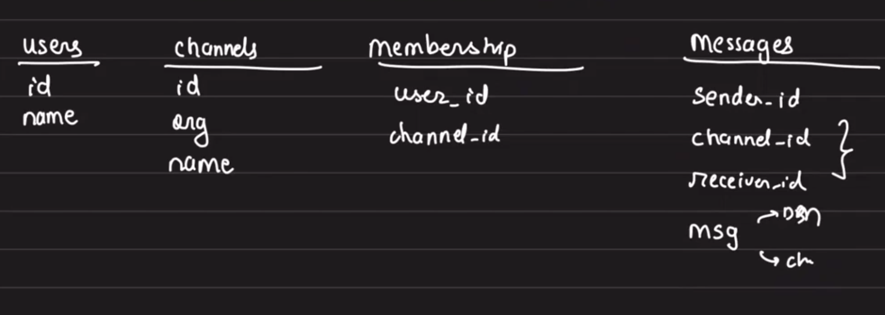

If the `messages` table has both `channel_id` and `received_id`:

- Either one of them will be `null`
  - If that is the case, there can be scenarios when both are `null`

### Approach 2

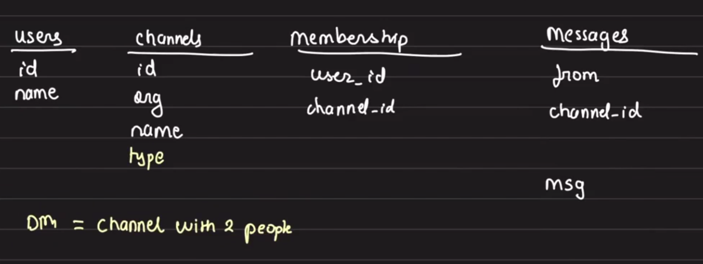

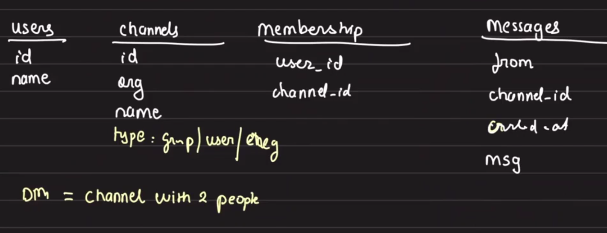

Now the user is part of a channel, and you can see the total number of unread messages in the channel.
For that, we need to store a checkpoint for each channel.

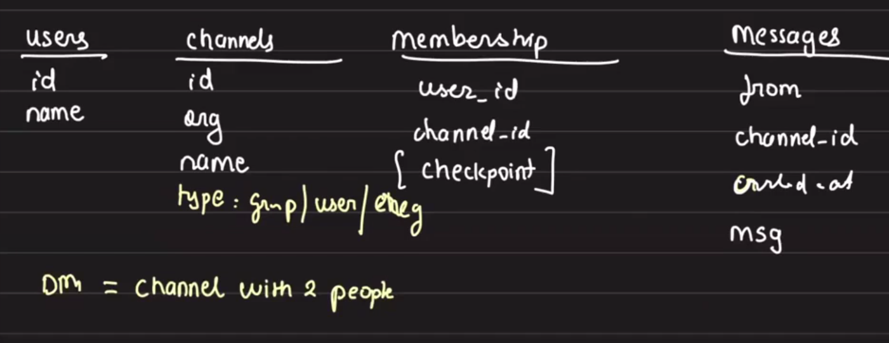

## Design Considerations

Slack does not have a very high message frequency compared to some other real-time systems.

### Transport Choice: API Server or WebSocket?

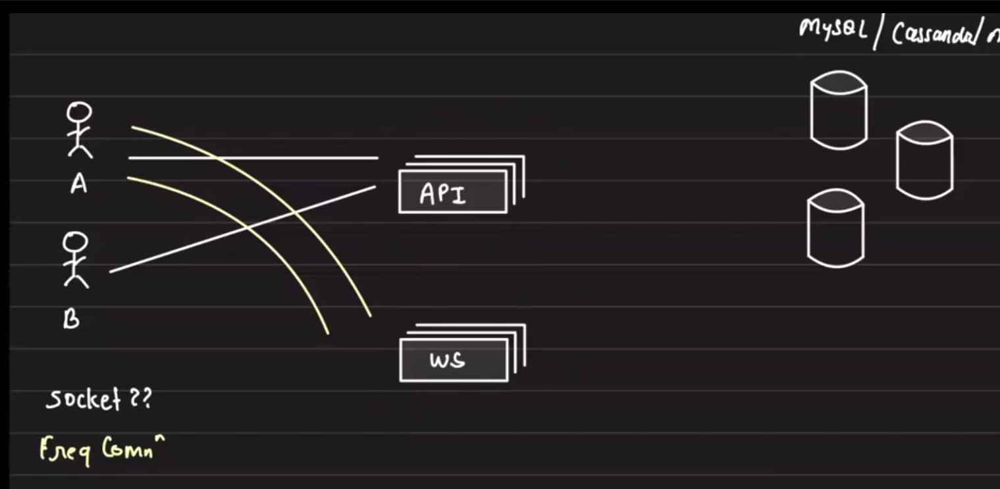

For Microsoft Teams and Slack, what guarantees do they provide?

- On Slack, when you send a message, it may appear gray and then turn black
- This indicates there is a small delay while the message is delivered

## Persistence Models

There are three ways to persist messages depending on the guarantee you want to provide.

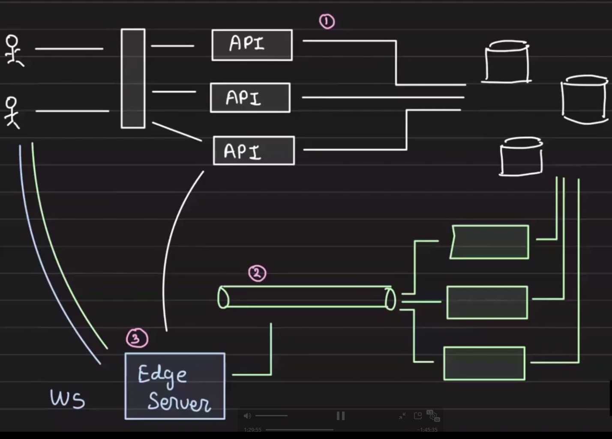

### First Way: Synchronous Persistence

- Slack is an enterprise-level application
  - Unless and until the message is saved, it should not be broadcast to others
  - For Slack, persistence is very important

The flow can be:

- User sends a message
- The message is persisted in the database
- The API server sends the message to the WebSocket server and then to users

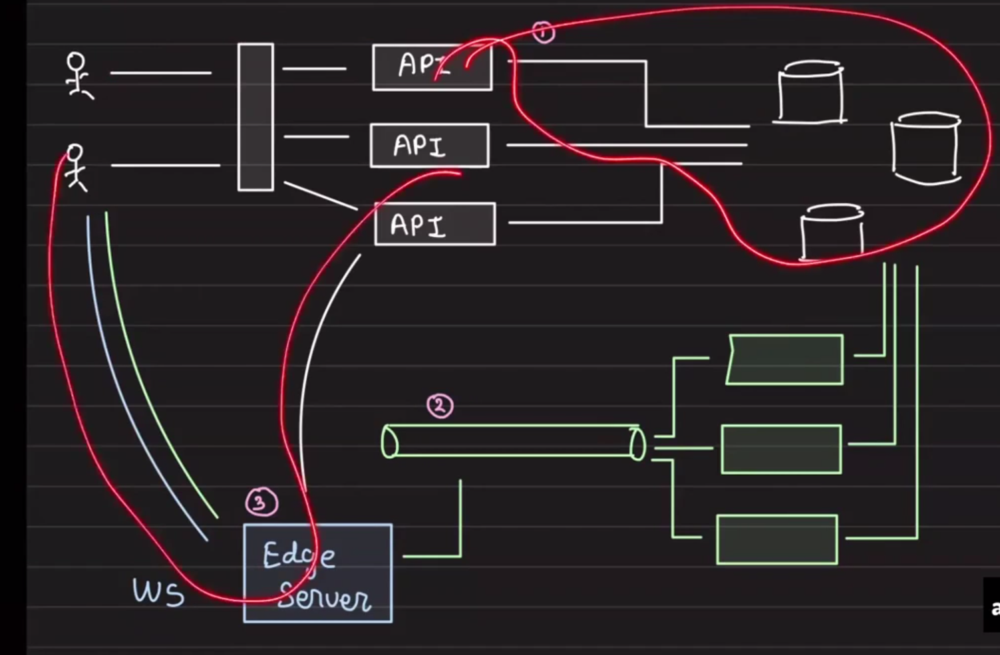

This synchronously guarantees message persistence before it is sent to other users.

### Second Way: Eventual Persistence

1. User calls the WebSocket server
2. The message is broadcast
3. The message is pushed to Kafka to store in the database

This approach can be used when immediate history delivery to other users is not required.
It works well for systems with high-frequency messages, such as Instagram or other social feeds.

### Third Way: No Persistence

- Persistence is not required at all
- Pure WebSocket communication is used
- Example: Zoom chat
  - Historical messages are not visible
  - Messages are only available while you are online

***
So depending on the kind of persistence you want to provide, you can choose any of the three approaches.

## Scaling WebSocket Servers

### How do we scale WebSocket servers?

- A WebSocket server has a limit on the number of connections it can handle

Suppose a scenario where one WebSocket server can handle four users at a time.
There are five members in a group.
`A`, `B`, `C`, and `D` are connected to `ws1`, and `E` is connected to `ws2`.

When `A` sends a message, it is easy to deliver to all members connected to `ws1` (`B`, `C`, `D`).

But how would the message reach `E` connected to `ws2`?

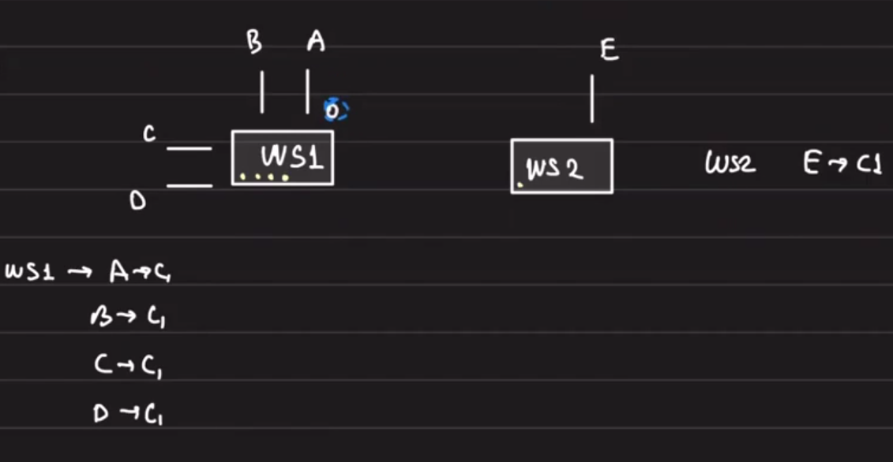

- A simple TCP connection is required between both WebSocket servers

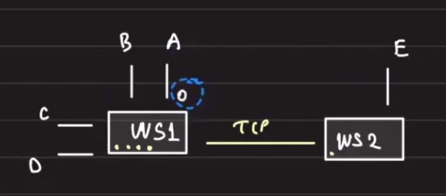

Now add person `F` connected to `ws3`, and they are part of the same channel/group.

- In this case, you would need another TCP connection to `ws3`

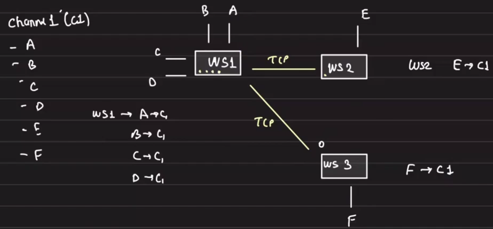

---

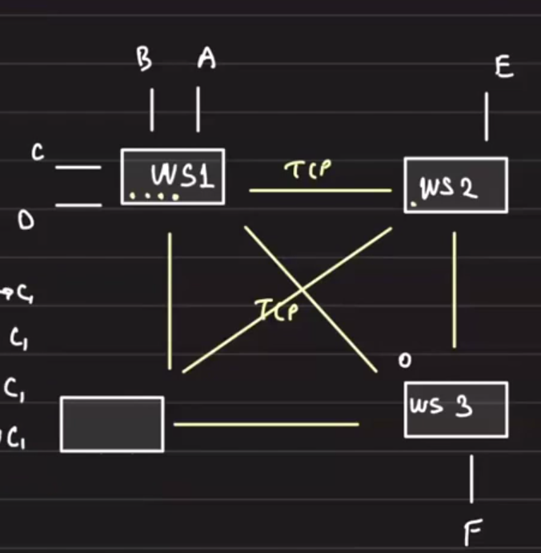

### Disadvantage

- If there are `N` servers, too many TCP connections would be opened

### Main Problem

- There are many persistent TCP connections
- Servers become clogged trying to maintain TCP connections with other WebSocket servers

## Pub/Sub Solution

### Solution

- Put pub/sub in front of WebSocket servers
- Not Kafka
- Need real-time pub/sub: `Redis`
- Redis does not store any data
- If a server is not connected, it will not receive data
- Redis does not guarantee delivery

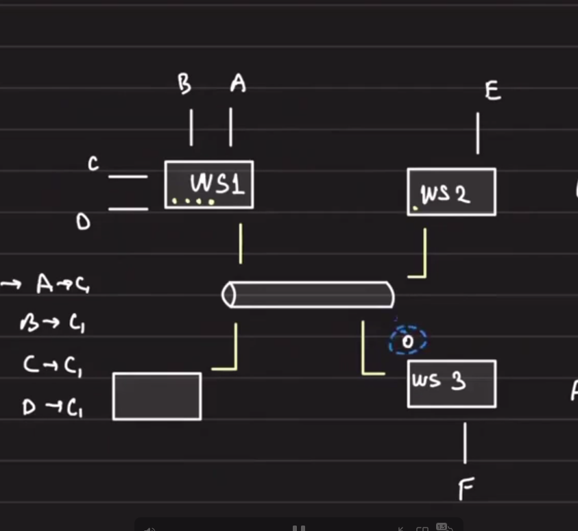

### Additional Consideration

- If a Slack channel has four servers and six members, and all six members are connected to `ws1` and `ws2`
- No one is connected to `ws3` and `ws4`

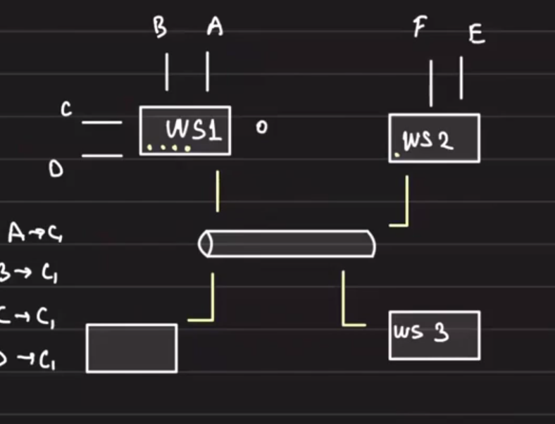

- Then why send that message to `ws3` and `ws4`?

### Solution with Redis

Redis can help:

- When a Redis connection is established with a WebSocket server,
- When `A` connects to `ws1`, it tells `ws1` its membership
- Then `ws1` asks Redis pub/sub to subscribe to channel `c1`

## Redis-Based Channel Subscription

### Scenario

- `Channel1`: `A`, `B`, `C`, `D`, `E`, `F`
- `Channel2`: `G`, `H`

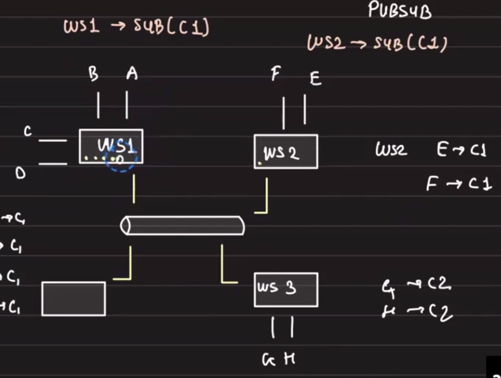

When `A` sends a message, `B`, `C`, and `D` immediately receive it.

Then the message is sent to Redis pub/sub for channel `c1`.
Redis then pushes the message to `ws2`.

So the whole channel subscription is handled by Redis.

## WebSocket Server Resolver

- When a user logs in, they are assigned to a specific WebSocket server
- This allows people from the same organization to join the same WebSocket server
- This reduces the balancing overhead on Redis pub/sub
- The goal is to minimize I/O for Redis pub/sub

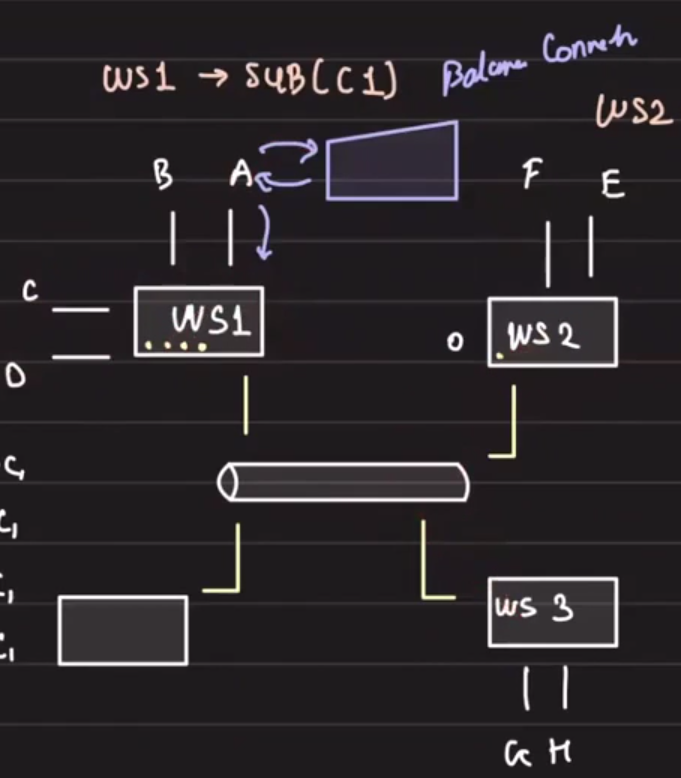

