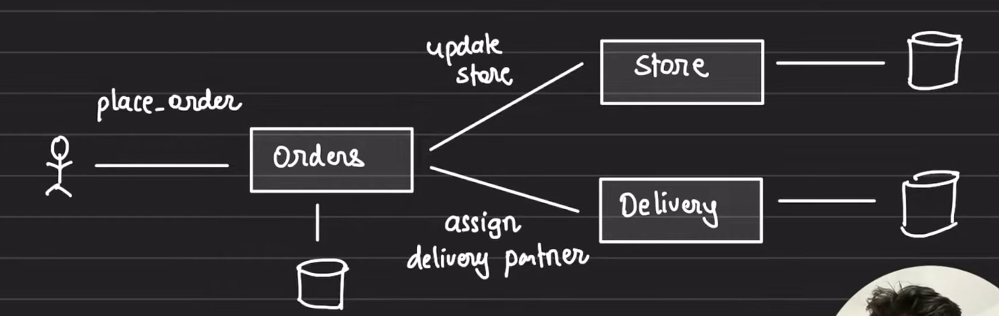
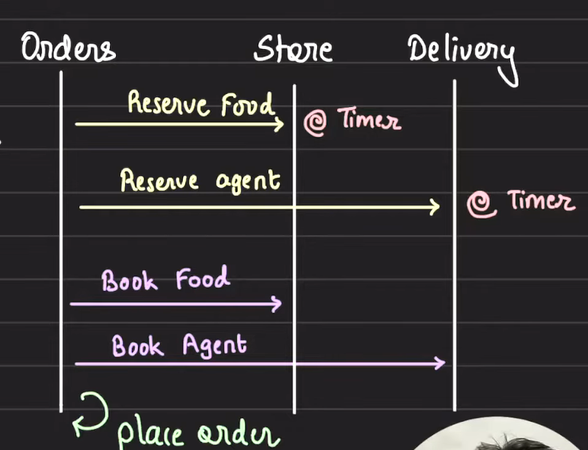
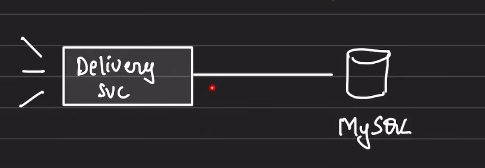
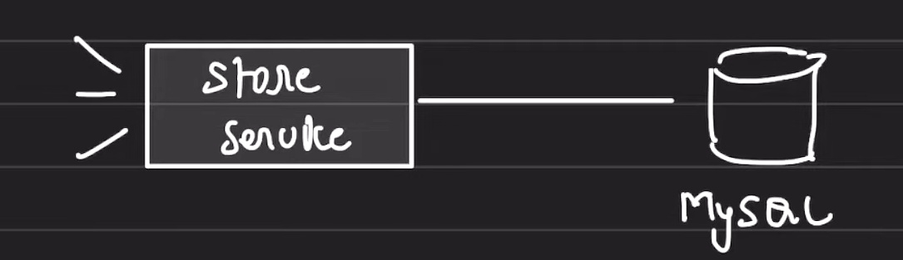
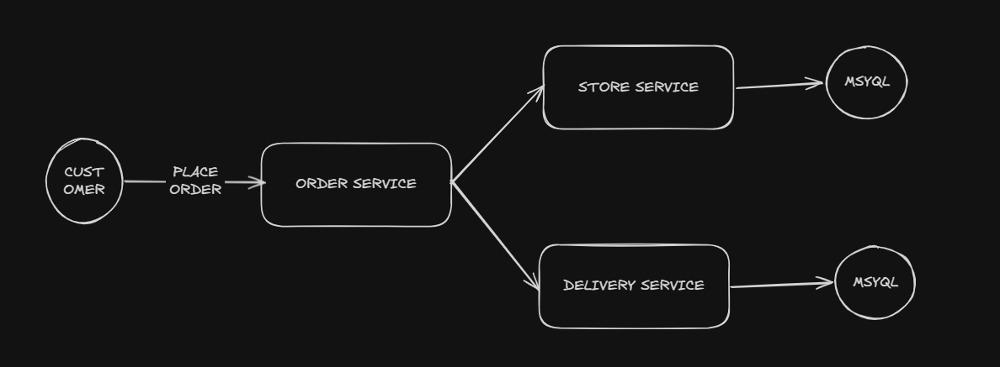

# Distributed Transactions: 2-Phase Commit

## Index

- [Overview](#overview)
- [Atomicity](#atomicity)
- [2-Phase Commit Protocol](#2-phase-commit-protocol)
  - [Phase 1: Prepare](#phase-1-prepare)
  - [Phase 2: Commit](#phase-2-commit)
- [Advantages](#advantages)
- [Disadvantages](#disadvantages)
- [Design](#design)
- [Schema](#schema)
  - [Agent Service](#agent-service)
  - [Store Service](#store-service)
- [API Endpoints](#api-endpoints)

## Overview

A transaction that spans multiple physical systems, machines, or computers is called a distributed transaction.

Example: Blinkit 10-minute delivery.

To guarantee food delivery under 10 minutes, Zomato should accept an order only when:

- the food is available in the dark store
- the delivery partner is available to deliver



## Atomicity

Both the store and delivery agent should be available.

If one of them is not available, the transaction should be rolled back and the order should be rejected.

If either of them fails:

- poor UX for the delivery partner
- loss because the store spent time packing

This is the classic case of distributed transactions.

## 2-Phase Commit Protocol

Split the entire flow into two phases:

1. Prepare (reserve)
2. Commit (book)



### Phase 1: Prepare

- The order service will first reserve the food in the store service: mark this item unavailable in the store for a particular time.
- The order service will then reserve the delivery agent, blocking and making them unavailable for a particular time.

### Phase 2: Commit

- Then you book the food in the store service.
- Then you book the delivery agent.

Once both of these are done, the order is placed.

**Reservation Phase:**

- If both fail, the transaction fails → we `ABORT`.
- If one succeeds, we cancel the reservation and `ABORT`, or the time will `AUTO CANCEL`.

**Commit Phase:**

- If both succeed, the order is placed.
- If only one succeeds, we cancel the reservation or the time will `AUTO CANCEL`.

## Advantages

- Guarantees atomic transactions
- Guarantees isolation

## Disadvantages

- Slow
- Prone to deadlock

## Design

- One order:
  - one agent
  - one food item

### Requirements

- A user should not see "order placed" if it is not fulfilled
- Two orders should not be assigned the same delivery agent

## Schema

### Agent Service

```json
{
  "id": ,
  "is_reserved": false,
  "order_id": null
}
```

`order_id` set to `null` means the agent is currently not serving any order.

*This could be implemented using either SQL or NoSQL.*



### Store Service

**Food**

```json
{
  "id": ,
  "name": ""
}
```

**Packets**

```json
{
  "id": ,
  "food_id": ,
  "is_reserved": ,
  "order_id": 
}
```



## API Endpoints

- Delivery service
  - `/delivery/agent/reserve`
  - `/delivery/agent/book`

- Store service
  - `/store/food/reserve`
  - `/store/food/book`



