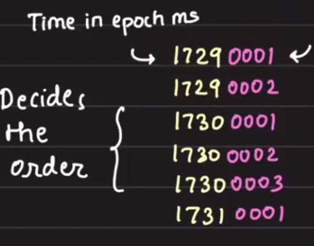
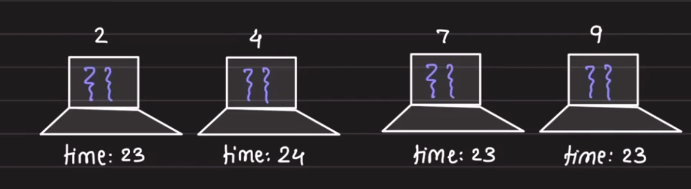
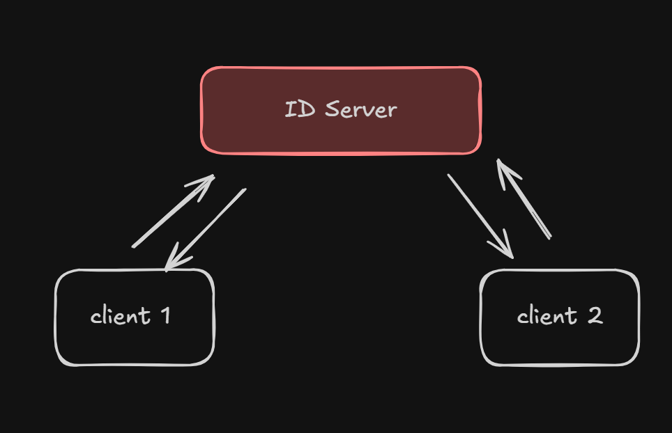
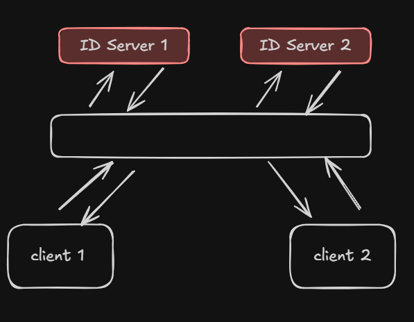

# Distributed ID Generators

## Index

- Agenda
- Problem statement
- Single-machine ID generation
- Multi-machine collision
- Thread safety
- Counter-based IDs
- Persisting counters
- Flush interval and crash handling
- Monotonic IDs
- Central ID generation service
- Availability and reliability
- Relaxed constraints

## Agenda

- Foundation of ID generation
- Monotonically increasing IDs
- Central ID generation service
- DB ticket servers
- Twitter's idea
- Instagram bettering it

## Problem Statement

Assign a global unique ID to "anything".

Write a function that returns something unique every time it is invoked.

We are not writing a new service, just a function that is part of the application.

## What is Unique Throughout?

The key source of uniqueness is time.

```go
func getId() int {
    return get_epoch_ms()
}
```

Every time the function is invoked, the time has moved forward. Hence it seems unique.

## What is the Catch?

The ID generation logic works fine when there is just one machine and the code is not invoked twice within the same millisecond.

### Multiple Machines

If there are multiple machines, functions invoked at the same time on two machines can generate the same ID, causing a collision.

Solution: prepend machine ID to time.

```go
func getId() int {
    return concat(get_epoch_ms(), get_machine_id())
}
```

### Program Threads

Functions can be invoked by two threads at the same time.

Add `thread_id` as a differentiator.

```go
func getId() int {
    return concat(get_epoch_ms(), get_machine_id(), get_thread_id())
}
```

### Add a Counter That Resets Every Few Minutes

A static counter can be concatenated.

```go
int counter = 0;
func getId() int {
    counter++;
    return concat(get_epoch_ms(), get_machine_id(), counter);
}
```

If we already have the static counter, the time is redundant.

```go
int counter = 0;
func getId() int {
    counter++;
    return concat(get_machine_id(), counter);
}
```

Now if the machine reboots, the counter will reset, so the ID generation logic fails.

### Static Counter is In-Memory

A static counter is in memory, so it is volatile.

So, we store the counter to disk (non-volatile).

Every time the counter increments, we store it to disk (this is failure tolerant).

```go
int counter = load();
func getId() int {
    counter++;
    store(counter);  // DISK I/O
    return concat(get_machine_id(), counter);
}
```

In this case we are doing disk I/O on every invocation.

### Write Only at a Certain Interval

Instead of writing every time, write only at a certain interval.

```go
int counter = load() + 1000;
// 1000 -> flush frequency

func getId() int {
    counter++;
    if (counter % 1000 == 0) store(counter);
    return concat(get_machine_id(), counter);
}
```

### What If the Machine Crashes Before Flushing?

Let's suppose the flush interval is 3.

- `{1, 2, 3}` -> Flush
- `{4, 5, 6}` -> Flush
- `{7, 8}` -> machine crashed

Since the last stored value is 6, it will start from 7 again.
So IDs `7` and `8` may duplicate.

The new safest value will be:

```text
6 + 3 + 1 = 10
```

That means the next safe ID after crash is `m1-10`.

## Monotonic IDs

Why monotonic IDs?

Monotonically increasing IDs are more useful in conflict resolution. For example, who came first?

So instead of `machine_time`, we now use `time - machine_id` because time always moves forward.

```go
func getId() int {
    return concat(get_epoch_ms() - get_machine_id())
}
```

All ID generation algorithms have time on the left-hand side. This gives `SORTABILITY`. The most significant part makes sorting simple.

Conflict in the first half? -> tie breaking in the second.



Although this is a good solution, it does not guarantee monotonicity.

Because clocks across machines can go out of sync.



At the same time instant, we invoke `get_id` on 4 machines.

- `get_id` on `m2` -> `232` (`time + machine_id`)
- `get_id` on `m4` -> `244`
- `get_id` on `m7` -> `237`
- `get_id` on `m8` -> `239`

This is not monotonically increasing.

## Central ID Generation Service

So instead of keeping ID generation logic in application code, let's create a central ID service.

This should solve the clock skew problem.



## Availability and Reliability

But this central ID service is a single point of failure.

- ID server could fail
- Disk of the service could fail

The ID servers need to gossip to converge upon an agreed value.
So we made it complicated.



One thing we learned from these evaluations is that:

**There is no way to distribute and guarantee strict monotonicity.**

So the solutions we see out there have relaxed constraints.

Relaxed constraints -> non-integer IDs, no monotonicity.

