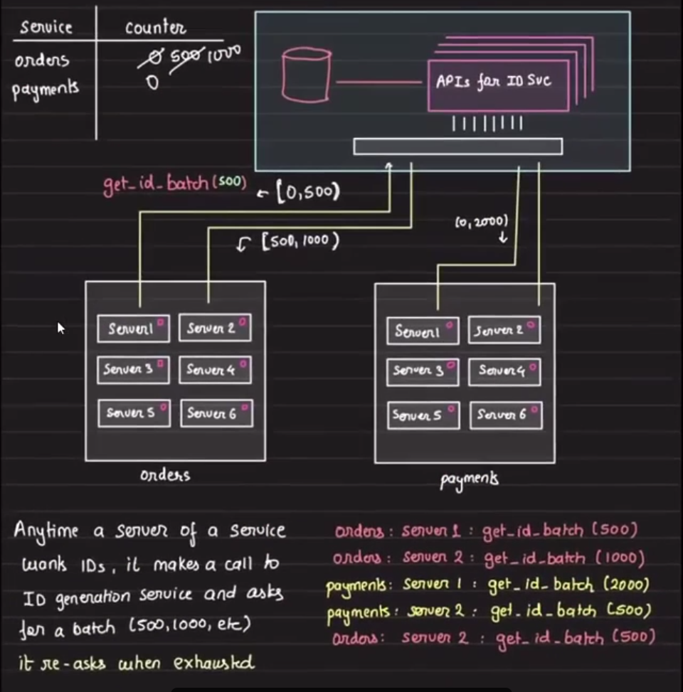
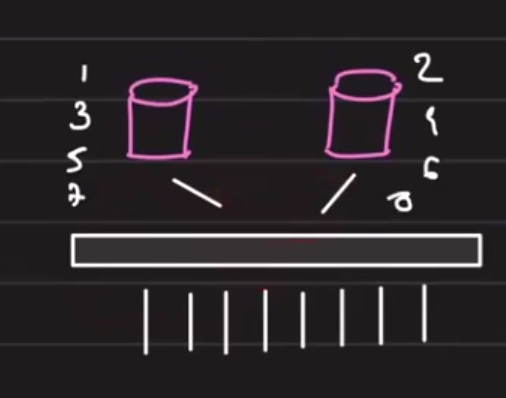
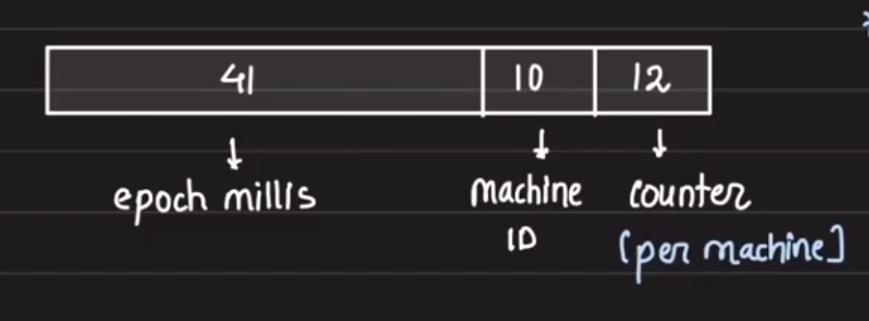
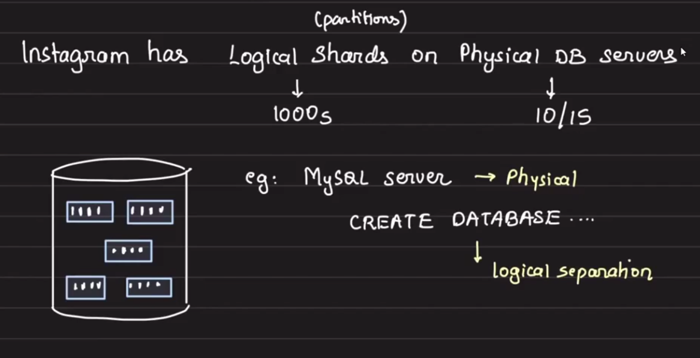

epoch (4bytes) + random(5 bytes) + conter (3 bytes)
96 bits lobng - 12 bytes: they also do not index well
Note that epoch_sec is on LHS

# Central ID Service with Batching (Amazon)

## Index

- Batching model
- Trade-offs (batch size, crash recovery)
- Why not UUIDs?
- MongoDB ObjectId
- Database ticket servers (Flickr)
- MySQL upsert and ticket servers
- Multi-server offsets (odd/even)
- Snowflake (Twitter)
- Snowflake variants (Discord, Sony)
- Snowflake at Instagram (DB-side implementation)

## Batching Model (Amazon)



When the service boots, it requests a batch of IDs from the ID service. The ID service returns a range in the form of a start and end value.

Drawback: the backend server keeps this range in memory, so if it crashes the in-memory range is lost.

You must tune the batch size:

- Too small: many calls to the ID service (higher latency / overhead).
- Too large: larger risk of wasted ranges if a server crashes.
- Find the right balance for your workload.

## Why Not UUID?

- UUIDs are 128-bit values and can be inefficient at scale.
- They do not index well and bloat indexes.
- UUIDs are random, which is good for security but bad for locality and index performance.

A 128-bit index entry is roughly 4x larger than a 32-bit entry; larger index entries increase disk I/O and reduce DB performance.

## MongoDB ObjectId

`ObjectId` layout (12 bytes / 96 bits):

- 4 bytes: epoch (seconds)
- 5 bytes: random / machine identifier
- 3 bytes: counter

Note: the epoch is on the left-hand side which preserves rough sortability by creation time.

## Database Ticket Servers (Flickr)

Why did Flickr build its own ID generation?

- The database was shared and they needed to avoid collisions and guarantee uniqueness.
- UUIDs indexed poorly for their workloads.

If your indexes do not fit in memory, DB performance suffers.

### Central Ticket Server (MySQL)

Clients request an ID by firing a query to a central MySQL ticket table.

Example table:

```sql
CREATE TABLE `tickets` (
    `id` BIGINT UNSIGNED NOT NULL AUTO_INCREMENT,
    `stub` CHAR(32) NOT NULL,
    PRIMARY KEY (`id`),
    UNIQUE KEY (`stub`)
);
```

Idea: delete and re-insert a row to make the DB generate the next auto-increment value. Deleting and inserting in a single transaction is costly for the DB.

### Upsert Options in MySQL

MySQL provides multiple upsert-like mechanisms:

- `INSERT ... ON DUPLICATE KEY UPDATE ...` — tries to insert; on unique-key conflict it executes the `UPDATE` clause.
- `REPLACE INTO ...` — on conflict it deletes the old row and inserts a new row (usually slower than `ON DUPLICATE KEY UPDATE`).

Both approaches are atomic from the DB perspective.

Example pattern (conceptual):

```sql
INSERT INTO `tickets` (`stub`) VALUES ('a')
    ON DUPLICATE KEY UPDATE `id` = `id` + 1;
```

In this pattern the `stub` value remains constant and the `id` increments.


## Multi-server Ticket Approach (odd/even)

Single server is a SPOF. One approach is to run two ticket servers and round-robin requests between them.

- Ticket server 1:
    - `auto_increment_increment = 2`
    - `auto_increment_offset = 1` (odd IDs)
- Ticket server 2:
    - `auto_increment_increment = 2`
    - `auto_increment_offset = 2` (even IDs)



If a server goes down, reset offsets on both DBs to `MAX + BUFFER` to avoid conflicts.

## Snowflake (Twitter ID Generator)

Snowflake is used for tweet IDs and was adopted by other products (Discord, Instagram).

- Snowflakes are 64-bit integers (8 bytes).
- Time is on the left-hand side (most significant bits); tie-breakers (machine/sequence) are on the right.



Snowflake runs in the application server (decentralized), not as a central service.

Typical bit allocation (Twitter original):

- 41 bits: timestamp (milliseconds since custom epoch)
- 10 bits: machine/node ID
- 12 bits: sequence number (per ms)

That means a single machine can generate up to 2^12 = 4096 IDs per millisecond.

Snowflake IDs are roughly sortable. Because the timestamp is the most significant portion, IDs increase as time moves forward. This makes operations like "get objects before/after a certain time" and pagination efficient.

Twitter pagination uses `since_id` instead of limit/offset for efficient forward/backward traversal.

## Snowflake Variants

### Discord

Discord uses the same concept but uses a different epoch (e.g., chosen to extend the usable range).

### Sony (Sonyflake)

Sony published `sonyflake` as an open-source variant. The logic runs in API servers:

- No additional service to run
- Simple function call (library)
- Minimal DB load

Decentralized ID generation helped Twitter and others scale.

## Snowflake at Instagram (DB-side implementation)

Previously, ID generation was in the API servers. Instagram moved this logic into the DB so IDs are generated during `INSERT`.

Requirements:

- IDs sortable by time (pagination, filtering, batch processing)
- ~64-bit IDs (efficient for indexing)
- No separate ID service

Instagram structure (example):

- 41 bits: epoch ms since 2011-01-01
- 13 bits: DB shard ID
- 10 bits: per-shard sequence number

Instagram uses logical shards (partitions) across physical DB servers; each shard has the same schema.



Example (conceptual) SQL/PLpgSQL for a `next_id()` function:

```sql
-- Database and table
CREATE DATABASE insta5;

CREATE TABLE insta5.photos (
    id BIGINT NOT NULL DEFAULT insta5.next_id(),
    -- other columns
);

-- Example function (pseudo PL/pgSQL)
CREATE OR REPLACE FUNCTION insta5.next_id() RETURNS BIGINT AS $$
DECLARE
    epoch CONSTANT BIGINT := 1314220021721; -- example epoch
    seq_id BIGINT;
    now_ms BIGINT;
    shard_id INT := 5;
    result BIGINT;
BEGIN
    SELECT nextval('insta5.table_id_seq') % 1024 INTO seq_id;
    now_ms := (EXTRACT(EPOCH FROM clock_timestamp()) * 1000)::BIGINT;
    result := (now_ms - epoch) << 23;       -- 41 bits shifted (13+10)
    result := result | (shard_id << 10);    -- 13 bits for shard id
    result := result | seq_id;              -- 10 bits for sequence
    RETURN result;
END;
$$ LANGUAGE plpgsql;
```

- `<< 23` sets the epoch part (13 + 10 bits)
- `<< 10` sets the shard id
