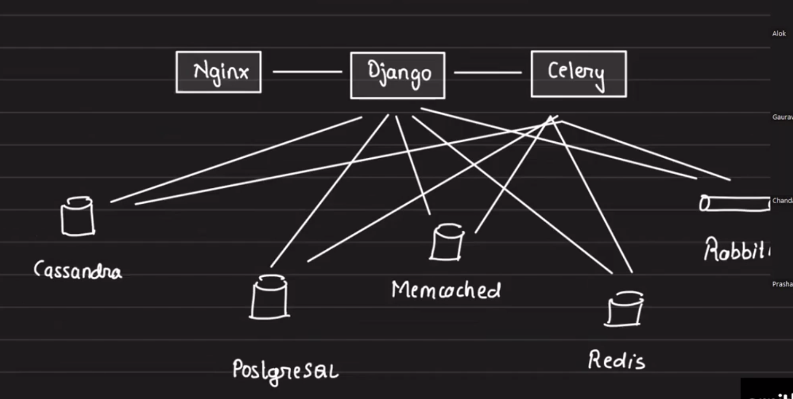
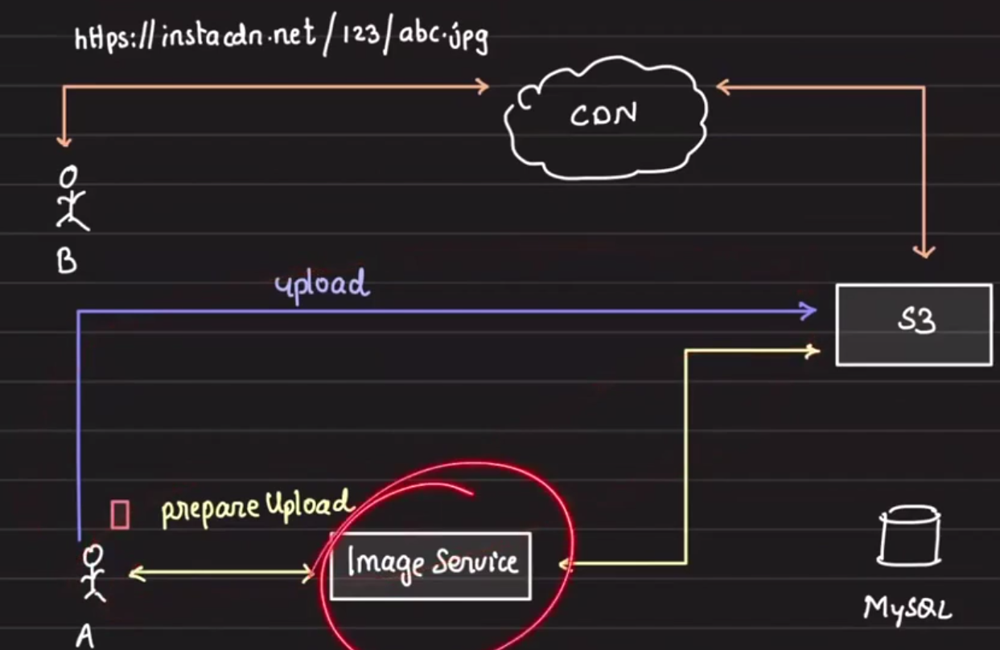
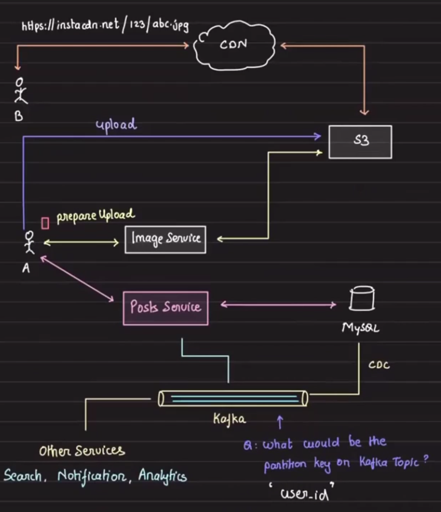

# Instagram Scale Architecture: CDN, Photo Upload & Hashtag Services

## Table of Contents

1. [Instagram's Year 1 Architecture](#year-1-architecture)
2. [Content Delivery Network (CDN) Overview](#cdn-overview)
   - How CDN Works
   - URL Translation and Caching
3. [Image Upload Service](#image-upload-service)
   - Requirements
   - Storage Architecture
   - Post Schema Design
   - Derivable Data Pattern
   - Service Separation
   - End-to-End Flow
4. [Privacy Considerations](#privacy)
   - Pseudo-Privacy with Signed URLs
   - CDN Stateless Architecture
5. [Image Optimization](#image-optimization)
   - Resolution-Based Serving
   - CDN Transformation Features
6. [Extensibility](#extensibility)

---

## Instagram's Year 1 Architecture {#year-1-architecture}



- Facebook made PHP and MySQL famous; everyone adopted that stack
- Instagram made the above architecture famous; everyone is following suit

---

## Content Delivery Network (CDN) Overview {#cdn-overview}

### How CDN Works

A CDN (Content Delivery Network) transparently sits between users and the origin server.


Consider this example:
- **Origin server**: `https://google.com`
- **Origin path**: `/images/logo.png` (returns JSON, images, HTML, video, or any content)
- **CDN domain**: `https://a.mycdn.net`

When a user requests content through the CDN:

```
User Request:  https://a.mycdn.net/system-design/logo.png
                    ↓
CDN finds origin for a.mycdn.net
                    ↓
Forwards to:   https://arpitbhyani.me/system-design/logo.png
                    ↓
CDN caches the response
                    ↓
Returns to user: https://a.mycdn.net/system-design/logo.png
```

### URL Translation and Caching

The CDN transparently replaces the domain in the URL while maintaining the path:

```
Original:     https://a.mycdn.net/system-design/logo.png
Maps to:      https://arpitbhyani.me/system-design/logo.png
Response:     Cached and returned to user
```

Every request to the CDN is forwarded to the origin server and cached for future requests.

---

## Image Upload Service {#image-upload-service}

### Requirements

- **Volume**: 5 million image uploads per day

### Considerations

Key areas to address:
- Storage solution
- Data flow architecture
- Separation of concerns
- Privacy and security
- Extensibility
- Performance optimization

### Storage Architecture

**Storage Solution**: Amazon S3

**Data Flow**: Pre-signed URLs



### Post Schema Design

**Initial Approach** (Incorrect):

| Field | Type | Note |
|-------|------|------|
| `id` | Auto-increment | Primary key |
| `user_id` | Integer | Post owner |
| `caption` | String | Text content |
| `url` | String | ❌ **Don't store this** |

**Why storing the URL is problematic**:

If you need to change the CDN provider, you'll need to migrate all stored URLs in the database.

### Derivable Data Pattern

**MANTRA**: Never store information that is derivable from other data.

**Better Approach**:

1. User uploads photo using the Image Service → receives `random_image_id`
2. User creates a post using the Post Service → stores only the `random_image_id`
3. The URL is generated on-the-fly when needed

**Revised Post Schema**:

| Field | Type | Source |
|-------|------|--------|
| `id` | Auto-increment | Primary key |
| `user_id` | Integer | User identifier |
| `caption` | String | Post text |
| `image_id` | String | Image Service reference |

Instead of storing the full URL in the database, generate it dynamically:
- Retrieve `user_id` from the database
- Retrieve `random_photo_id` from the database (generated by Image Service)
- Format as: `https://instacdn.net/{user_id}/{random_photo_id}.png`


### Service Separation

The Post Service can also validate that the `image_id` provided in the request belongs to the same user, ensuring consistency.


Benefits:
- **Image Upload Service**: Handles image storage and CDN delivery
- **Post Service**: Manages post metadata and user associations

### End-to-End Flow



**Step-by-step process**:

1. **User A uploads a photo** using the Image Service
   - Image stored in S3
   - `random_photo_id` is generated and returned

2. **User A creates a post**
   - Entry created in posts table with `image_id`
   - Other metadata stored (caption, etc.)

3. **User B visits User A's profile**
   - Request: `GET /users/A/posts`
   - Response includes dynamically generated URLs:
   
   ```json
   [
     {
       "id": 1,
       "user_id": "A",
       "caption": "Beautiful sunset",
       "url": "https://instacdn.net/A/12345.png"
     }
   ]
   ```

4. **URL rendering**
   - URLs are rendered in `` tags in the frontend
   - Requests go to the CDN (instacdn.net)
   - CDN serves cached or fresh content

---

## Privacy Considerations {#privacy}

### True Privacy vs. Practical Privacy

**Reality Check**: Nothing is truly private. When a photo is cached in a CDN with a TTL (Time-To-Live), during that period, it becomes visible to anyone with the URL.

**Are Instagram photos really private?** Short answer: **No**

### Pseudo-Privacy with Signed URLs

Every photo URL contains a signature (time-based token) attached as query parameters:

```
https://instacdn.net/ul/123.jpg?ig_cache_id={}&oh={}&oe={}&nc_sid={}
```

**How it works**:

1. When the URL is rendered in an `` tag, the request goes to the CDN
2. The CDN validates the request using the attached signature keys
3. If signatures are valid and not expired, the image is returned
4. Otherwise, a 404 error is returned

**Key parameters**:

| Parameter | Meaning | Purpose |
|-----------|---------|---------|
| `oe` | Expiry | When the URL becomes invalid |
| `oh` | Hash | Integrity verification |
| `ig_cache_id` | Cache identifier | Tracks which version is cached |

### Why Incognito Mode Doesn't Work

Without these signature parameters, the image won't open in incognito mode:
- The URL is short-lived because the signatures expire quickly
- Old URLs become invalid after the `oe` (expiry) timestamp passes
- This provides pseudo-privacy while maintaining CDN efficiency

### CDN Statelessness

The CDN is 100% stateless:
- It doesn't know who is using it
- It doesn't know what the user is doing
- It only validates signatures and serves cached content
- This design ensures maximum scalability and performance

---

## Image Optimization {#image-optimization}

### The Problem with One-Size-Fits-All

Users belong to different geographies with varying:
- Network bandwidth
- Mobile device capabilities
- Processing power
- Screen resolutions

Sending a 5 MB photo from a celebrity to all followers is a terrible idea due to:
- Network congestion
- Slow load times for low-bandwidth users
- High data consumption for mobile users
- Unnecessary server load

### Solution: Multi-Resolution Serving

Serve different image resolutions based on user context and device capabilities:

- **Tier 1 cities**: High bandwidth, advanced devices → Full resolution
- **Tier 2 cities**: Moderate bandwidth, mid-range devices → Medium resolution
- **Tier 3 cities**: Limited bandwidth, basic devices → Low resolution

### CDN-Powered Transformation

Instead of building your own image optimization service, use a CDN that provides transformation features out-of-the-box.

**Example with query parameters**:

```
https://instacdn.net/ul/1234.jpg?w=360
```

**How CDN transformation works**:

1. CDN loads the original photo
2. Transforms it to the specified width (e.g., 360px)
3. Caches the transformed version
4. Sends the transformed photo to the user

This approach:
- Reduces bandwidth usage
- Improves user experience
- Eliminates the need to pre-generate multiple resolutions
- Leverages CDN edge servers for efficient transformation

---

## Extensibility {#extensibility}

### Event-Driven Architecture

To enable other services to act on image uploads, push events to **Apache Kafka**:

```
Image Upload Service → Kafka Topic: "image-uploads"
                    ↓
   ┌─────────────────┼─────────────────┐
   ↓                 ↓                  ↓
Analytics      Search Service    Notification
Service        (indexing)        Service
```

**Downstream consumers**:

| Service | Use Case |
|---------|----------|
| Analytics | Track upload patterns, popular content |
| Search Service | Index images for discovery |
| Notification Service | Notify followers of new uploads |
| Recommendation Engine | Suggest similar content |

This architecture ensures:
- Loose coupling between services
- Scalability without modifying the upload service
- Easy addition of new consumers
- Asynchronous processing without blocking uploads