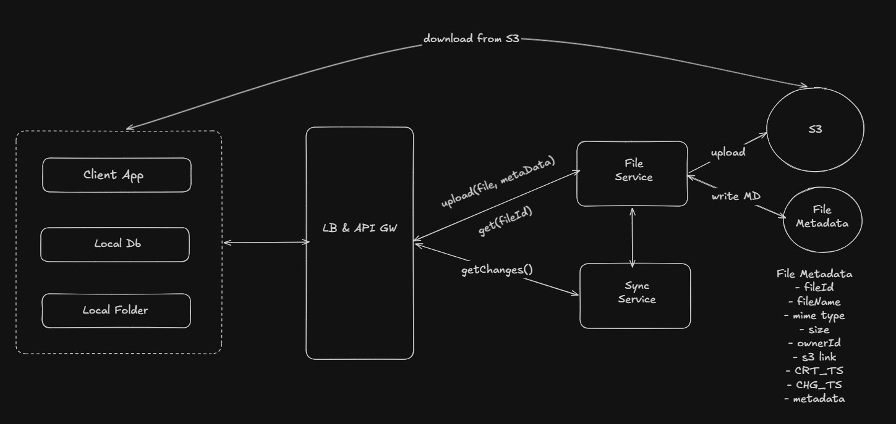
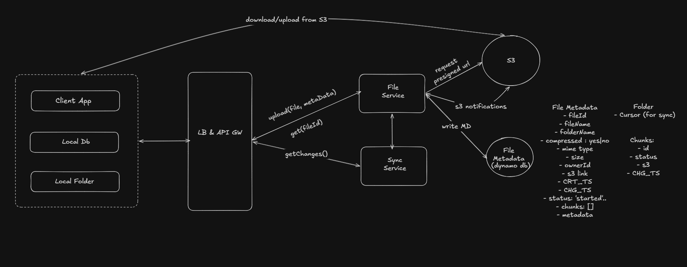

## Dropbox System Design

## Table of Contents

- [Dropbox System Design](#dropbox-system-design)
- [Platform APIs](#platform-apis)
- [1. Upload large files](#1-upload-large-files)
- [2. Latency](#2-latency)
- [3. High Data Integrity](#3-high-data-integrity)
  - [a) Sync should be fast](#a-sync-should-be-fast)
  - [b) Sync should be consistent](#b-sync-should-be-consistent)

# Functional Requirements
1. User can upload files.
2. User can download files.
3. User can share files across devices.

# Non-Functional Requirements
1. CAP: prefer availability.
2. Low-latency uploads and downloads.
3. Support large files up to 50 GB.
4. High data integrity (sync accuracy).

# Core Entities
- File (raw bytes)
- File metadata (name, size, type, etc.)
- User

# APIs
- `POST /file` -> 200: body `{ file, metadata }`
- `GET /files/{fileId}` -> file and metadata
- `GET /changes?since={timestamp}` -> `fileIds[]`, `fileMetadata[]`

# Data Synchronization
1. Remote changed:
   - Pull for changes.
   - Download the new file and update.

2. Local changed:
   - Upload the changed file to remote.

## Platform APIs
- Windows API: File system watcher detects local changes.
- macOS API: FSEvents detects local changes.

Local DB: metadata for the local folder.

# High-Level Design

# Deep Dives

## 1. Upload large files
- Use pre-signed URLs.
- Chunk files on the client into 5 MB parts.
- Store chunk metadata in the database to track state.
- Compare chunks on client and server using fingerprints.
  - Fingerprint each chunk with `Hash(bytes)`.
- Determine chunk upload status from multipart upload notifications.
  - S3 notifications can update chunk status.

## 2. Latency
- Use compression to reduce transfer size.

## 3. High Data Integrity

### a) Sync should be fast
- Polling / adaptive sync.
- WebSockets.
- Download only updated chunks.
  - Add `updatedAt` field and use a delta service to request only changed data.

### b) Sync should be consistent
- Poll the DB for chunk changes.
- Event bus (Kafka) for folder/cursor updates is likely overkill.
  - Sending updated chunk events to Kafka adds complexity.

> Finalized on polling the DB.

# Final Design

# New APIs
1. `POST /files` -> returns pre-signed URL.
2. `PUT {presignedURL}` -> 200: body `{ file chunk }`.
3. `PATCH /file` -> partial metadata update (chunk upload).
4. `GET /changes?since={timestamp}` -> `fileMetadata[]`.
