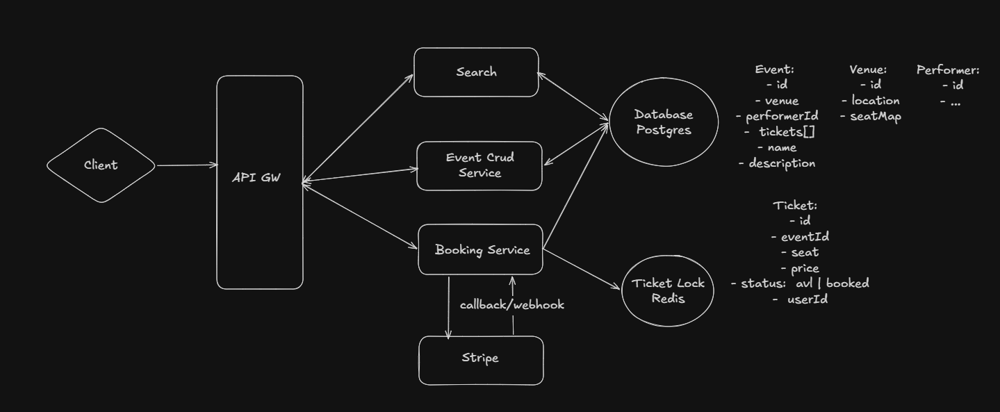
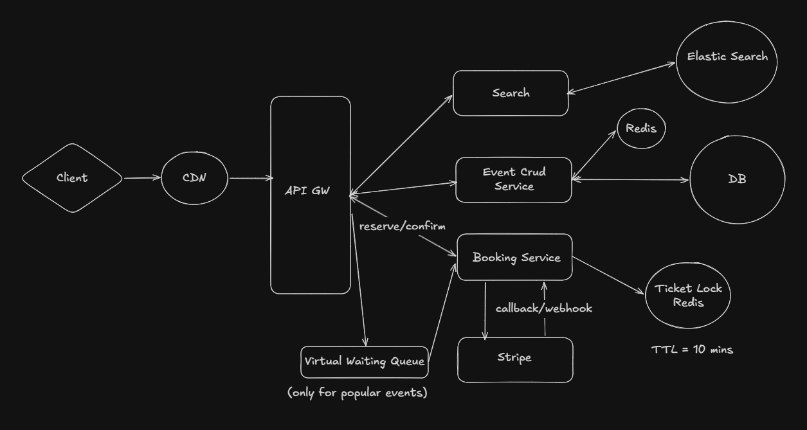

## Ticketmaster system design

## Table of Contents

- [Ticketmaster system design](#ticketmaster-system-design)
- [Funcational requirements](#funcational-requirements)
- [Summary](#summary)
- [Functional requirements](#functional-requirements)
- [Non-functional requirements](#non-functional-requirements)
- [Core entities](#core-entities)
- [APIs](#apis)
- [High-level design](#high-level-design)
- [Deep dive](#deep-dive)
  - [1) Low-latency search](#1-low-latency-search)
  - [2) Handling surge events](#2-handling-surge-events)
  - [3) Caching and Redis](#3-caching-and-redis)
- [API gateway and client-facing considerations](#api-gateway-and-client-facing-considerations)
- [gRPC and HTTP/2](#grpc-and-http2)
  - [Why gRPC is mentioned](#why-grpc-is-mentioned)
  - [Why HTTP/2 is relevant](#why-http2-is-relevant)
- [GraphQL (why it might come up)](#graphql-why-it-might-come-up)
- [Recommendations (short)](#recommendations-short)

## Funcational requirements
# Ticketmaster — System Design

## Summary

This document captures a high-level design for a Ticketmaster-like system: booking tickets, viewing events, and searching events. It covers functional and non-functional requirements, core entities, APIs, architecture sketches, deep-dive topics (search, surge handling, consistency), and notes about RPC/HTTP choices.

## Functional requirements

- Users can book tickets.
- Users can view event details.
- Users can search for events.

## Non-functional requirements

- CAP priority: consistency > availability for bookings (avoid double booking).
- Strong consistency for booking flows; high availability for search/view operations.
- Read-heavy: reads >> writes.
- Scalable to handle traffic surges for popular events.

## Core entities

- Event
- Venue
- Performer
- Ticket

## APIs

GET /event/:eventId
- Returns event details including venue, performer, and tickets.

GET /search?term={term}&location={location}&type={type}&time={time}
- Returns a list of matching events (partial Event objects optimized for search).

POST /booking/reserve
- Headers: Authorization (JWT/session token)
- Body: { "ticketId": "..." }
- Creates a temporary reservation (status: RESERVED) and starts a TTL timer.

PUT /booking/confirm
- Headers: Authorization (JWT/session token)
- Body: { "ticketId": "...", "paymentDetails": { /* stripe info */ } }
- Confirms reservation and marks ticket BOOKED after successful payment.

## High-level design

Key question: What if a user reaches the payment page and does not complete the payment?

- Use a reservation TTL (e.g., 10 minutes).
    - Option 1: periodic cleanup (cron) that checks `RESERVE_TS` on tickets and releases expired reservations (status: AVL | RES | BOOKED).
    - Option 2: use a distributed lock (Redis) with TTL to guard ticket allocation and auto-expire locks.

Architecture sketch:

Another view (service interactions):

## Deep dive

### 1) Low-latency search

a) Use ElasticSearch / OpenSearch

- Supports text queries, filters, and geo-queries.
- Example index mapping could include event name, performer, venue location, and a nested tickets array.
- Cache hot results in CDN or at the query layer for very popular queries.

Update strategy:
- Bookkeeping: updates to the primary database should be propagated to the search index. Doing this synchronously in the CRUD service risks inconsistency if the DB update succeeds and the index update fails.

b) CDC (Change Data Capture)

- Use CDC (e.g., Debezium / AWS DMS) to stream database changes to a message queue (Kafka), then consume and apply updates to Elasticsearch/OpenSearch. This decouples DB writes from index updates and improves reliability.

### 2) Handling surge events

- Seat-map updates and real-time availability:
    - Long polling: works but with overhead.
    - Server-Sent Events (SSE): simple unidirectional stream from server → client; useful to push seat availability updates.
    - WebSockets (WS): full-duplex channel; useful if the client must send frequent updates, but SSE is often sufficient for availability pushes.
    - Recommendation: SSE for broadcasting seat availability; use WebSockets only if bidirectional communication from the client is required.

- Virtual waiting queue: enable for extremely popular events to smooth traffic.

### 3) Caching and Redis

- Use Redis for:
    - Caching read-heavy data (e.g., event metadata, seat maps).
    - Short-term locks or reservation state with TTL (ticket locks).

## API gateway and client-facing considerations

- Expose client-facing APIs via an API Gateway. Serve cached search results through CDN where appropriate.
- Keep booking endpoints strongly consistent and pinned to backend booking services (not fully cacheable).

## gRPC and HTTP/2

### Why gRPC is mentioned

- gRPC is a high-performance RPC framework suitable for internal service-to-service communication in microservices architectures.
- Advantages relevant to this system:
    - Protobuf binary payloads: compact and fast (better for high-throughput internal calls).
    - Strong IDL (service contracts): clear, typed interfaces for Event, Booking, and User services.
    - Built-in streaming: useful for server-to-server streams (e.g., streaming seat-map updates to downstream processors).

### Why HTTP/2 is relevant

- gRPC runs over HTTP/2 and inherits these transport benefits:
    - Multiplexing: many RPCs share a single TCP/TLS connection, reducing latency and handshake overhead.
    - Header compression and lower per-request overhead.
    - Efficient streaming (full-duplex), helpful for real-time features.

Note: Browsers do not support raw gRPC; use gRPC-Web or translate at the gateway if you need browser clients to talk gRPC.

## GraphQL (why it might come up)

- GraphQL can be appealing for client flexibility: clients can request precisely the shape of data they need (e.g., `event + venue + performer + tickets`) in a single query.
- Pros:
    - Reduces over/under-fetching for diverse client views.
    - Single endpoint that can aggregate data from multiple microservices.
- Cons for this system:
    - Harder to cache at CDN level compared to REST/search endpoints.
    - Resolver complexity and potential N+1 query problems when joining many entities.
    - Booking flows require strong consistency and transactional semantics; complex GraphQL mutations can make this harder to reason about.
- Recommendation: Consider a GraphQL layer only if multiple clients need different shapes of event data. Keep booking and critical writes as dedicated REST/gRPC endpoints behind the gateway.

## Recommendations (short)

- Use gRPC + HTTP/2 for internal microservice communication where low latency and strong contracts matter.
- Expose client-facing read APIs (search) via REST backed by OpenSearch and CDN caching.
- Keep booking flows in a strongly-consistent service (RPC/REST) with Redis locks/TTL and a reliable cleanup strategy.
- Consider GraphQL at the API Gateway only when client flexibility justifies its complexity.

---

If you'd like, I can also:

- Add a brief pros/cons table for REST vs GraphQL vs gRPC.
- Insert code snippets for a sample Protobuf `Booking` service and a sample REST booking flow.

Updated file: [ticketmaster.md](ticketmaster.md)
