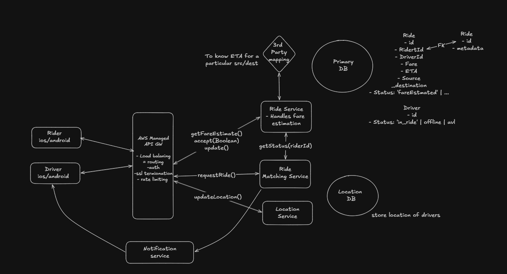
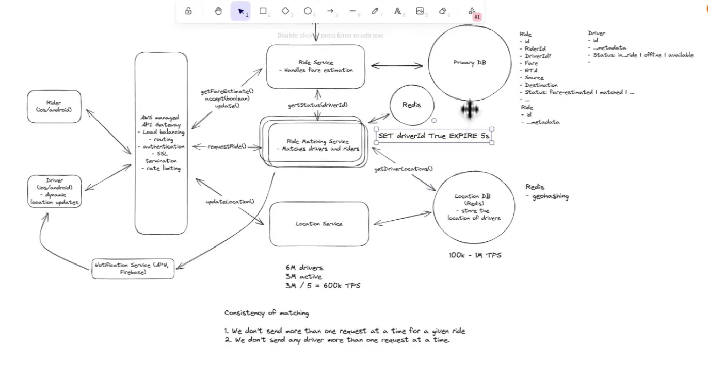
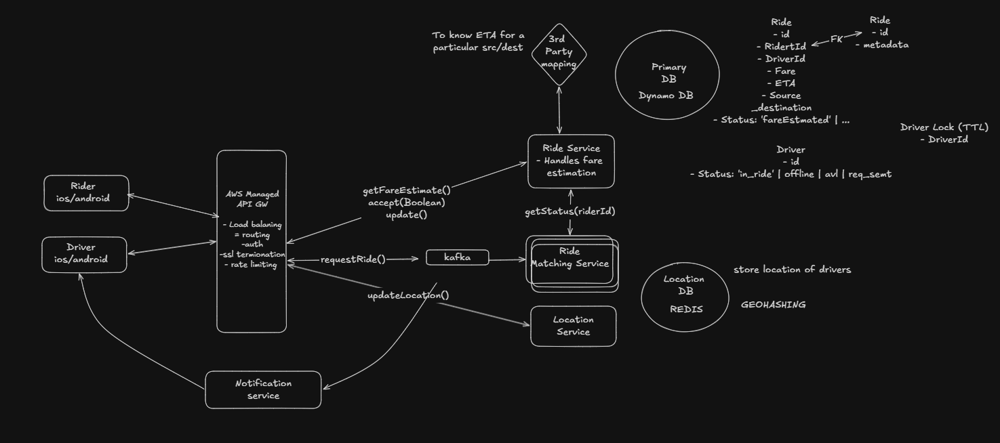

## Uber System Design

# Functional Requirements
- A user can input a start and destination location and receive an estimated fare.
- A user can request a ride based on the estimated fare.
- A driver can accept or decline a request and navigate to pickup/drop-off.

## Out of scope
- Multiple car types
- Driver ratings
- Scheduling a ride in advance

# Non-Functional Requirements
- Low-latency matching: less than 1 minute to match or fail
- Consistent matching: one ride is matched to one driver
- Highly available matching service
- Support high throughput and surges during peak hours or special events

# Core entities
- Ride
- Driver
- Rider
- Location

# API

- `POST /ride/fare-estimate` -> `Partial<Ride>`
  ```json
  {
    "source": "...",
    "destination": "..."
  }
  ```

- `PATCH /ride/request` -> 200
  ```json
  {
    "rideId": "..."
  }
  ```

- `POST /location/update`
  ```json
  {
    "lat": ..., 
    "long": ...
  }
  ```

- `PATCH /ride/driver/accept`
  ```json
  {
    "rideId": "...",
    "accepted": true
  }
  ```

- `PATCH /ride/driver/update` -> `long/long | null`
  ```json
  {
    "rideId": "...",
    "status": "picked up" | "dropped off"
  }
  ```

# High-level design



# Deep Dive

## Low latency matching

- Location database queries must be fast.
- 6M drivers total, 3M active.
- Drivers send location updates every 5 seconds.
- 3M / 5s = 600k TPS.

Introduce a geo-spatial index such as PostGIS on PostgreSQL.
A quadtree can be used for spatial indexing.
https://en.wikipedia.org/wiki/Quadtree

To reduce TPS:
- Option 1: add a queue and write updates in batches.
  - This would require reindexing the database.
- Option 2: use Redis instead of Postgres.
  - Redis supports 100k–1M TPS.
  - Redis supports geohashing.

Learn more about geohashing.

Prefer a quadtree when location density and spatial distribution are uneven and updates are not extremely frequent, since the tree needs reindexing.

## Consistency of matching

- Do not send more than one request at a time for the same ride.
  - The ride matching service can enforce this.
- Do not send more than one request at a time to the same driver.
  - The driver table may include a `request_sent` status field.
  - The ride matching service should check the driver status before sending another request.

We do not want to block a driver indefinitely if there is no response.
- If the driver does not respond within 5 seconds, the request should time out.
- The lock or status must be cleared after the timeout.

A cron job is one option, but it is not ideal.

A better solution is to use Redis and distributed locking.
- The `request_sent` status field is no longer required in the same way.
- Send the request with a TTL of 5 seconds.
  - If the driver responds within 5 seconds, the next request can be sent.
  - Example: `SET driverId TRUE EX 5`



## Alternative solution

Another option is to use DynamoDB with a driver lock table and TTL.

## Other deep dive topics

- Handle high throughput and surges during events.
- Add a queue between request ingestion and the ride matching service.

## Final Design


