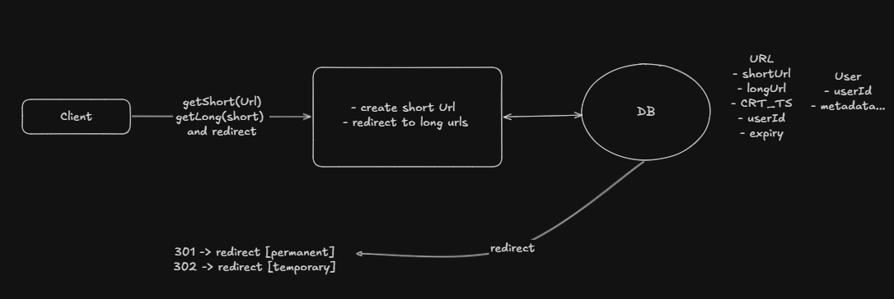
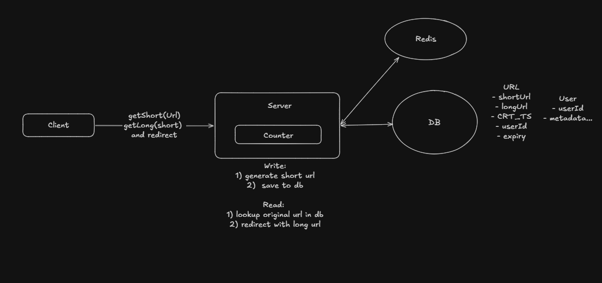
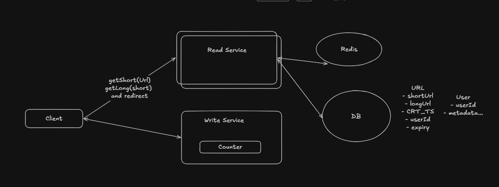
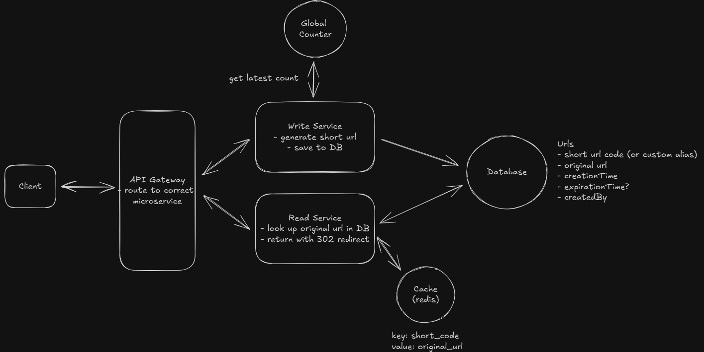

# URL Shortener

## Table of Contents

- [URL Shortener](#url-shortener)
- [Functional Requirements](#functional-requirements)
- [Non-Functional Requirements](#non-functional-requirements)
- [Core Entities](#core-entities)
- [APIs](#apis)
- [High-Level Design](#high-level-design)
- [Deep Dive](#deep-dive)
  - [1) Fast and Unique Short URL](#1-fast-and-unique-short-url)
  - [2) Fast Redirects](#2-fast-redirects)
  - [3) Global Counter Handling](#3-global-counter-handling)
- [Final Design](#final-design)

## Functional Requirements
- Create short URL from long URL
  - Support custom alias
  - Support expiry
- Redirect to long URL from short URL

## Non-Functional Requirements
- Low latency on redirect
- 100M DAU and 1B URLs
- Ensure uniqueness of short URLs
- High availability

## Core Entities
- shortUrl
- longUrl
- User

## APIs

- POST `/urls` -> shortUrl
  ```json
  {
    "originalUrl": "...",
    "alias": "...",          // optional
    "expiration": "..."     // optional
  }
  ```

- GET `/{shortUrl}` -> redirect to longUrl

## High-Level Design



## Deep Dive

### 1) Fast and Unique Short URL
- Use Base62 encoding (`0-9`, `a-z`, `A-Z`)
- `62^6 = 56B` possible values

Options:
- Hash long URL
  - `md5(longUrl)` -> hash -> Base62
  - collision risk remains
- Counter-based approach
  - bijective functions (e.g. [sqids.org](https://sqids.org/))

Best method: Unique counter with Base62 encoding
- Avoid collisions by using a global unique counter
- Increment counter for each new URL and encode the result in Base62
- Redis is well-suited for managing this counter because it supports atomic operations
  - Redis processes one command at a time, eliminating race conditions
  - `INCR` atomically increments and returns a unique value
  - simultaneous requests receive distinct values (e.g. `1000`, `1001`)



### 2) Fast Redirects
- Need to estimate read traffic
  - `10^8 / 10^5 seconds = 1000` reads per second
  - `1000 x 10k (peak) = 10k to 100k reads per second`
- `100k` reads per second is a high volume

Strategy:
- Scale reads separately from writes
- Use a read-optimized datastore or cache for redirects



### 3) Global Counter Handling
- If each write service uses a different counter, IDs can diverge
- Create a global counter to avoid fragmentation
- Use snapshots or caches of the global counter at regular intervals



## Final Design
- Use a global, atomic counter for unique short URL generation
- Encode counter values in Base62 for compact short codes
- Store long URL mappings in a persistent datastore
- Use Redis or a cache layer to accelerate redirect reads
- Separate read and write traffic for scalability
- Support optional custom alias and expiration metadata
