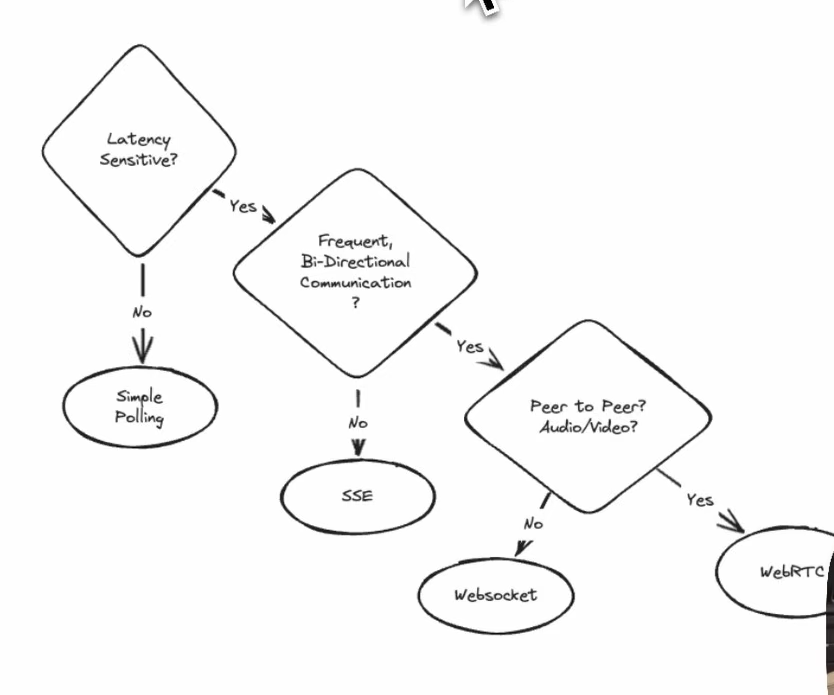
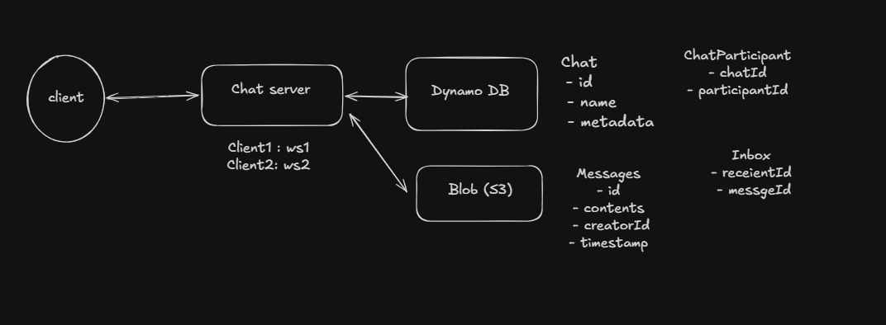
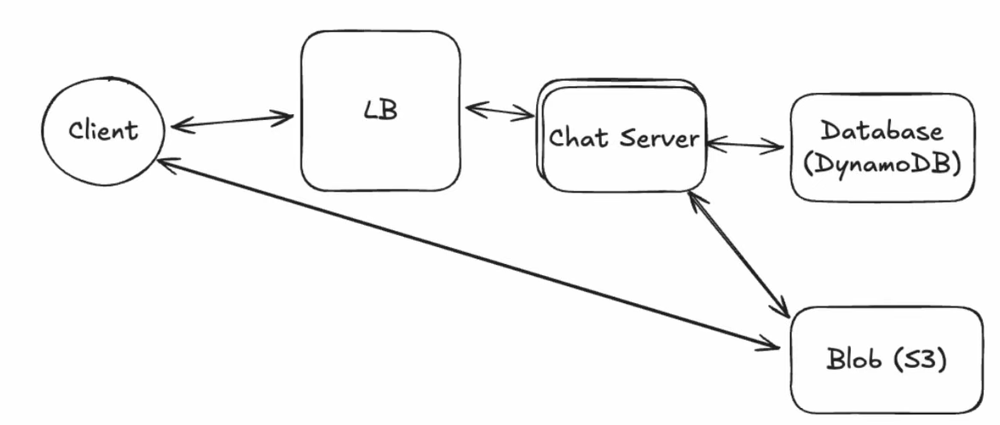
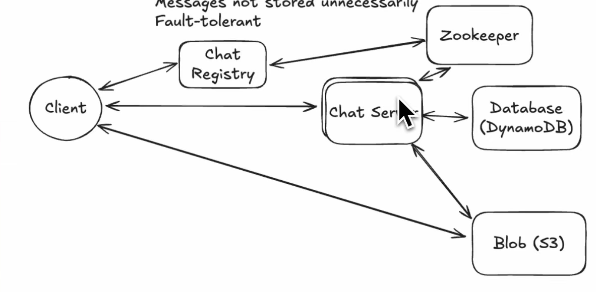
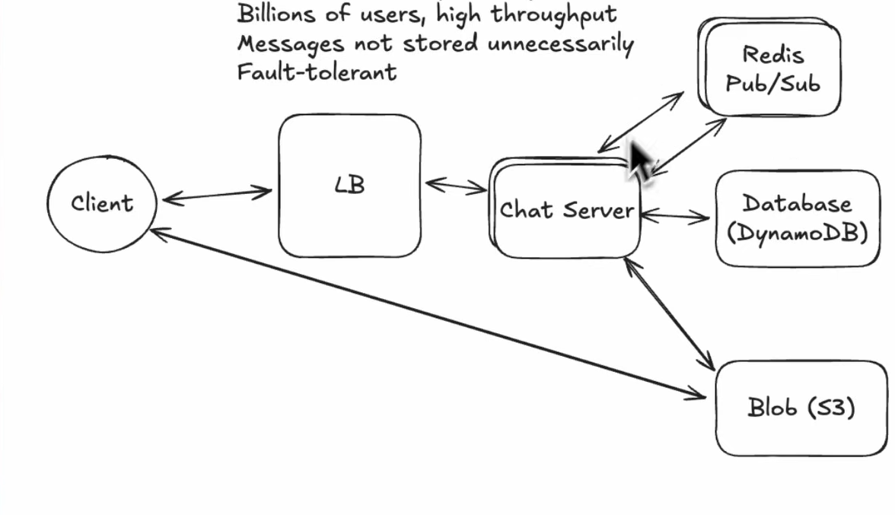
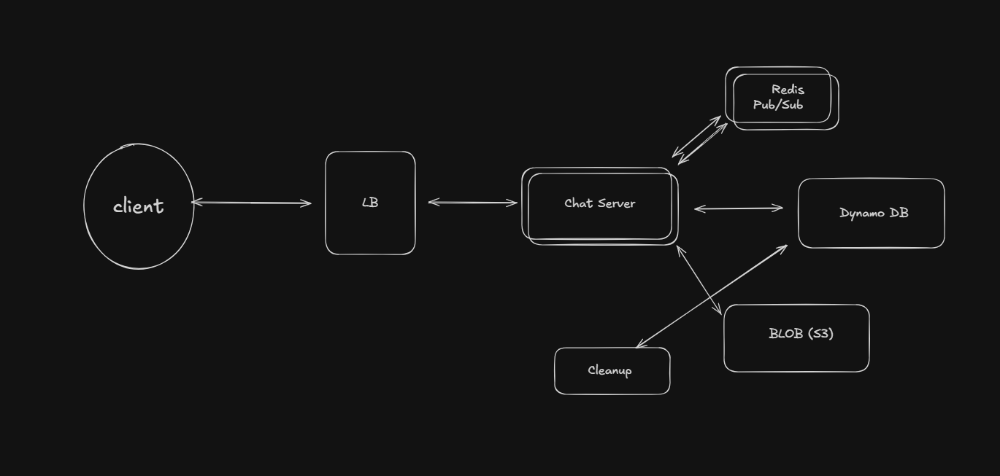

# WhatsApp System Design

## Functional Requirements
- Start group chats
- Send/receive messages
- Send/receive media
- Access messages after being offline

## Non-Functional Requirements
- Delivered with low latency (< 500ms)
- Guaranteed delivery of messages
- Scale to billions of users
- Messages not stored unnecessarily
- Fault tolerance

## Core Entities
- User
- Chat
- Messages
- Client (to know online/offline status)

=> We would need a WebSocket connection.

## APIs

### Commands Sent:
- createChat
- sendMessage
- createAttachment
- modifyParticipants

### Commands Received:
- newMessage
- chatUpdate

## High Level Design

Flow will be like this:
`Client` -> `Chat Server` -> Get `chatId` from `chatParticipant` table -> Write messages to `messages` table -> Then in inbox channel, write all messages for each recipient.

Now, when a client comes online after being offline for some time, we look up the inbox table, check its recipient ID, and fetch all `msgIds` that need to be delivered. After that, we send those messages over the chat server, and when it sends an acknowledgment (ACK), we delete those messages from the inbox table.

By this, we guarantee that messages are delivered and we don't store messages unnecessarily.

### Initial Design

## Deep Dive

The first two requirements are already satisfied in the initial design.

### Serving Billions of Users:
Scale chat servers and add a Load Balancer (LB).
- Our web server is stateless.

In this case, we need a **Layer 4 Load Balancer**.
In other cases, we might use a Layer 7 Load Balancer.

#### Layer 4 LB:
- Works at the transport layer.
- Forwards traffic based on IP, port number, TCP/UDP protocol.
- Does not look inside the actual request content.
- Example: Send all traffic on port 443 to backend servers.
- If the client makes the connection, then the LB will make the connection.
- If the client disconnects, the LB also disconnects.
=> Makes our load balancer kind of invisible.

#### Layer 7 LB:
- Works at the Application Layer (HTTP/HTTPS).
- Can inspect the request content (this adds overhead).
- Routes based on:
  - URL path (`/api`, `/images`)
  - Hostname
  - Headers
  - Cookies

Example:
- `/api` → API servers
- `/images` → Image servers

### Routing Problem
Now, since we have horizontally scaled our chat server, we might have a routing problem.
Example: User 1 connects to Server 1 and User 2 connects to Server 2 -> User 2 will not be able to receive messages directly.

We drop the LB and expose the client to the chat server via DNS.

Flow will be like this:
User A goes to the chat registry to know which server it is connected to -> gets the server address and delivers the message.

To deliver the message to other users in the chat (2 hops):
Chat Server -> Zookeeper (to know the chat server of other users) -> Delivers messages.

For this, we need consistent hashing, which can lead to uneven load.

## Better Solution

**Redis Pub/Sub**

Flow will be like this:
User connects to any chat server -> Server registers a subscription to a particular chat ID -> Chat server publishes a notification to that topic given the user ID -> Now Redis will forward it over the server for that user ID -> Server will pass it over the WebSocket to deliver the message finally.

### Requirement: Messages not stored unnecessarily
- Add a cleanup service to clear messages older than 30 days from the inbox and messages tables.

## Final Design

